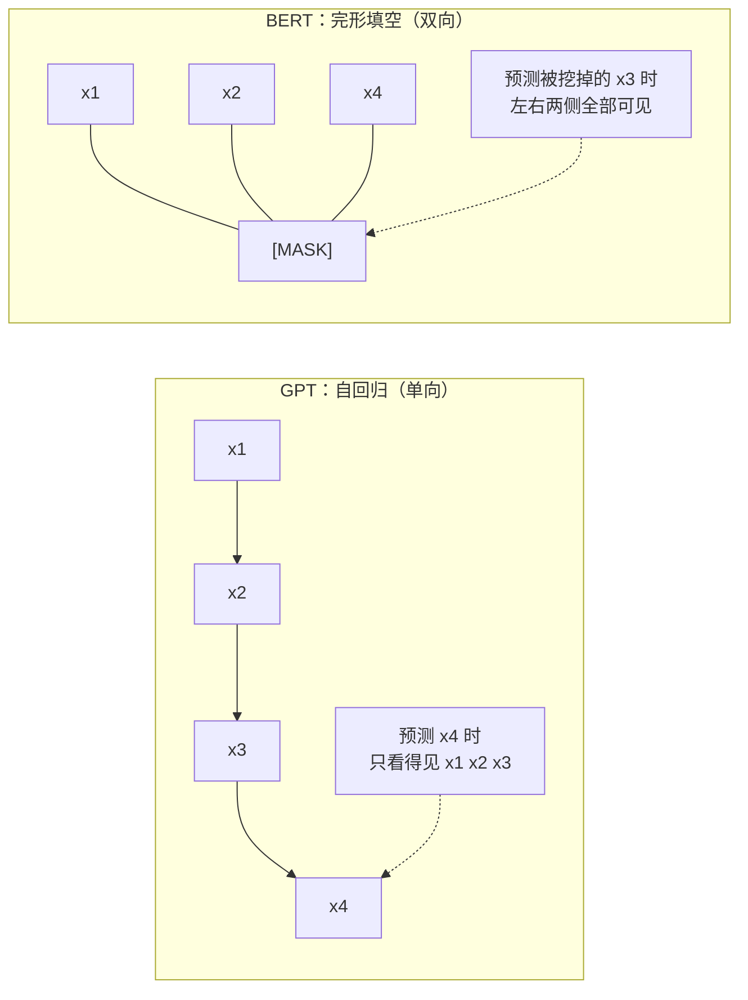
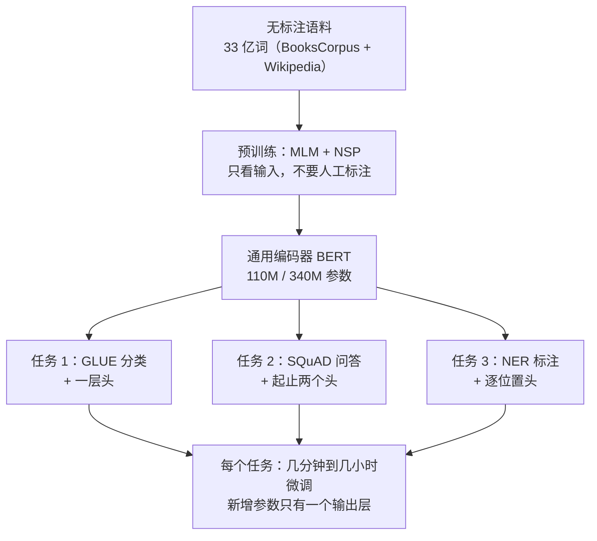
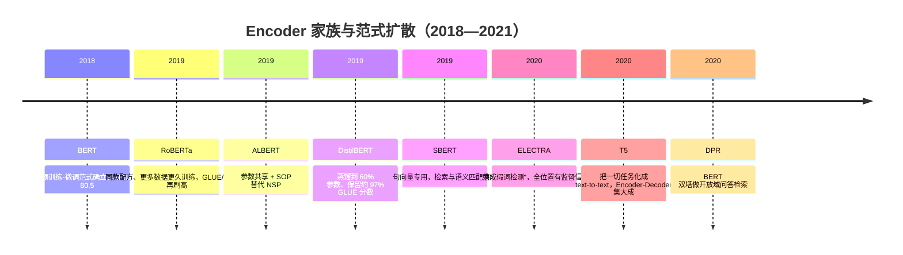
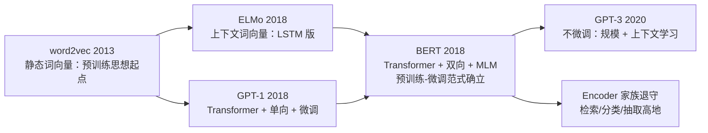

# 05 · BERT 精读 —— 预训练-微调范式的确立

> **一句话理解**：把完形填空做成预训练目标，让 Transformer 编码器**双向**读句子，再用一层输出层微调到几乎全部 NLP 任务上——"先通识教育、再临时 specialization"的流水线从此成为行业默认。

[⬆️ 返回总目录](../README.md) · [⬅️ 返回专栏目录](./README.md)

---

## 📌 论文速览

| 项目 | 内容 |
|------|------|
| 论文 | BERT: Pre-training of Deep Bidirectional Transformers for Language Understanding |
| 作者/机构 | Devlin, Chang, Lee, Toutanova（Google AI Language） |
| 时间 | 2018 年 10 月挂 arXiv；2019 年 NAACL（最佳论文奖） |
| 链接 | https://arxiv.org/abs/1810.04805 |
| 解决什么 | 无标注语料上的预训练怎么用**双向上下文**；下游任务怎么用**一个模型 + 一层输出头**通吃 |
| 核心机制 | 掩码语言模型（Masked Language Model, MLM）+ 下一句预测（Next Sentence Prediction, NSP） |
| 关键数字 | GLUE 80.5（BERT-Large，较此前最佳绝对 +7.7）；SQuAD 1.1 单模型 F1 90.9 / 集成 91.8（人类 91.2） |
| 一句话地位 | 确立"预训练 → 微调"两段式范式，Encoder 家族的开山与巅峰起点 |

> 读法提醒：本页所有推导用本库自己的记号重写；论文原始图表一律不搬运，示意图全部自绘；数字只引用论文与官方排行榜可查的。

## 🌱 一句话核心思想

**语言理解不需要为每个任务从头训练——先在无标注文本上做几百万步"完形填空"，再给具体任务加一层输出头微调，就能全面刷新纪录。**

展开半页：2018 年之前的 NLP，每个任务一套模型、一套特征工程。word2vec（[04 精读](./04-word2vec.md)；正文见[词向量](../docs/4-专业方向/07-自然语言处理与LLM/01-词向量与embedding.md)）证明了"词可以在无标注语料上学出表示"，但它每个词只有一个向量，无法处理"bank 在河岸句与银行句里不同"的问题；ELMo 用双向 LSTM 拼接上下文表示，GPT-1 用 Transformer 但只允许从左往右看。BERT 的主张有两点：

1. **双向**：预测一个词时，左边右边都要看——完形填空天然就是这个训练信号；
2. **范式**：预训练一次，微调 N 次，每次只加一层输出头。

## 🧠 方法精读

### 0. 记号翻译表

| 论文记号 | 本库记号 | 人话 |
|----------|----------|------|
| $x = (x_1, \dots, x_n)$ | 同 | 一个 token 序列（词片，WordPiece 切分） |
| $\hat{x}$（被替换后的输入） | $\tilde{x}$ | 挖过洞的句子：15% 位置被换成 [MASK]/随机词/原词 |
| $M$（被选中的位置集合） | $M$ | 本轮要"填空"的位置集合，$|M| \approx 0.15n$ |
| $T_i$ / $E_A$ / $E_B$ | $x_i$ / 句子 $A$ / 句子 $B$ | 第 $i$ 个 token / 句对的上下两句 |
| $C$（[CLS] 的最终隐向量） | $h_{[\mathrm{CLS}]}$ | 整句的"汇总向量"，NSP 与分类任务用它 |
| $H_i$（第 $i$ 个位置的最终隐向量） | $h_i$ | 第 $i$ 个 token 经过 12/24 层编码器后的表示 |
| $\theta$ | 同 | 模型全部参数（BERT-Base 110M / BERT-Large 340M） |

### 机制一：双向 vs 单向——两种"读句子"的数学

**出发点是一个纯概率事实**：任何序列的联合分布都可以按链式法则无损分解

$$
P(x_1, x_2, \dots, x_n) = \prod_{i=1}^{n} P(x_i \mid x_1, \dots, x_{i-1})
$$

👉 人话：一句话的概率可以拆成"从左到右逐词接龙"的乘积——**每个条件都直接从联合分布里读出**。GPT 走的就是这条路：训练时每个位置都贡献一份似然信号（详见 [06 · GPT-3 精读](./06-GPT-3.md)）。

**BERT 换了一族条件**：不是"看左边猜右边"，而是"挖掉中间猜中间"，即使用**全条件** $P(x_i \mid x_{-i})$（$x_{-i}$ 表示去掉第 $i$ 个位置的全部其余 token）。同一个联合分布，两族条件都能表达它，但训练时的信息流完全不同：

**用三个 token 走一遍**（"我 / 爱 / NLP"）：

- GPT 预测"爱"：条件只有"我"——`P(爱 | 我)`；
- BERT 预测被 mask 的"爱"：条件是"我"和"NLP"——`P(爱 | 我, __, NLP)`，右侧的"NLP"是强提示（后面是宾语，中间几乎只能是动词）。

👉 人话：对**理解类任务**（分类、抽取、匹配），判断时本来就能看到整句；预训练时允许看两侧，训练信号与下游用法一致。对**生成任务**这反而不成立——生成时未来还没写出来（这一伏笔在"争议"节回收）。

**代价的量化（这是 BERT 论文没细说、但数学上立刻能算的账）**：GPT 的 $n$ 个位置每步都产生损失信号；BERT 每步只对 $|M| \approx 0.15n$ 个位置产生信号——**同样过一遍文本，BERT 的有效监督密度约是 GPT 的 15%**。这是后来 decoder-only 路线在"训练效率"上胜出的核心论据之一。

🧮 深潜：为什么 BERT 不能像 GPT 那样"直接写文章"——迭代填空的困境

**自回归采样**是逐词的：每个新词只依赖已生成的词，采样就是不断读出 $P(x_{t} \mid x_{<t})$ 再掷骰子——训练目标与生成过程**严格同构**。

**BERT 的全条件族**没有这种结构：想生成第 1 个词就需要知道后面的词，而那些词还不存在。硬要生成只有两条路：

1. **迭代填空**：先全部填 [MASK]，反复"选一个位置预测、再替换回输入"地滚动修正。问题是每一步填的都是**在噪声上下文下的条件分布**，而训练时模型见过的上下文只有"一个位置被挖"的情形——训练与生成的条件分布错位，误差会累积（后续工作 mask-and-infill 类生成、以及扩散语言模型，都在与这个错位搏斗）；
2. **改成单向**：回到 GPT，等于放弃双向。

👉 人话：训练目标决定了模型的"用法生态位"——**GPT 的目标就是生成过程本身，BERT 的目标是打分/理解过程**。这不是实现细节，是目标函数的结构性属性。

### 机制二：输入表示三件套——一个序列格式包住所有任务

BERT 把"单句、句对、问答段落"全部塞进同一种输入格式：

$$
e_i = t_i + s_i + p_i
$$

👉 人话：第 $i$ 个位置的输入向量 = **token 向量**（WordPiece 词片，约 30k 词表）+ **句段向量**（第一句全 $E_A$、第二句全 $E_B$）+ **位置向量**。句对任务拼成 `[CLS] A [SEP] B [SEP]`，单句任务就是 `[CLS] A [SEP]`——格式统一，预训练与微调用同一套输入管线。

两个特殊 token 的角色分工值得记牢：

| token | 训练时 | 微调时 |
|-------|--------|--------|
| [CLS] | NSP 的分类依据（汇总句对关系） | 一切"整句级"任务的摘要向量 |
| [SEP] | 告诉模型句子边界在哪 | 句对/段落任务的边界标记 |

👉 人话：[CLS] 位置的向量因为被 NSP 训练过"看完两句话做全局判断"，天然适合当"整句摘要"再用——这不是什么深刻设计，而是"预训练任务顺手给这个位置留了全局语义"的副产品利用。

🧮 WordPiece 为什么用"词片"而不是"词"：一个期望长度账

**问题**：英语词表若按整词收，几十万词也收不全，且低频词训练信号稀薄。

**做法**：WordPiece 把词切成高频子词（如 "playing" → "play" + "##ing"），词表约 30k。对第 $j$ 个真实词，切出的片数 $k_j$ 是个随机变量，期望输入长度

$$
\mathbb{E}\big[\text{序列长}\big] = \sum_j \mathbb{E}[k_j]
$$

👉 人话：高频词一片（短序列），生僻词多片——**让罕见词也由常见碎片拼出**，参数预算集中在高频片上，任何没见过的词都能被拆出来表示（OOV 问题被结构性解决）。代价是：序列平均变长、同一语义对应多种切法；中文后来在 LLM 时代的 BPE 词表下常被切成更多片、花更多 token，就是这套"按频率切"逻辑的连锁后果（详见 [LLM 全景](../docs/4-专业方向/07-自然语言处理与LLM/04-大语言模型LLM全景.md)的 token 一节）。

**算例**：词表里有 "un" / "##believ" / "##able" 而没有 "unbelievable" 时，输入是三片——这三片各自都高频、都被充分训练过；若按整词收，"unbelievable" 这一个槽位的训练信号要独自积累。频率-片数的自适应，就是子词化的全部好处。

### 机制三：MLM 目标——被 mask 词的似然

**目标函数**（自写形式）：

$$
\mathcal{L}_{\mathrm{MLM}}(\theta) = -\; \mathbb{E}_{x \sim \mathcal{D}}\; \mathbb{E}_{M \sim \mathcal{U}(x)} \left[ \sum_{i \in M} \log P_\theta\big(x_i \mid \tilde{x}\big) \right],
\qquad
P_\theta(x_i \mid \tilde{x}) = \mathrm{softmax}\big(W\, h_i(\tilde{x})\big)_{x_i}
$$

其中 $M$ 是从 $x$ 的位置里均匀随机选的 15%（$|M| = \max(1, \lfloor 0.15n \rfloor)$），$\tilde{x}$ 是把 $M$ 位置"动过手脚"后的输入，$W$ 是词表上的投影矩阵。

👉 人话：随机挖掉 15% 的词，让模型在被挖的位置输出"原来是什么词"——交叉熵形式与普通分类一致，只是"类别"是词表、标签是原词。

**这个目标在统计上是什么？** 它不是真似然，是**伪似然**（pseudo-likelihood）——对联合分布的一种逼近：把联合拆成一堆"全条件"的乘积。BERT 论文自己把 MLM 类比为去噪自编码器（denoising autoencoder）：输入加噪（挖洞），模型学重建。

🧮 展开推导：伪似然与真似然差在哪（含每个 token 的"信号配额"计算）

**第 1 步：真似然（GPT）**。对整个语料，目标是最大化 $\sum_x \log P_\theta(x)$，链式法则分解后**每个位置都出现一次**。对长度 $n$ 的句子，梯度信号位置数 = $n$。

**第 2 步：BERT 的目标**。对同一个句子，一轮前向只对 $i \in M$（15% 的位置）求 $\log P(x_i | x_{-i})$。把"哪些位置进 $M$"在期望意义下摊平：

$$
\mathbb{E}_M\!\left[\sum_{i \in M} \log P(x_i | x_{-i})\right] = \sum_{i=1}^{n} 0.15 \cdot \log P(x_i | x_{-i})
$$

👉 每个位置平均只拿到 0.15 份信号——同一遍文本，MLM 的监督密度是自回归的 15%。**双向换来的是条件更丰富，付出的是信号更稀**：这笔账决定了两个家族其后五年的命运（详见"后世影响"）。

**第 3 步：为什么不直接用全部位置做全条件训练？** 如果每个位置都以"其余所有位置"为条件，第 $i$ 个位置的输入里就**包含 $x_i$ 自己**——模型直接抄答案（恒等映射），损失为零，什么也没学。挖洞（mask）就是把答案藏起来强行让模型推理：MLM 的"挖"不是工程花招，是**全条件建模不可省的一步**。

**第 4 步：伪似然 vs 真似然的合法性**。概率上，一族全条件 $\{P(x_i | x_{-i})\}$ 在一致性条件下唯一决定联合分布（Gibbs 采样定理的离散版）；但 MLM 每轮只用随机 15% 的全条件，且推理时无法直接从模型采样整句（要迭代填空）。所以 **BERT 是好的"理解/打分器"，不是生成模型**——论文自己也说 MLM 让模型"不是严格的单向/双向语言模型"。

**80/10/10 替换策略——论文最著名的工程细节**。对被选中的 15% 位置，BERT 不是 100% 换成 [MASK]，而是：

| 概率 | 操作 | 例子（原词"爱"） |
|------|------|------------------|
| 80% | 换成 [MASK] | "我 [MASK] NLP" |
| 10% | 换成随机 token | "我 香蕉 NLP" |
| 10% | 保持原词 | "我 爱 NLP"（仍要在输出端预测"爱"） |

**为什么这么拧巴？** 一句话：**预训练与微调的输入分布要对齐**。算一笔期望账：

$$
P(\tilde{x}_i = [\mathrm{MASK}]) = 0.15 \times 0.80 = 12\%, \qquad
P(\tilde{x}_i \ne x_i) = 0.15 \times 0.90 = 13.5\%
$$

👉 人话：微调阶段输入里**一个 [MASK] 都没有**。若预训练 100% 用 [MASK]，模型会学出"被问的词永远长着 [MASK] 的脸"这种坏习惯；掺 10% 随机词 + 10% 原词，是逼模型在"看着正常句子"的状态下也能输出判断——随机词还顺带教会模型"输入可能有噪声，别盲信被问位置附近的词"。

📊 展开算例：一句话过一遍 MLM（含 80/10/10 抽签全过程）

**输入句**（WordPiece 切后 10 个位置）：`[CLS] 我 爱 自然 语言 处理 这 门 课 [SEP]`（示意，实际中文由词片切分）。

**第 1 步：抽 15% 位置**。$10 \times 0.15 = 1.5$，四舍五入取 2 个位置，随机抽中第 3 位（"爱"）与第 6 位（"处理"）。

**第 2 步：对每个被选位置抽签**（期望比例 80/10/10，实际按随机数落点）：

| 被选位置 | 抽签结果 | 输入端变成 | 输出端标签 |
|----------|----------|------------|------------|
| 3（爱） | 落在 80% 区间 → [MASK] | `[CLS] 我 [MASK] 自然 语言 处理 这 门 课 [SEP]` | 爱 |
| 6（处理） | 落在 10% 区间 → 随机词"香蕉" | 同句第 6 位变"香蕉" | 处理 |

**第 3 步：损失**。只在位置 3、6 上计算交叉熵：

$$
\mathcal{L} = -\log P_\theta(\text{爱} \mid \tilde{x}) - \log P_\theta(\text{处理} \mid \tilde{x})
$$

**第 4 步：读数**。若模型把"香蕉"当成真词信了，位置 6 的预测会受干扰——这正是 10% 随机词想教的东西：**别盲信输入**；NSP 头同时在 $h_{[\mathrm{CLS}]}$ 上做二分类（本例是单句，训练时 NSP 用的是句对样本，两个任务混在同一批里）。

**注意**：每个 batch 都重新抽 mask 位置（静态版是预处理时固定一次——RoBERTa 后来证明动态重抽略好，这是后话）。

### 机制四：NSP——句对二分类

第二个预训练任务：给模型两句话 $A$、$B$，一半样本 $B$ 是 $A$ 的真实下一句（标签 IsNext），一半从语料里随机抽（标签 NotNext）：

$$
\mathcal{L}_{\mathrm{NSP}}(\theta) = -\, \mathbb{E}_{(A,B,c)} \big[ \log P_\theta(c \mid A, B) \big],
\qquad
P_\theta(c \mid A, B) = \mathrm{softmax}\big(W_{\mathrm{nsp}}\, h_{[\mathrm{CLS}]}\big)_c
$$

👉 人话：句首放一个特殊 token [CLS]，取它的最终隐向量当"整句摘要"，接一个二分类头判断"B 是不是 A 的下一句"。整个预训练损失就是 $\mathcal{L} = \mathcal{L}_{\mathrm{MLM}} + \mathcal{L}_{\mathrm{NSP}}$（两项同样本混批）。

**NSP 的动机与它的命门**：动机是让模型学句间关系（问答、蕴含、匹配都涉及"两句怎么连"）。命门在于这个任务太容易**投机**：随机抽的 B 大概率主题都不同，只看"主题是否连贯"就能答对，不必细究逻辑顺序——这正是 ALBERT（arXiv 1909.11942）后来把 NSP 换成 SOP（句子顺序预测：真句对但交换顺序）的批评依据，也是 RoBERTa 直接删掉 NSP 的理由（见"争议"节）。

### 机制五：预训练 → 微调的接口——"一层输出头"的含金量

BERT 的范式主张浓缩成一句：**任务特异性全部塞进输出层，表示特异性全部留在预训练里**。

| 任务形态 | 输出头 | 损失 |
|----------|--------|------|
| 单句/句对分类（情感、蕴含） | $h_{[\mathrm{CLS}]}$ 接线性层 + softmax | 交叉熵 |
| 抽取式问答（SQuAD） | 每个位置出两个分数：起点/终点 logits | 起止位置交叉熵 |
| 序列标注（NER） | 每个 token 位置接线性层 | 逐 token 交叉熵 |

👉 人话：预训练产出一个"通用理解器"，下游只是给它配不同的"答题卡"。对每个任务，**全部 110M/340M 参数都参与微调**（不是冻结），但新增参数只有输出层——工程上"一个底座 + N 个轻头"的部署形态由此而来（这条思路后来在 LoRA 里以极端形式复活，见 [08 · DPO 精读](./08-DPO.md)同章节正文）。

预训练配置（论文报告，量级参考）：语料 BooksCorpus（约 8 亿词）+ 英文维基（约 25 亿词），共约 33 亿词；BERT-Base/Large 分别用 4/16 块 Cloud TPU 训 100 万步；序列长度前 90% 步数为 128、末 10% 为 512。

## 📊 实验解读

### 证明了什么（数字均为论文/官方榜可查）

| 基准 | 此前代表性最佳 | BERT-Large | 读法 |
|------|----------------|------------|------|
| GLUE 总分（测试榜） | — | **80.5**（摘要：绝对 +7.7） | 一次预训练横扫九个任务 |
| MNLI（自然语言推断，测试） | — | 86.7 | GLUE 里最难任务之一大幅抬升 |
| SQuAD 1.1（开发集） | — | 单模型 EM 84.1 / F1 90.9；集成 F1 91.8 | 人类为 EM 82.3 / F1 91.2：**EM 已超人类，F1 单模型略逊、集成反超** |
| SWAG（常识推理，开发） | — | 准确率 86.3 | NSP 所针对的"句间关系"能力的外证 |

三条真正"范式级"的证明：

1. **双向确实值钱**：论文消融（BERT-Base，GLUE 开发集）里把双向改成从左到右（LTR），**SQuAD 类抽取任务掉分最重**——答案位置的判定高度依赖右侧上下文；分类类任务受影响较小。
2. **少数据任务也成立**：MRPC、STS-B 这类只有几千训练样本的任务，BERT 靠预训练表示 + 一层头照样刷新——"预训练表示可迁移"第一次在 Transformer 尺度上被系统验证。
3. **微调成本极低**：每个任务的微调在单台 TPU 上以小时计，相较预训练便宜三个数量级——"一次预训练、无数次微调"的经济账成立了。

**GLUE 80.5 怎么读**：GLUE 是九个任务的加权平均（MNLI、SST-2 等较大任务权重大），80.5 的含义不是"每个任务都 80 分"，而是"一个底座在九种任务形态（蕴含/情感/相似度/语法）上同时达到当时的最好水平附近"。此前每个任务的 SOTA 各自属于不同模型、不同技巧；BERT 之后，**一张预训练底座 + 一层头**成了所有任务的公共答案——这就是范式转移的实测形态。

> 🔥 **炼丹小灶（微调配方，论文附录 B 报告的搜索范围，经验参考不是圣旨）**：batch size 16/32，学习率 {5e-5, 3e-5, 2e-5}，epoch {2, 3, 4}——在这个小格子里扫一遍就是论文的全部微调调参；BERT-Large 偶发训崩（小数据任务上随机种子敏感），论文的官方建议是**换个种子重跑**。这个"五六年前的配方表"今天仍是 BERT 类模型微调的默认起点。

### 没证明什么（同等重要）

- **"语言理解已解决"是误读**。GLUE 在 BERT 之后迅速被打满，社区随即造出 SuperGLUE（arXiv 1905.00537）；对模型稍作扰动的对抗样本就能让分数大跌——高 Benchmark 分 ≠ 稳健理解。
- **没有证明双向对生成也更好**。MLM 的伪似然结构决定了 BERT 不是生成模型；论文根本没有测开放生成。
- **没有证明 NSP 有用**。论文自己的消融里 NSP 的贡献就含混（见下），所谓"NSP 帮了句间任务"在两年内被 RoBERTa/ALBERT 证伪了大半。
- **没有对比"同样算力下的 decoder-only + 微调"**。消融基线是自家变体（去 NSP、改单向），不是"GPT-1 同预算重训"——训练效率那笔 15% 的账没有在论文里被正面对账。

### 消融怎么读（论文消融表的三行）

用 BERT-Base 在 GLUE 开发集上读三组：

1. **No NSP**：删掉 NSP，QQP、MRPC、SST-2 等**小数据任务平均掉约 1 分量级**，MNLI 等大数据任务几乎不动 → 论文当时的读法是"NSP 主要帮小数据任务"；
2. **LTR & No NSP**（单向且去 NSP）：SQuAD 崩得最惨 → 双向性对"要在句中定位答案"的任务近乎刚需；
3. **+ BiLSTM（在单向模型上补双向）**：救不回 SQuAD 的差距 → 双向要"从预训练起就双向"，事后拼接不顶用。

👉 读法示范：消融表要先看**哪个任务的哪类能力被打掉**（抽取 vs 分类），再决定信哪句结论——"NSP 有用"这个结论两年后就翻案了，但"双向对抽取重要"至今成立。

## 🔁 后世影响与争议

### 谁站在它肩上

- **范式扩散**：此后 CV 的 MAE/DINO、语音的 wav2vec 2.0 都是"自监督预训练 + 下游微调"的同构移植——BERT 证明的"表示可以从无标注数据里白拿"远超 NLP 边界。
- **工业落地**：2019 年 Google 宣布把 BERT 用进搜索查询理解（公开报道），是"预训练模型进核心产品"的标志事件。
- **研究基础设施**：GLUE 榜单因 BERT 而爆红，"刷榜—饱和—出新榜"的节奏由此定型。

### 争议与反思

1. **NSP 被证伪**：RoBERTa（arXiv 1907.11692）做了更干净的控制实验——**去掉 NSP、数据扩到约 10 倍、更大 batch、更长训练**，各项分数不降反升；ALBERT 用 SOP 说明 NSP 学的是"主题连贯"而非"顺序逻辑"。回头看：NSP 是论文里**最弱的一环**，也是"消融基线选择不彻底"的经典教学案例。
2. **[MASK] 的预训练-微调失配**：80/10/10 是在"预训练效率"与"分布对齐"之间的折中——但 12% 的 [MASK] 输入终究是人造分布。ELECTRA（arXiv 2003.10555）用"替换词检测"让全部位置都有信号，同样算力下大幅超越 MLM。
3. **微调不稳定**：BERT-Large 在小数据任务上对随机种子敏感，作者自己报告"某些任务上需要换种子重跑才能复现"；后续研究（如 arXiv 2006.04884）系统研究了这种不稳定性，指向批量小/学习率敏感等原因——"大模型微调是玄学"的印象从这开始。
4. **家族的退潮**：2020 年之后，GPT-3 证明了"decoder-only + 大规模 + 少样本提示"的路线（[06 · GPT-3 精读](./06-GPT-3.md)），而 MLM 的 15% 信号密度劣势在规模化时被放大。今天的主流 LLM 几乎全是 decoder-only；**Encoder 没有死，而是退守到它擅长的高地**——检索（双塔/embedding 模型）、分类、抽取，这些"看全句再打分"的任务至今仍是 BERT 类模型的根据地。

### 三种自监督目标的对照（把争议浓缩成一张表）

BERT 之后的预训练目标演化，本质是在**四个维度上重新配平**：

| 目标 | 信号密度 | 输入失配 | 双向性 | 能否直接生成 |
|------|----------|----------|--------|--------------|
| 自回归（GPT：从左猜右） | 100% 位置 | 无（训练=生成过程） | 无 | ✅ 天然支持 |
| MLM（BERT：挖空填空） | ~15% 位置 | 有（12% 输入是 [MASK]） | ✅ 全双向 | ✗ 需迭代填空 |
| 替换检测（ELECTRA：找假词） | 100% 位置 | 极小（假词混在真句里） | ✅ 全双向 | ✗ |

👉 人话：没有全赢的选项——**GPT 赢在效率和生成，BERT 赢在理解任务的条件信息量，ELECTRA 修 BERT 的效率但没修生态位**。2020 年后"能生成 + 训练信号满格"的两项合流，把行业推向 decoder-only，这是上表读出的历史走向。

### 跨领域的同构移植

- **视觉**：MAE（掩码图像建模）直接把"挖掉 75% 的 patch 让模型补全"搬进 ViT——MLM 思想的像素版；
- **语音**：wav2vec 2.0 对连续语音做"挖帧预测离散量化码"——连续信号版的完形填空；
- **图**：图自编码器掩码节点特征重建——同构到节点级。
👉 一句话：BERT 验证的最通用结论是"**把输入的一部分藏起来让模型猜，就是无监督学习信号**"——这个元思想已经不属于 NLP 了。

## 🔗 在本库中的位置

- **正文对照**：[Transformer 架构细节与变体](../docs/4-专业方向/07-自然语言处理与LLM/03-Transformer架构细节与变体.md)——Encoder/Decoder/Encoder-Decoder 三大家族的分叉，本篇是"Encoder 家族"的原始文献；
- **上游**：[词向量与 embedding](../docs/4-专业方向/07-自然语言处理与LLM/01-词向量与embedding.md)（预训练思想的起点）、[Transformer 与注意力机制](../docs/4-专业方向/07-自然语言处理与LLM/02-Transformer与注意力机制.md)（BERT 的骨架）；
- **下游**：[大语言模型 LLM 全景](../docs/4-专业方向/07-自然语言处理与LLM/04-大语言模型LLM全景.md)（decoder-only 路线如何接棒）、[微调与对齐](../docs/4-专业方向/07-自然语言处理与LLM/05-微调与对齐.md)（"微调"这一步后来的全部演化）；
- **前置精读**：[04 · word2vec 精读](./04-word2vec.md)。

本篇在"预训练思想谱系"里的位置：

## 📝 小结与自测

**要点回顾**

- MLM = 随机挖 15% 做"全条件"预测：统计身份是**伪似然**，换来双向，付出 15% 的监督密度；
- 80/10/10 是为**对齐预训练与微调的输入分布**（[MASK] 只在预训练出现）；
- NSP 是句对二分类，动机合理但任务太易投机，后被 RoBERTa/ALBERT 证伪大半；
- 范式贡献："一个预训练底座 + 每任务一层输出头"，把 NLP 从特征工程时代搬进预训练时代；
- 关键数字：GLUE 80.5（+7.7）、MNLI 86.7、SQuAD 1.1 F1 单模型 90.9 / 集成 91.8 对人类 91.2。

🖱️ 自测 1：为什么 MLM 不能对全部位置同时做"全条件"预测？

因为输入里会包含答案自己：第 $i$ 个位置若在输入中可见，最优解就是"抄输入"（恒等映射），损失为零，模型什么也学不到。mask 的本质是把答案从输入里藏起来，是全条件建模不可省的一步——不是数据增强的花招。

🖱️ 自测 2：80% [MASK] / 10% 随机词 / 10% 原词，各自解决什么问题？

- 80% [MASK]：主体信号，模型必须靠上下文推理；
- 10% 随机词：让"被问的位置"不一定顶着 [MASK] 的脸，且教会模型输入可能有噪声；
- 10% 原词：进一步贴近微调时"输入是干净句子"的分布，同时仍要在输出端预测该词（保持自监督信号）。
三者合起来压一个目标：**预训练的输入分布别和微调差太远**。

🖱️ 自测 3：如果有人说"BERT 证明了双向一定比单向好"，怎么纠正？

论文只证明了**在理解类任务、尤其抽取式问答上**双向带来大幅收益（LTR 消融 SQuAD 崩、补 BiLSTM 救不回）；同时 MLM 付出监督密度 15% 的代价，且模型因此不能直接生成。规模化时代 decoder-only 在生成、对话、few-shot 上的全面胜出说明：**没有绝对的好坏，只有任务结构与训练效率的匹配**。

🖱️ 自测 4：[CLS] 凭什么能当"整句摘要"？换个位置行不行？

[CLS] 被选中不是因为位置特殊，而是因为 **NSP 任务恰好在这个位置上被训练过"读完句对做全局判断"**——它的隐向量被优化成携带跨句全局信息的形态。理论上任何一个"训练时承担过全局任务"的位置都可以；但换成普通 token 位置（如第一个实词），它只被 MLM 训练过"猜这个词"，没理由携带整句语义。实践里若不用 NSP，社区也有把所有位置池化（mean pooling）当句向量的做法——SBERT 的对比实验显示池化方案在小模型上各有胜负，但"[CLS]=NSP 的遗产"这个解释不变。

## 📚 延伸阅读（均为真实 arXiv）

- 原论文：BERT: Pre-training of Deep Bidirectional Transformers for Language Understanding（2018，https://arxiv.org/abs/1810.04805）
- ELMo: Deep contextualized word representations（2018，https://arxiv.org/abs/1802.05365）——BERT 之前的上下文词向量
- ULMFiT: Universal Language Model Fine-tuning（2018，https://arxiv.org/abs/1801.06146）——"预训练-微调"流程化的另一位先驱
- GLUE: A Multi-Task Benchmark and Analysis Platform（2018，https://arxiv.org/abs/1804.07461）——被 BERT 刷新的基准本身
- RoBERTa: A Robustly Optimized BERT Pretraining Approach（2019，https://arxiv.org/abs/1907.11692）——NSP 证伪与训练配方反思
- ALBERT: A Lite BERT for Self-supervised Learning（2019，https://arxiv.org/abs/1909.11942）——参数共享与 SOP
- DistilBERT（2019，https://arxiv.org/abs/1910.01108）——蒸馏压缩
- ELECTRA: Pre-training Text Encoders as Discriminators（2020，https://arxiv.org/abs/2003.10555）——替换词检测替代 MLM
- Sentence-BERT（2019，https://arxiv.org/abs/1908.10084）——句向量与检索落地

---

[⬅️ 上一页：04 · word2vec 精读](./04-word2vec.md) · [返回专栏目录](./README.md) · [下一页：06 · GPT-3 精读 ➡️](./06-GPT-3.md)
