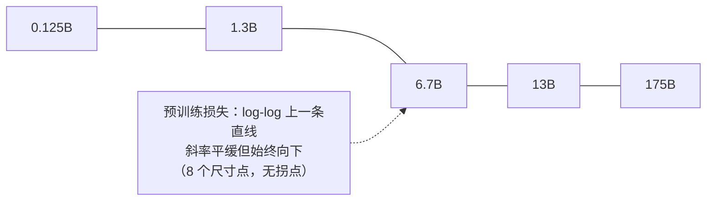
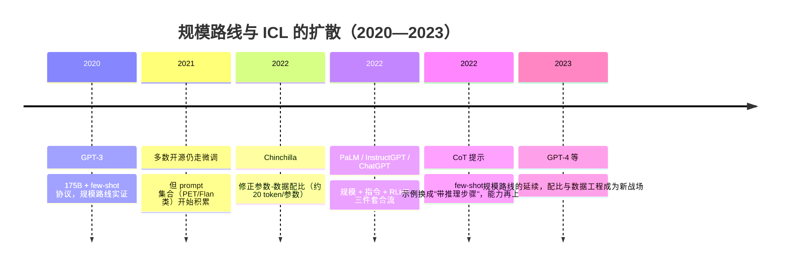

# 06 · GPT-3 精读 —— 规模路线的实证里程碑

> **一句话理解**：把一个"预测下一个词"的模型放大到 1750 亿参数、用约 3000 亿 token 训练，然后在**不做任何梯度更新**的前提下，仅在输入里塞几条示例，它就能做翻译、问答、算术——"少样本学习是规模的副产品"这篇论文给出了第一份系统实证。

[⬆️ 返回总目录](../README.md) · [⬅️ 返回专栏目录](./README.md)

---

## 📌 论文速览

| 项目 | 内容 |
|------|------|
| 论文 | Language Models are Few-Shot Learners |
| 作者/机构 | Brown 等 31 人（OpenAI） |
| 时间 | 2020 年 5 月挂 arXiv；NeurIPS 2020 |
| 链接 | https://arxiv.org/abs/2005.14165 |
| 解决什么 | 不微调的前提下，语言模型能不能靠"看几个例子"学会新任务 |
| 核心机制 | decoder-only 自回归语言模型 + 上下文学习（In-Context Learning, ICL）+ 8 个尺寸的规模化扫描 |
| 关键数字 | 1750 亿参数（此前纪录为 GPT-2 的 15 亿）；few-shot SuperGLUE 71.8 vs 微调 T5-11B 的 89.8；TriviaQA few-shot 71.2；训练算力论文估计约 3.14×10²³ FLOPs |
| 一句话地位 | "大力出奇迹"路线的奠基实证；从此行业的默认问题是"多大算力买多少智能" |

> 读法提醒：本页推导全部自写、图表自绘；数字只引论文与公开榜可查的；对"涌现""智能"等词保持克制——论文自己也没用这些词来宣称完成。

## 🌱 一句话核心思想

**把"预训练 + 每任务微调"（BERT 范式）改成"只预训练 + 提示示例"：模型足够大时，任务说明和示例放进上下文，能力就被"激发"出来，一个权重一动不动地服务所有任务。**

展开半页：BERT 证明了预训练表示可以微调迁移，但每个任务仍要更新梯度。GPT-3 问的问题更激进：**连微调都不做行不行？** 它的做法不是新架构，而是三个"加法"：

1. **参数**：从 GPT-2 的 15 亿到 1750 亿（96 层、模型维度 12288、上下文 2048 token）；
2. **数据**：过滤后的 Common Crawl 为主（约 60% 权重），混 WebText、书籍、维基，加权采样共训约 3000 亿 token；
3. **评测协议**：zero-shot（只有任务说明）/ one-shot（一个示例）/ few-shot（最多几十个示例），全部只进上下文、不进梯度。

与 [05 · BERT 精读](./05-BERT.md) 的对照是本专栏的一条主线：BERT 的 MLM 每步只有 15% 位置有监督信号，GPT 的自回归每步 100%——**规模化时代，训练效率与"训完即生成"的结构优势合流，decoder-only 从此接管主线**。

## 🧠 方法精读

### 0. 记号翻译表

| 论文记号 | 本库记号 | 人话 |
|----------|----------|------|
| $u_i$（第 $i$ 个 token） | $x_i$ | 词片（BPE）序列的元素 |
| $P(u_i \mid u_{i-k}, \dots, u_{i-1}; \Theta)$ | $P(x_i \mid x_{i-k:i-1};\theta)$ | 只看左侧 $k$ 个 token 预测下一个 |
| $\Theta$ | $\theta$ | 模型参数（175B 个） |
| $\mathcal{D}$（数据分布） | $\mathcal{D}$ | 海量文本的分布 |
| $N$ / $D$ / $C$ | 同 | 参数量 / 数据量 / 计算量（scaling 三角） |
| $\mathcal{L}(\mathcal{D})$（论文的训练目标） | $\mathcal{L}_{\mathrm{LM}}$ | 自回归负对数似然 |

### 机制一：自回归似然——1750 亿参数的"接龙"目标

**从链式法则出发**（推导不跳步）：

**第 1 步**：一段文本 $x_{1:n}$ 的概率按联合分布的链式法则可以**无损**分解：

$$
P(x_1, \dots, x_n) = \prod_{i=1}^{n} P(x_i \mid x_1, \dots, x_{i-1})
$$

**第 2 步**：把每个条件交给同一个神经网络 $\theta$（decoder-only Transformer，因果掩码保证看不见未来）：

$$
P_\theta(x_i \mid x_{<i}) = \mathrm{softmax}\big(\mathrm{Transformer}_\theta(x_{<i})\big)_{x_i}
$$

**第 3 步**：训练目标是语料上的平均负对数似然（论文写作 $k$ 步上下文，实现中 $k$ 为 2048）：

$$
\mathcal{L}_{\mathrm{LM}}(\theta) = -\,\mathbb{E}_{x \sim \mathcal{D}}\left[\frac{1}{n}\sum_{i=1}^{n} \log P_\theta(x_i \mid x_{<i})\right]
\;=\; -\,\mathbb{E}\left[\frac{1}{n}\log P_\theta(x_{1:n})\right]
$$

👉 人话：整篇目标就是"接龙接得准"——预测下一个词的对数概率平均起来最大化。没有任务标签、没有奖励、没有人在环；**所有后来涌现的能力，都是把这个单一目标做到极限的副产品**（这是论文最反直觉也最重要的主张）。

**与困惑度（Perplexity）的关系**（常被混淆，顺手推导）：

$$
\mathrm{PPL} = \exp\big(\mathcal{L}_{\mathrm{LM}}\big) = \exp\left(-\frac{1}{n}\sum_i \log P_\theta(x_i \mid x_{<i})\right) = \left(\prod_i P_\theta(x_i \mid x_{<i})\right)^{-1/n}
$$

👉 人话：困惑度 = 每步"真实下一个词"的几何平均概率取倒数——模型每一步相当于在 PPL 个候选里犹豫。损失每降 0.1，PPL 大约乘 $e^{-0.1}\approx 0.90$，**损失上的小数字是 PPL 上的大改善**，这是看 scaling 曲线时的换算直觉。

**与 BERT 的结构对照**（一段收束）：

| | GPT-3（自回归） | BERT（MLM） |
|---|---|---|
| 条件族 | $P(x_i \mid x_{<i})$ | $P(x_i \mid x_{-i})$（全条件） |
| 每步监督信号 | 100% 位置 | ~15% 位置 |
| 输入失配 | 无（训练过程=生成过程） | 12% 输入是 [MASK] |
| 能否直接生成 | ✅ | ✗（迭代填空） |
| 训练-使用同构 | ✅ 完全同构 | ✗（微调换输入分布） |

👉 GPT-3 的全部"用法"（对话、翻译、问答）在数学上都是同一个动作：**把上文喂进去，读下一词分布**。训练与使用零转换——这是它敢在"不微调"协议下测几十个任务的结构性底气。

### 机制二：上下文学习（ICL）——梯度为零的"学习"

**先看一个具体的 few-shot 提示长什么样**（自拟示意，展示论文的评测格式，英译法任务）：

```text
Translate English to French:
cheese => fromage
sea => mer
the cat => le chat
a big table =>
```

模型要做的只是在末尾续写（大概率续出 "une grande table"）。注意三件事：**没有梯度更新；没有任务专门参数；换一批示例（改成"情感分类"）同一个模型立刻改行**。"学习"的全部载体就是上文里那几行示例。

**三种评测协议的形式化**（论文的定义）：

| 协议 | 上下文里有什么 | 梯度更新 |
|------|----------------|----------|
| Zero-shot | 任务自然语言说明（可选）+ 查询 | 无 |
| One-shot | 说明 + 1 个"输入→输出"示例 + 查询 | 无 |
| Few-shot | 说明 + 最多几十个示例 + 查询 | 无 |

**关键的形式化**：把示例与查询拼成一条序列，模型的"答题"就是一个条件概率：

$$
P_\theta\big(y \mid x_1, y_1, \dots, x_K, y_K, x_{\mathrm{query}}\big)
$$

其中 $(x_j, y_j)$ 是第 $j$ 个示例、$K$ 为示例数。**$\theta$ 全程冻结**——"学习"发生在激活值里，不在权重里。

<details>
<summary>🧮 展开推导：ICL 的"答题概率"其实是拼接序列的续写概率（一步代入）</summary>

**命题**：$P_\theta(y \mid x_1, y_1, \dots, x_K, y_K, x_{\mathrm{query}})$ 等于"把全部内容拼成一个长串 $s$ 之后，模型对 $y$ 位置的续写概率"。

**推导**：令 $s = x_1 \circ y_1 \circ \cdots \circ x_K \circ y_K \circ x_{\mathrm{query}}$（$\circ$ 为 token 序列拼接，实现里用分隔符隔开）。自回归模型的定义给出

$$
P_\theta(s \circ y) = P_\theta(s)\cdot P_\theta(y \mid s) \quad\Longrightarrow\quad P_\theta(y \mid s) = \frac{P_\theta(s \circ y)}{P_\theta(s)}
$$

👉 人话：**"看示例学任务"在数学上就是"条件于长上下文的续写"**——没有任何新机制，同一个接龙目标，换个上文就换个任务。这一恒等式是理解 ICL 的钥匙：为什么示例格式、顺序、分隔符都会改变表现？因为它们改变了条件 $s$，而 $P_\theta(\cdot\mid s)$ 对 $s$ 敏感是自然的。论文也实测了示例顺序随机化的影响（不同顺序的表现方差不小），这是 ICL"不稳定性"的最早记录之一。

**再往前半步（任务隐变量视角）**：把"任务"想象成隐变量 $z$（"这是英译法""这是情感分类"），示例是 $z$ 的证据：

$$
P_\theta(y \mid \text{demos}, x) = \sum_z P_\theta(y \mid z, x)\, P_\theta(z \mid \text{demos})
$$

👉 人话：few-shot 示例的作用是让模型在**前向传播内推断"现在在做什么任务"**，推断越准答题越像样——模型参数里预先得存着"任务的条件分布"才行，这解释了为什么 ICL 能力随规模增长（小模型里 $P_\theta(z|\text{demos})$ 推不准）。这是论文 meta-learning 框架的本意；注意这是解释性视角，不是论文证明的定理。

</details>

**一个必答的质疑：这是"学习"还是"检索"？** 如果 few-shot 提升只是因为模型"认出了示例是训练时见过的题"，那 few-shot learning 就是数据污染的马甲。论文用两类证据回应：一是在训练时做了去污（见机制四），二是 few-shot 的提升遍布几十个任务、且 one→few-shot 的增益随规模系统增大。但**这个质疑从未被彻底关闭**——它成了后续三年 ICL 研究的第一驱动问题（见"影响与争议"）。

**上下文的预算账**：few-shot 的示例全部挤在 2048 token 的窗口里——

$$
K \le \left\lfloor \frac{2048 - \ell_{\text{说明}} - \ell_{\text{查询}}}{\ell_{\text{单个示例}}} \right\rceil \approx \text{几十到上百条（短任务）/ 个位数（长任务）}
$$

👉 人话：示例越长能塞的越少——翻译类短任务能塞几十条，摘要类长任务塞几条就满。**few-shot 的"K"天生被上下文长度锁死**，这是后来"长上下文军备竞赛"最直接的动机之一：窗口越长，"现场教学"的容量越大。

<details>
<summary>📊 展开算例：同一个任务的四种提示，读出 ICL 的三个敏感点</summary>

**任务**：判断单词是否与其解释匹配（论文的 Word in Context/Synonym 类任务的示意版）。

| 提示变体 | 形式 | 预期表现 |
|----------|------|----------|
| A. zero-shot 无示例 | "这个词和解释匹配吗？词：bank，解释：河岸。答是/否" | 格式不确定，模型可能续写解释而非答"是/否" |
| B. zero-shot 有格式说明 | 同上 + "只回答 是 或 否" | 格式稳定，准确率一般 |
| C. few-shot 4 条 | 前面放 4 条"词/解释/答案"完整示例 | 通常最好：格式与任务都被锚定 |
| D. C 的示例打乱顺序 | 同 C，示例顺序重排 | 表现有波动（论文实测顺序方差不小） |

**三个敏感点**：① **格式锚定**——示例最大的作用常常是"告诉模型输出长什么样"，纯格式收益可能被误记为"学习能力"；② **顺序敏感**——$P_\theta(y\mid s)$ 对 $s$ 敏感的直接体现；③ **示例质量**——错示例会系统性带偏（后续 ICL 研究的大量篇幅都在拆这几股贡献）。

👉 读论文 few-shot 表格时，先问一句："与 zero-shot 的差距里，有多少只是格式对齐收益？"——论文自己没有拆干净这一项，这是引用其 few-shot 数字时的标准谨慎。

</details>

### 机制三：Scaling 曲线——幂律与"没有平台期"

GPT-3 的第二个科学贡献不是"最大"，而是**系统**：同一配方训了 8 个尺寸（约 1.25 亿到 1750 亿参数），让"规模-能力"第一次有了可读的曲线。

**幂律形式**（继承自 Kaplan 等《Scaling Laws for Neural Language Models》，arXiv 2001.08361）：

$$
\mathcal{L}(N) \approx \left(\frac{N_c}{N}\right)^{\alpha_N}
$$

其中 $N$ 为参数量、$N_c$ 与 $\alpha_N > 0$ 为拟合常数。

**推导：为什么"log-log 图上是直线"**。两边取对数：

$$
\log \mathcal{L} = \alpha_N \log N_c - \alpha_N \log N
$$

👉 人话：把"损失"和"参数量"都取对数画出来，幂律就是一条**斜率为负的直线**——GPT-3 的 8 个模型点在预训练损失上近似排成这样一条直线，横跨三个数量级以上的参数范围、没有出现"练不动了"的弯折。**直线没有拐点 = 外推有据 = 接着放大预算**，这是 OpenAI 后续路线的决策依据，也是这篇论文"值钱"的核心图表（此处自绘示意，不搬运原图）：



<details>
<summary>🧮 深潜：直线外推的三种危险读法（ scaling 曲线的使用说明书）</summary>

幂律直线是**经验拟合**，不是定律。三种典型误用：

1. **跨区间外推**：8 个尺寸（到 175B）上拟合的 $\alpha_N$，外推到 10 倍之外没有保证——损耗曲线在多 epoch、数据受限时会出现"数据墙"（同一份数据重复看会失效），Kaplan 系曲线与后续研究都明确过这一点；
2. **把预训练损失当能力**：损失衡量"接龙接得准"，任务能力（准确率、win-rate）是另一个映射——损失平滑下降不保证能力平滑上升，"涌现之争"正是这个映射不连续性的争论；
3. **忽略"损失地板"**：真实文本本身有歧义与噪声（同一个上文有多种合理续写），损失存在不可约下界，幂律最终必然触底变平——只是"在哪个量级触底"当时无人知道。

👉 人话：scaling 曲线是一张**有边界的地图**——GPT-3 的贡献是画出了三个数量级内的直线，不是证明了直线通向无穷。

</details>

**Scaling 三角与 Chinchilla 修正**：损失同时由 $N$（参数）、$D$（数据）、$C$（算力，$C \approx 6ND$ 的经验式）决定。GPT-3 的配比 $D/N \approx 300\text{B}/175\text{B} \approx 1.7$ token/参数——**参数给得多、数据给得少**。两年后 Chinchilla（Hoffmann 等，arXiv 2203.15556）推导出固定算力下的最优配比约为 **20 token/参数**，并用 70B 参数 + 1.4T token 训练的模型在一系列任务上超过 280B 的 Gopher——**不是推翻 GPT-3 的"规模有效"，而是修正"规模的分配方式"**：同样的钱，参数和数据要按平方根同步涨。

<details>
<summary>🧮 展开算例：GPT-3 配比在 Chinchilla 框架下的账</summary>

**Chinchilla 结论**（对数坐标下的等腰约束优化，直觉版）：固定算力 $C \approx 6ND$，最优解满足 $D/N \approx 20$。

**GPT-3 的账**：$N = 175\text{B}$，$D \approx 300\text{B}$ token，$D/N \approx 1.7$——若按 20 的配比，175B 参数"应该"配 3.5T token（当时的十倍以上），或者同样的 300B token 只"值得"配约 15B 参数。

**两种读法**：

1. **批评读法**：GPT-3 是"参数冗余"的——Chinchilla 用 70B 就打赢了更大参数的模型；
2. **辩护读法**：GPT-3 的目标函数不只是"同算力损失最低"，还包括**推理成本与少样本能力**——参数是能力的容器，一次性多买参数、摊薄到每次推理的长期成本未必亏（后来的推理时代更倾向大参数 + 少训练 token 的"过训"路线，是这比账的新版本）。

👉 人话：**Chinchilla 修正的是"训练预算怎么花"，没有否定"规模出能力"**——把这两篇读成对立是社区流行但失准的叙事。

</details>

### 机制四：数据与去污——300B token 怎么来的

**配比**（论文报告）：过滤后 Common Crawl（约 60% 权重）+ WebText2 + Books1 + Books2 + 维基百科；各源按权重采样，**高质量源实际会被重复看到多次**，总训练量约 3000 亿 token。

**去污协议**：对每个评测集，在训练数据里做 **13-gram 重叠匹配**（测试样本与其训练近邻的高频 13 元组重叠超过阈值则剔除该训练文档），并对若干数据集做了"污染前后版本"的对照分析。

👉 人话：13-gram 是个**工程折中**——n 太小会误杀正常语料（常见短语谁都有），n 太大漏检改写式泄漏。论文承认部分任务存在污染影响、并报告了"清洗版"成绩；后续研究（如 Basu 等 2021，arXiv 2108.06632）指出该协议对"语义相同、字面不同"的泄漏基本无感，**GPT-3 的部分评测优势可能被污染放大**——这是这篇论文至今洗不掉的问号。

### 两种范式的经济学：BERT 微调 vs GPT-3 提示

| 维度 | BERT 范式（预训练 + 每任务微调） | GPT-3 范式（预训练 + 提示/示例） |
|------|----------------------------------|----------------------------------|
| 任务适配成本 | 每任务一次梯度训练（小时级 + 标注数据） | 每任务写一段上文（分钟级，无需标注集） |
| 参数怎么变 | 每任务一套权重副本 | 一套权重服务所有任务 |
| 上限 | 有标注即上限抬升明显 | 受限于模型已会的内容 |
| 错配成本 | 输入分布失配（预训练有 [MASK]，下游没有） | 无失配：训练=使用，接龙接到底 |
| 灾难性遗忘 | 存在（每任务微调互相干扰） | 结构性不存在（权重冻结） |
| 服务形态 | 每任务部署一个小模型 | 一个大模型 + 一条 API |

👉 人话：GPT-3 用"推理时多算"（每次请求都带上示例重新前向）换"训练时不算"（不再微调）。这笔账在算力便宜、任务多变的场景里占优——**云 API 按上下文计费的商业模式，在这张表里已经能看出雏形**。同时注意，两范式并非替代：GPT-3 自己的对照（71.8 vs 89.8）表明有标注、值得微调的任务，梯度更新仍占上风——今天"先提示、榨干再微调"的阶梯（见[微调与对齐](../docs/4-专业方向/07-自然语言处理与LLM/05-微调与对齐.md)的决策表）就是这两篇论文合读的结论。

另注一笔"隐性成本"：上下文学习把任务适配成本从训练期搬到了**每次推理**——示例越长、请求越贵，且所有示例都要重复传输与计算。后来"把示例固化进权重"（指令微调）与"把知识搬出上下文"（RAG）两条路线，本质上都是在替这笔推理账做优化（见 [RAG 与 Agent](../docs/4-专业方向/07-自然语言处理与LLM/06-RAG与Agent.md)）。

## 📊 实验解读

### 证明了什么（数字均为论文表格可查）

| 维度 | 结果 | 读法 |
|------|------|------|
| 知识型闭卷问答 | TriviaQA few-shot 71.2，超过当时的闭卷微调基线 | "参数里装知识"的极致展示 |
| 综合理解 | SuperGLUE few-shot 71.8，**仍低于微调 T5-11B 的 89.8** | 论文如实呈现"无梯度 vs 有梯度"的差距 |
| 少样本增益 | 一批任务上 few-shot 显著优于 zero-shot，且**差距随模型尺寸拉大** | ICL 是规模的函数，不是免费存在于任何尺寸 |
| 平滑性 | 预训练损失随 N 幂律平滑下降，8 个尺寸无拐点 | 外推"更大还会更好"的经验依据 |
| 即兴任务 | 新词造句、单词反解、三位数加法等 few-shot 可用 | 任务从未专门训练，却能"照猫画虎" |

三条"范式级"的证明：

1. **"不微调也能做任务"成立**：在足够规模上，纯提示/示例协议从"玩具"变成"可用"——此后提示工程（Prompt Engineering）成为一类正经技能，任务适配从"改权重"迁移到"改上文"；
2. **能力-规模的第一张系统地图**：8 尺寸扫描 + 平滑幂律，把"要不要更大"从信仰问题变成曲线问题；
3. **one API, all tasks 的商业形态**：一个冻结模型服务所有任务，微调管线可以整个跳过——这是后来 LLM API 产品形态的原型实验。

**把 headline 数字放回上下文**：71.8 vs 89.8 不是"GPT-3 不行"也不是"微调已死"，而是**两种适配范式的定量定位**——无梯度路线当时大约抵得上有梯度路线的八成，且这八成**零边际训练成本、即开即用**。工程含义直白：任务值得专门优化吗？不值得就提示，值得再微调。

### 没证明什么（同等重要）

- **没有证明"涌现"这个词的含义**。论文展示了"规模带来新能力"的现象，但"能力突然出现"的度量学争论（涌现是真实相变还是指标不连续的伪影）要到 2022-2023 年才正面开打（arXiv 2206.07682 vs 2310.06825）——**别把 GPT-3 论文读成"涌现已被证明"**。
- **没有证明 few-shot 是"学会"而非"匹配"**：示例可能只是把模型"引导到训练时见过的相近任务"上；机制层面的解释（ICL≈隐式梯度/贝叶斯任务推断）都是后继工作。
- **没有证明规模能解决所有任务**：论文自己列出失败项——阅读理解类（如 RACE 与微调基线差距大）、一些"字符串操作"类任务 few-shot 仍差；算术能力到三位数加法也明显衰减。
- **没有对齐、没有安全评估**：GPT-3 论文没有人类偏好环节——"会答题"与"好好答题"之间的鸿沟由 [07 · InstructGPT 精读](./07-InstructGPT.md) 补上；
- **可复现性受限**：权重不开放，学术界的"复现"长期只能引用 API 或改训开源复刻，这类超大实验本质上是"单点证词"。

<details>
<summary>📊 查表防坑：引用 GPT-3 数字前先过的四个问题</summary>

1. **协议对齐了吗？** zero/one/few-shot 三档成绩差距常常很大（部分任务 few-shot 比 zero-shot 高一二十分），引用时必须带协议名；
2. **对手是谁？** 71.8 的 SuperGLUE 是对**微调过的** T5-11B（89.8），不是对同样"无梯度"的基线——换基线，叙事方向反转；
3. **污染对照给了吗？** 论文对部分任务提供"清洗版"数字；引用原始版等于默认污染影响为零；
4. **K 是多少、窗口满了吗？** few-shot 的 K 从 0 到几十不等，短任务塞满与长任务只塞两三条，难度完全不同。

👉 人话：GPT-3 的实验章节是"评测协议教科书"，也是"引用事故高发区"——四个问题都过一遍，数字才算"公开可查"地用对了。

</details>

### 消融怎么读（这篇论文的"消融"就是扫描）

GPT-3 没有传统意义的模块消融，它的对照组是**三个维度的扫描**：

1. **尺寸扫描**（8 个模型）：看"能力是否只在大尺寸出现"——少数任务上小模型 few-shot 接近随机，175B 才显著起来，这类点就是"涌现叙事"的原始素材；
2. **示例数扫描**（K=0/1/多）：one→few 的增益曲线随尺寸变陡，是"ICL 是规模函数"的直接证据；
3. **顺序随机化**（同一批示例打乱顺序）：表现有明显方差——ICL 的脆弱性内生于"它只是条件概率"这一本质。

👉 读法示范：看到"175B 会做 X 而 13B 不会"的表格时，先问三件事——X 的指标是否连续（离散指标会制造"突变"假象）？样本量多大（尾部任务的置信区间常很宽）？有无污染对照？三问过后，"涌现"常常缩水成"平滑增长 + 不连续指标"。

## 🔁 后世影响与争议

### 谁站在它肩上



- **提示工程与思维链**：ICL 的直接延伸——把示例换成带中间步骤的推理样例（Chain-of-Thought，arXiv 2201.11903），"模型会推理"的第一波强证据建立在 GPT-3 的 few-shot 协议之上；
- **指令微调与对齐**：Flan（arXiv 2109.01652）证明"把很多任务写成指令再微调"能强化 ICL；InstructGPT（[07 精读](./07-InstructGPT.md)）把"听懂指令"与"答得让人满意"再分两步补完；
- **Scaling 科学**：Chinchilla（2203.15556）及后续的配比研究、涌现度量之争（2206.07682 / 2310.06825），全部以 GPT-3 的尺寸扫描为参照系；
- **产业形态**：API 产品、按 token 计费、上下文窗口军备竞赛——起点都是"一个冻结模型 + 一条上下文"。值得一提的是商业与科学的互锁：API 收入养更大模型、更大模型产生更强结果，这套循环从 GPT-3 的产品化（2020 年 API 上线）开始转动，也种下了"单点证词"的信任争议（见下）。

### 争议与反思

1. **数据污染**：13-gram 去污的松紧之争持续至今（2108.06632 等指出低估），部分 benchmark 成绩的可信度打折；后来的大模型论文普遍给出更细的污染分析——**GPT-3 用自己的教训推动了整个领域的评测卫生**；
2. **算力集中与单点证词**：3×10²³ FLOPs 量级的实验只有极少数机构做得起，且权重不开放——"科学结论"与"企业证词"的边界从此成为 AI 研究的常态化紧张点；
3. **规模是不是智能的全部**：《随机鹦鹉》（arXiv 2104.08758）代表的一脉批评：大模型是文本分布的优秀补全器，不等于理解与意义；GPT-3 论文本身没做这个哲学声明，但它的标题"Language Models are Few-Shot Learners"确实被双方反复引用；
4. **Chinchilla 修正与"过训"回摆**：20 token/参数成为 2022-2023 的标准配比；而 2024 年后的推理时代，为压低推理成本，行业又转向"小参数 + 多 token"的过训方向——**配比的最优解随目标（损失/能力/成本）移动，没有永恒答案**；
5. **few-shot 的机制至今未定论**：ICL≈贝叶斯推断、≈隐式梯度（如 arXiv 2212.10559 的"Transformer 前向即梯度下降"分析）等解释并存——GPT-3 造出的这个现象，本身成了一个新的研究领域。

## 🔗 在本库中的位置

- **正文对照**：[大语言模型 LLM 全景](../docs/4-专业方向/07-自然语言处理与LLM/04-大语言模型LLM全景.md)——本篇是其"Scaling Law + 上下文学习"两大支柱的原始文献；
- **上游**：[Transformer 架构细节与变体](../docs/4-专业方向/07-自然语言处理与LLM/03-Transformer架构细节与变体.md)（decoder-only 骨架）、[05 · BERT 精读](./05-BERT.md)（微调范式的对照组）；
- **下游**：[微调与对齐](../docs/4-专业方向/07-自然语言处理与LLM/05-微调与对齐.md)、[07 · InstructGPT 精读](./07-InstructGPT.md)（把"会接话"变成"听指挥"）；scaling 的工程账见[大规模训练工程](../docs/3-深度学习/04-深度学习基础/06-进阶专题-大规模训练工程.md)。

本篇与前后两篇精读构成一条完整的问题链——**"能力从哪来 → 听不听话 → 怎么答得让人满意"**：


## 📝 小结与自测

**要点回顾**

- 目标：单一自回归似然（链式法则分解 + softmax 读出），训练与生成/使用完全同构，这是"不微调"协议的结构基础；
- ICL 的数学身份：拼接序列的条件续写概率 $P_\theta(y\mid s)$，示例、格式、顺序都是条件 $s$ 的一部分——顺序与格式的敏感不是 bug，是这个身份的推论；
- 少样本增益随规模拉大；预训练损失随参数幂律平滑下降（log-log 直线），外推支撑规模路线，但直线是经验拟合、跨区间外推无保证；
- 关键数字：175B / 约 300B token；few-shot SuperGLUE 71.8 对微调 T5-11B 的 89.8；TriviaQA few-shot 71.2；
- Chinchilla 修正配比（约 20 token/参数），修正的是预算分配而非"规模有效"本身；污染检测（13-gram）偏松是长期争议。

<details>
<summary>🖱️ 自测 1：为什么说 ICL"没有免费午餐"——示例顺序为什么会改变结果？</summary>

因为 few-shot 答题概率就是条件概率 $P_\theta(y \mid s)$，而示例顺序改变了条件 $s$：对同一个模型，不同顺序的上文会把注意力引向不同的位置、诱发不同的"任务解读"。这不是 bug，而是"ICL = 条件续写"这个数学身份的自然推论——任何对 $s$ 的敏感（格式、分隔符、示例数）都从同一条恒等式出发。

</details>

<details>
<summary>🖱️ 自测 2：GPT-3 的 few-shot 在 SuperGLUE（71.8）输给微调 T5-11B（89.8）近 18 分，为什么它仍是里程碑？</summary>

因为它比较的两边预算完全不对等：T5-11B 是"预训练 + 每任务全量梯度微调"，GPT-3 是"零梯度、纯上下文"。里程碑在于把"无梯度路线"从几乎不可用抬到"与微调模型同台竞技、部分任务反超"——它开启的不是"打败微调"，而是"任务适配的新自由度"：从此工程上多了一个"先提示、后微调"的决策阶梯。

</details>

<details>
<summary>🖱️ 自测 3："损失每降 0.1，PPL 约乘 0.9"——一个 175B 与 13B 模型损失差 0.05，PPL 差多少？</summary>

$e^{-0.05} \approx 0.95$，即大模型 PPL 约低 5%。scaling 曲线在损失轴上看着"只降一点点"，换到 PPL（每步等效候选数）轴上就是实打实的确定性提升——这是"小损失=大能力"的换算直觉，也是为什么预训练团队盯住 0.01 级损失差异。

</details>

<details>
<summary>🖱️ 自测 4：有人说"GPT-3 证明了涌现能力"。哪里过头了？</summary>

GPT-3 论文展示的是"随规模出现的新任务能力"现象记录（部分任务小尺寸近随机、大尺寸显著），既没有用"涌现"宣称完成机制解释，也没有排除指标不连续、污染、任务分布重叠等平凡解释。涌现的度量学争论（2206.07682 提出涌现、2310.06825 论证换连续指标后部分"涌现"平滑化）都在其后。**准确的说法：GPT-3 提供了"规模带来新行为"的系统观察，机制与度量之争留给了后继。**

</details>

## 📚 延伸阅读（均为真实 arXiv）

- 原论文：Language Models are Few-Shot Learners（2020，https://arxiv.org/abs/2005.14165）
- Scaling Laws for Neural Language Models（2020，https://arxiv.org/abs/2001.08361）——幂律的出处
- Training Compute-Optimal Large Language Models（Chinchilla，2022，https://arxiv.org/abs/2203.15556）——配比修正
- Chain-of-Thought Prompting Elicits Reasoning in Large Language Models（2022，https://arxiv.org/abs/2201.11903）
- Emergent Abilities of Large Language Models（2022，https://arxiv.org/abs/2206.07682）与 Are Emergent Abilities of Large Language Models a Mirage?（2023，https://arxiv.org/abs/2310.06825）——涌现之争正反双方
- On the Dangers of Stochastic Parrots（2021，https://arxiv.org/abs/2104.08758）——规模路线的批评檄文
- Minding Language Models' Data (or Lack Thereof)（2021，https://arxiv.org/abs/2108.06632）——污染检测的批评
- Transformers Learn In-Context Gradient Descent（2022，https://arxiv.org/abs/2212.10559）——ICL 机制的一种解释
- Multitask Prompted Training (Flan)（2021，https://arxiv.org/abs/2109.01652）——指令微调强化 ICL

---

[⬅️ 上一页：05 · BERT 精读](./05-BERT.md) · [返回专栏目录](./README.md) · [下一页：07 · InstructGPT 精读 ➡️](./07-InstructGPT.md)
