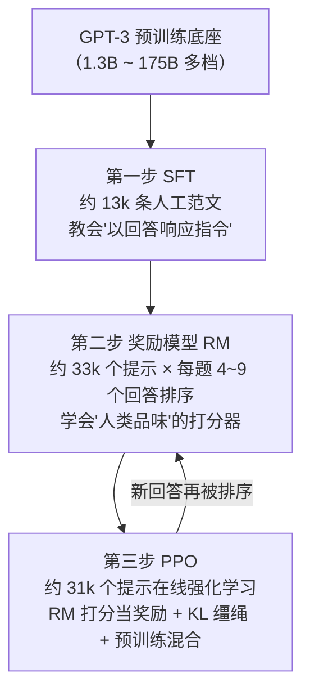
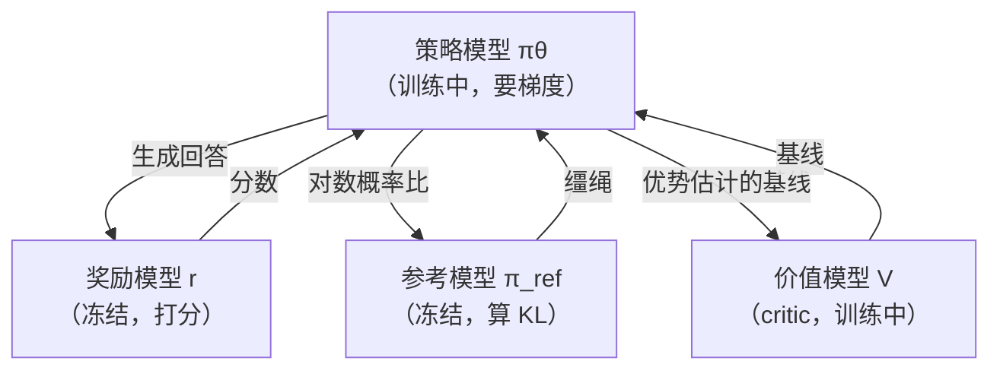
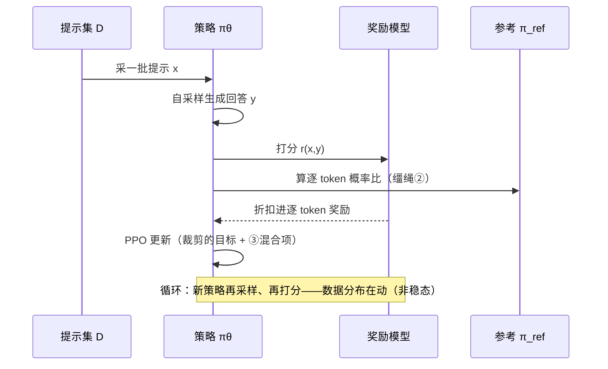
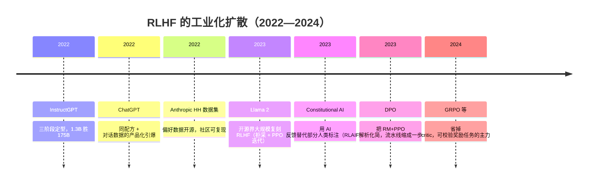

# 07 · InstructGPT 精读 —— RLHF 的工业化起点

> **一句话理解**：GPT-3 会接话不会好好回答——InstructGPT 用三步流水线（SFT 范文 → 奖励模型学品味 → PPO 带缰绳优化）把它调成"听指挥的助手"，并且证明了一件反直觉的事：**13 亿参数的对齐模型，比 1750 亿的裸 GPT-3 更招人类喜欢**。

[⬆️ 返回总目录](../README.md) · [⬅️ 返回专栏目录](./README.md)

---

## 📌 论文速览

| 项目 | 内容 |
|------|------|
| 论文 | Training language models to follow instructions with human feedback |
| 作者/机构 | Ouyang 等 20+ 人（OpenAI） |
| 时间 | 2022 年 3 月挂 arXiv；NeurIPS 2022 |
| 链接 | https://arxiv.org/abs/2203.02155 |
| 解决什么 | 预训练模型"会续写不会回答"；且"答得好"没有可自动化的损失函数 |
| 核心机制 | 三阶段流水线：监督微调（SFT）→ Bradley-Terry 奖励模型（RM）→ 带 KL 惩罚与预训练混合项的 PPO |
| 关键数字 | 1.3B InstructGPT 输出在人类偏好评估中胜过 175B GPT-3；标注数据约 13k（SFT）/ 33k（RM）/ 31k（PPO）条 |
| 一句话地位 | RLHF 三阶段的定型文献；ChatGPT 与此后一切"对齐后"助手的直系祖先 |

> 读法提醒：本页给出**论文级完整目标函数**（正文 [微调与对齐](../docs/4-专业方向/07-自然语言处理与LLM/05-微调与对齐.md) 是直觉版，本页补齐推导与每项的来历）；推导自写、图表自绘、数字只引论文可查的。

## 🌱 一句话核心思想

**"好好回答"没法写成损失函数，但"哪个回答更好"人类答得出来——把人类的比较变成可微分的信号，再用强化学习把这个信号优化到底，同时用 KL 缰绳防止模型跑疯。**

展开半页：GPT-3（[06 精读](./06-GPT-3.md)）证明了规模买来能力，但直接对它说"帮我写周报"，它多半续写一篇《周报百科》。缺的不是知识而是三样东西：**听懂指令的格式**（什么算"回答"）、**人类的品味**（怎样的回答算好）、**不跑偏的约束**（别为讨好打分器把话变成胡话）。InstructGPT 的三步恰好各管一样：



注意一个贯穿全文的关键点：**每一步的数据都不大**（万级），相对于 175B 的参数量几乎是零头——"对齐主要教格式与品味，知识几乎都在预训练里"，这个判断（后来被 LIMA 的"表面对齐假说"进一步发挥）是整条流水线成立的前提。

## 🧠 方法精读

### 0. 记号翻译表

| 论文记号 | 本库记号 | 人话 |
|----------|----------|------|
| $\pi_\theta$ / $\pi^{RL}_\theta$ | $\pi_\theta$ | 正在优化的策略（语言模型） |
| $\pi^{SFT}$ | $\pi_{\mathrm{ref}}$ | 参考模型：SFT 完成后冻结的那份，KL 缰绳的锚点 |
| $r_\theta(x, y)$（RM 分数） | $r(x,y)$ | 奖励模型对"提示 $x$ 配回答 $y$"打的分 |
| $y_w$ / $y_l$（论文排序里的优劣对） | $y_w \succ y_l$ | 同一问题下人类判定更好/更差的两个回答 |
| $\beta$（KL 惩罚系数） | $\beta$ | 缰绳松紧：偏离参考模型每 nat 付出多少奖励 |
| $\gamma$（预训练混合系数） | $\gamma$ | 对齐税的补贴：混进多少普通语言建模损失 |
| $D_{\pi_\phi}$（策略数据分布） | 在线采样分布 | 模型自己生成的（提示， 回答）对 |

### 机制一：SFT——把"接龙机器"教会"答题"

SFT 的损失与 GPT-3 预训练**同型**，只是数据换成了人工范文（标注员对真实用户提示写出高质量回答，约 13k 条）：

$$
\mathcal{L}_{\mathrm{SFT}}(\theta) = -\,\mathbb{E}_{(x, y^*) \sim \mathcal{D}_{\mathrm{demo}}}\left[ \sum_{t} \log P_\theta\big(y^*_t \mid x, y^*_{<t}\big) \right]
$$

👉 人话：把"问题 + 人工优质回答"拼成一段文本，只对回答部分算"接龙损失"（teacher forcing，逐词最大似然）——和预训练一模一样的机制，只是上文从互联网文本换成了"指令 → 回答"。**没有任何新数学**，全部魔力在数据形态。

论文的两个训练细节值得记（都是消融可查的）：

- **训 16 个 epoch，但验证损失 1 个 epoch 后就过拟合**——然而继续训，人类偏好评分仍在上**升**。👉 "验证损失最优"与"人评最优"在 SFT 里是错位的，对齐时代开始不能再只盯 loss 曲线；
- RM 初始化自 SFT 模型而非裸预训练模型——**打分器要懂"回答的分布"才能细辨好坏**（从预训练初始化的 RM 在 RLHF 里效率更低，论文有对照）。

<details>
<summary>📊 展开算例：一条 SFT 范文与一条偏好排序，看清两阶段数据长什么样</summary>

**SFT 范文（示意格式，构造以展示形态）**：

```text
### 指令：把这段话改成更礼貌的版本：把报告发我。
### 回答：麻烦你方便的时候把报告发我一下，谢谢！
```

损失只对"回答"部分的每个 token 计算——模型学的是"在指令上文下，优质回答的接龙概率"。

**偏好排序（同一提示采 4 个回答，标注员排序）**：

| 名次 | 回答（示意） | 蕴含的偏好对 |
|------|--------------|--------------|
| 1 | 直接给出改写，并附一句使用建议 | (1,2) (1,3) (1,4) |
| 2 | 给出改写，但先铺垫两段客套 | (2,3) (2,4) |
| 3 | 反问"你想要多礼貌？" | (3,4) |
| 4 | 续写了一段关于礼貌的说明文 | — |

一条标注 = C(4,2) = 6 个偏好对；RM 损失对这 6 对分别施加"1 应高于 2/3/4"的软约束。

**读数**：注意名次 3 与 4 的差距——"反问澄清"与"答非所问续写"是两种不同的失败，但 BT 只记录"3 好于 4"这个序。👉 偏好数据天然**丢失失败原因的结构**，RM 只能学到"哪种更讨喜"的聚合，学不到"为什么"——这是后续偏好数据要拆单维度（事实性/礼貌/长度分开比较）的根源。

</details>

### 机制二：奖励模型——把"人类比较"变成"可微分的分数"

**第一步：人类给的是"排序"，不是"分数"。** 标注员对同一提示的 $K$ 个回答（$K = 4 \sim 9$）排出好坏。为什么不给绝对分？因为**绝对尺度没有共识**（"这个 7 分还是 8 分"人人不同），而**两两比较相对稳定**——这是数据设计层面对人类认知偏差的规避。

**第二步：Bradley-Terry 模型——偏好概率只用"分数差"解释。** 公设：

$$
P(y_w \succ y_l \mid x) = \sigma\big(r(x, y_w) - r(x, y_l)\big), \qquad \sigma(z) = \frac{1}{1 + e^{-z}}
$$

👉 人话：RM 分数差每拉大 1 分，人类选前者的概率过一道 sigmoid——分数本身没有单位意义，**只有差值参与概率**（尺度自由：给所有分数同时 +10，偏好概率不变）。

**第三步：极大似然得到排序损失。** 对观察到的偏好对 $(x, y_w, y_l)$，负对数似然：

$$
\mathcal{L}_{\mathrm{RM}}(\theta) = -\,\mathbb{E}_{(x, y_w, y_l)}\left[ \log \sigma\big(r(x, y_w) - r(x, y_l)\big) \right]
$$

<details>
<summary>🧮 展开推导：从"排序数据"到"成对损失"（不跳步），以及 C(K,2) 的账</summary>

**第 1 步：一条排序如何变成偏好对。** 标注员给出 4 个回答的排序 $y_{(1)} \succ y_{(2)} \succ y_{(3)} \succ y_{(4)}$（下标括号为名次）。这个全序蕴含全部成对关系：$(1,2), (1,3), (1,4), (2,3), (2,4), (3,4)$，共

$$
\binom{K}{2} = \frac{K(K-1)}{2}
$$

👉 $K=4$ 时 6 对、$K=9$ 时 36 对——**一次标注的边际收益随 $K$ 平方增长**（多标一个回答，多出 $K-1$ 个偏好对），这是论文把 $K$ 从 4 提到 9 的经济动机（同时也增加标注负担与出错面）。

**第 2 步：成对似然相乘。** 假设给定 RM 分数后各偏好对条件独立（标准 BT 假设），一条排序样本的似然 = 全部成对概率之积；取负对数并线性拆开 $\log$，得到逐对求和的形式——即正文损失式的期望版。**一次排序不是一次监督，而是 C(K,2) 次监督**。

**第 3 步：梯度长什么样（为什么这个损失"懂差值"）。** 对一对样本记 $\Delta r = r(x,y_w) - r(x,y_l)$，则

$$
\frac{\partial \mathcal{L}}{\partial \Delta r} = -\,\frac{\sigma'(\Delta r)}{\sigma(\Delta r)} = -\big(1 - \sigma(\Delta r)\big)
$$

（用到 $\sigma'(z) = \sigma(z)(1-\sigma(z))$。）

👉 人话：当 RM 已经把好回答排得很高（$\sigma(\Delta r) \to 1$），梯度趋零——**学会了的对子自动静音**；分不清时（$\Delta r \approx 0$，$\sigma = 0.5$）梯度最大——**火力集中在"人类能分辨而 RM 还分不出"的边界上**。这是成对损失比回归绝对分更高效的数学根源。

**第 4 步：归一化技巧（工程细节，但常被复现者漏掉）。** 论文对同一提示内的分数差做了标准化/缩放处理，防止 RM 分数尺度在训练中漂移、把 PPO 的奖励尺度带飞——**RM 输出的是"相对差"，不是有单位的"质量分"**。

</details>

**RM 的天花板，论文自己量过**：RM 在留出标注者上的偏好预测一致率约 **69.6%**，而标注者彼此的一致率约 **72.6%~77.3%**——RM 几乎贴着人类共识的内部上限。👉 读法：这不是"RM 不准"，而是**人类偏好本身只有约七成一致率**，RM 学到的是这个有噪分布的主要结构——同时意味着"把 RM 优化到极限"必然开始拟合噪声（reward hacking 的统计学根源，[08 · DPO 精读](./08-DPO.md)与正文深潜再展开）。

### 机制三：PPO 完整目标——论文级公式逐项拆解

**论文的完整目标函数**（本库记号重写）：

$$
\operatorname{objective}(\theta)
= \mathbb{E}_{(x, y) \sim D_{\pi_\theta}}
\Big[ \underbrace{r(x, y)}_{\text{① RM 打分}}
\;-\; \underbrace{\beta \,\log\frac{\pi_\theta(y \mid x)}{\pi_{\mathrm{ref}}(y \mid x)}}_{\text{② KL 缰绳}} \Big]
\;+\; \underbrace{\gamma\, \mathbb{E}_{x \sim D_{\mathrm{pretrain}}} \big[\log \pi_\theta(x)\big]}_{\text{③ 预训练混合}}
$$

👉 人话：**让模型自己生成的回答拿 RM 高分（①），但与 SFT 参考模型的偏差按概率比指数扣分（②），同时掺一部分普通语言建模防止"对齐税"伤及基本能力（③）**。逐项拆开：

**① 奖励项**：期望是对**模型自己采样的** $(x,y)$ 取的——这是"在线"的全部含义：策略在训练中不断生成新回答、被 RM 打分、再更新。RM 的分数不是地面真值，只是"人类品味的代理"。

**② KL 缰绳**：与参考模型（SFT 那份，冻结）的逐 token 概率比取对数加权。它防两件事——reward hacking（钻 RM 漏洞的怪话，因为怪话在 $\pi_{\mathrm{ref}}$ 下概率极低、KL 惩罚指数级重）与语言能力崩坏（预训练的流畅性住在 $\pi_{\mathrm{ref}}$ 里，离开它就要扣分）。**实现细节**：论文把这项 KL 折叠进**逐 token 奖励**（每个 token 的即时奖励 = RM 终分折算 − β×该 token 的对数概率比），而非只在整句层面惩罚——这样 PPO 的优势估计天然带上缰绳，信用分配更细。

<details>
<summary>🧮 展开推导：整句惩罚 ↔ 逐 token 折叠为什么等价（一步分解）</summary>

整句 KL 按链式法则可以拆成逐 token 之和（这是语言模型特有的可分解性）：

$$
\log\frac{\pi_\theta(y \mid x)}{\pi_{\mathrm{ref}}(y \mid x)}
= \sum_{t=1}^{T} \log\frac{\pi_\theta(y_t \mid x, y_{<t})}{\pi_{\mathrm{ref}}(y_t \mid x, y_{<t})}
$$

👉 推导只有一步：两边都是"整句概率的对数"，而整句概率本身就是逐 token 条件概率的乘积（[06 精读](./06-GPT-3.md)机制一的同一恒等式），取对数后乘积变求和。

**于是"终局一次性扣分"可以改写成"每个 token 走一步就扣一步"**：

$$
r_{\text{逐 token}}(x, y_t) = r_{\text{终分}}/T - \beta \log\frac{\pi_\theta(y_t \mid \cdot)}{\pi_{\mathrm{ref}}(y_t \mid \cdot)}
$$

（终分折算进每步的写法示意；实践中还有折扣与标准化细节。）

👉 人话：把"账"从"整句结一次"摊到"逐 token 记账"，PPO 的优势函数就能对**句子中段的每个词**做信用分配——哪个词偏离参考模型太多、哪个词贡献了高分，各自记账。代价：逐 token 记账使奖励信号更密也更噪，这是 PPO 实现里那些"奖励尺度敏感"问题的来源之一。

</details>

**③ 预训练混合项（PPO-ptx）**：对齐后模型在公开 NLP 任务上会**掉分**（论文称为 alignment tax，对齐税）——因为 RLHF 的数据分布窄、任务单一。混入 $\gamma$ 权重的普通语言建模，把通用能力"补"回来。👉 一句话：**②保"不胡说"，③保"不忘本"**，两个正则的方向完全不同。

**β 的直觉读法（不是超参玄学，是有单位的汇率）**：目标的最优解有闭式（推导见下），

$$
\pi^*(y \mid x) \propto \pi_{\mathrm{ref}}(y \mid x)\, \exp\!\big(r(x, y) / \beta\big)
$$

👉 人话：最优策略 = 参考分布按奖励指数重新加权。**β 是"每偏离参考模型一 nat，要多少奖励补偿"的汇率**：β 小 = 激进敢偏（高分但易钻空）；β 大 = 保守恋家（安全但学不动）。这个闭式同时是 [08 · DPO 精读](./08-DPO.md) 全部推导的第一块积木。

<details>
<summary>🧮 展开推导：KL 目标的闭式最优解（拉格朗日乘子法，不跳步——DPO 的第一块积木）</summary>

**问题**：固定提示 $x$，在回答分布 $\pi(y)$ 上最大化

$$
J(\pi) = \sum_y \pi(y)\Big[ r(y) - \beta \log\frac{\pi(y)}{\pi_{\mathrm{ref}}(y)} \Big],
\qquad \sum_y \pi(y) = 1
$$

（为排版略去 $\mid x$。）

**第 1 步：带约束的拉格朗日函数。** 引入乘子 $\lambda$：

$$
\mathcal{L}(\pi, \lambda) = \sum_y \pi(y)\Big[r(y) - \beta\log\frac{\pi(y)}{\pi_{\mathrm{ref}}(y)}\Big] + \lambda\Big(\sum_y \pi(y) - 1\Big)
$$

**第 2 步：对某个 $\pi(y)$ 求偏导（关键一行，乘积法则）**。注意 $\frac{\partial}{\partial \pi}\left[\pi \log \pi\right] = \log\pi + 1$：

$$
\frac{\partial \mathcal{L}}{\partial \pi(y)} = r(y) - \beta\log\frac{\pi(y)}{\pi_{\mathrm{ref}}(y)} - \beta + \lambda \stackrel{!}{=} 0
$$

**第 3 步：解出形状。** 移项、除以 $\beta$、取指数：

$$
\pi(y) = \pi_{\mathrm{ref}}(y)\, e^{r(y)/\beta} \cdot e^{(\lambda - \beta)/\beta}
$$

指数上第二因子与 $y$ 无关，是常数；由归一化约束 $\sum_y \pi(y) = 1$ 定出它必须等于 $1/Z(x)$，其中

$$
Z(x) = \sum_y \pi_{\mathrm{ref}}(y)\, e^{r(y)/\beta}
$$

**第 4 步：凹性检查（确认是最大值）**。二阶导 $\partial^2 J / \partial \pi(y)^2 = -\beta / \pi(y) < 0$，$J$ 严格凹，驻点即唯一全局最大值。

**结论与读法**：

$$
\pi^*(y \mid x) = \frac{1}{Z(x)}\, \pi_{\mathrm{ref}}(y \mid x)\, e^{r(x,y)/\beta}
$$

- 奖励高的回答概率被**指数放大**，但底数仍是 $\pi_{\mathrm{ref}}$——参考模型给零概率的回答永远翻不了身（语言能力的下界）；
- $Z(x)$ 是对**全部可能回答**的求和——天文数字、算不动。**正是这块算不动的石头，逼出了"先训 RM、再跑 RL"的两步绕路，也埋下了 DPO 把它"消掉"的伏笔**（[08 精读](./08-DPO.md)的推导从"对上式两边取对数反解 $r$"开始）。

</details>

### 机制四：工程账——为什么 RLHF 贵且娇气

PPO 阶段显存里要同时住**四组模型**：



👉 人话：一个在学的（策略）、一个在学的（价值）、两个冻结的（奖励、参考）——显存翻倍起步，且四者的规模、学习率、奖励尺度互相牵扯，调参窗口窄。**这套工程复杂性本身就是后来 DPO 出现的动机**（[08 精读](./08-DPO.md)直接把它砍成一组模型）。论文的实用选择：RM 与价值模型用 6B 量级（更大的不稳定且贵），策略可到 175B——**RM 不必与策略同大**。

**一轮 PPO 训练循环长什么样**（把上图按时间轴走一遍）：



👉 读法：注意"数据分布在动"这一行——策略每更新一步，采样的回答分布就漂移一次，RM 是按旧分布训的、KL 缰绳也在追——**RLHF 的不稳定本质上是"在移动的地面上同时追三个目标"**。理解了这张图，就理解了为什么后来那么多人想简化它。

## 📊 实验解读

### 证明了什么（数字均为论文可查）

| 结论 | 数字/表述 | 读法 |
|------|-----------|------|
| 对齐 > 规模（偏好维度） | **1.3B InstructGPT 输出被人类偏好评估选中的频率高于 175B GPT-3**（论文摘要级结论，偏好评测中约七成胜率） | 全文最重的一句：在"听指挥"这个维度上，13 亿美元的对齐打过了参数规模 |
| 流水线每步都有增益 | GPT-3（提示）< SFT < PPO，人类偏好单调上升 | 三步不是仪式，各有实功 |
| 更诚实 | TruthfulQA 上"真实且有信息量"的回答约为 GPT-3 的**两倍**；封闭域问答幻觉率 **41% → 21%** | 对齐没有消灭幻觉，砍半已是好成绩 |
| 更可控的毒性 | 明确要求"保持尊重"时毒性输出**约少 25%**；默认设置下与 GPT-3 相当 | 收益依赖显式指令——见"没证明" |
| 泛化到没见过的标注者 | 留出标注者组的偏好仍成立 | 学的是"可迁移的品味"，不是过拟合某几个人 |
| 对齐税被缓解 | 混入预训练项（PPO-ptx）后公开 NLP 任务的回归显著减小 | ③项的设计得到消融支持 |

**"1.3B 胜 175B"正确与错误的两种读法**：

- ✅ 正确：在**人类偏好维度**（对真实用户提示的回答质量）上，小模型 + 三步对齐超过了大模型裸用；
- ❌ 错误：据此说"13 亿参数等于 1750 亿的智力"。知识、推理等硬能力仍随规模上涨（论文自己注明 InstructGPT 在不少基准上仍依赖底座规模）；对齐买到的是**可用性与听话程度**，不是智力。
👉 一句话：**规模买能力，对齐买可用性，两笔账分开记**。

### 没证明什么（同等重要）

- **没有解决安全**：被明确要求"表现得有毒"时，InstructGPT 比裸 GPT-3 **更顺从地产出毒性内容**——"听话"是双刃剑，对齐让模型服从的是**当前指令**，不是道德本身；
- **没有解决幻觉**：41%→21% 是减半，不是清零；RLHF 奖励的是"人类喜欢的样子"，与"事实为真"并不重合（奖励模型偏爱笃定的语气，可能变相鼓励自信的错误——此为后续大量工作的起点）；
- **没有证明偏好聚合的正当性**：约 33k 排序数据出自特定标注人群与指南，"所有人的偏好"从未被代表——标注指南里"想看到什么"的每个选择，都是一次未经投票的立法；
- **没有证明 PPO 是唯一解**：论文对照的是"只做 SFT""PPO 去掉 KL"等自家变体；"跳过 RM 与 RL 行不行"的问题由 [08 · DPO 精读](./08-DPO.md)在一年后回答。

<details>
<summary>📊 人评怎么读：偏好胜率与量表两种口径的坑</summary>

论文的人类评估主要有两种：**成对偏好**（两个模型的回答并排，标注者选更好的，报告胜率）与**1~7 量表**（对单个回答打分）。引用时的坑：

1. **胜率依赖对手与标注者指南**：换一批标注者、换一份"什么叫更好"的指南，胜率可以大幅漂移——69.6% 与 77.3% 的一致率数字就是这漂移的量级感；
2. **量表有中心偏移**：人对 7 分制的中段用法不稳定，跨论文比"平均分"几乎无效；
3. **成对偏好抹掉幅度**：51% 胜率（基本平手）与 51% 胜率（每次都险胜）在数字上无法区分。
👉 读 InstructGPT 系结论的正确姿势：把它当"大量标注者聚合下的方向性结论"，而不是可复现到小数点的测量——这也是"对齐缺度量学"批评（正文 [进阶专题](../docs/4-专业方向/07-自然语言处理与LLM/07-进阶专题-LLM训练与推理全栈.md)评估学一节）的具体来源。

</details>

### 消融怎么读

1. **三步递进对照**：GPT-3 直接用提示 < SFT < PPO（人类偏好单调升）——每阶段的边际贡献都量化了，这是流水线被工业界照抄的底气；
2. **去 KL/去预训练混合**：去掉 KL → reward hacking 症状；去掉 ③ → 公开 NLP 任务大幅回归（对齐税显形）——两个正则各有消融支撑，不是拍脑袋加的；
3. **RM 尺寸扫描**：RM 更大并未同比例变好，6B 量级是精度与稳定的折中——"辅助模型不必与主模型同大"的经验从此进入行业常识；
4. **标注者间一致性（69.6% vs 72.6%~77.3%）要当"噪声地板"读**：RM 贴着它走，说明剩余误差主要是**人类偏好的内在分歧**——继续堆 RM 参数不会消失，只能在数据治理（单维度比较、多人标注取多数）里缓解。

## 🔁 后世影响与争议

### 谁站在它肩上



- **ChatGPT 的直系配方**：2022 年 11 月的 ChatGPT 是"InstructGPT 三阶段 + 对话化数据"的产品化，论文是它的"出厂说明书"；
- **开源复刻运动**：Anthropic HH-RLHF（arXiv 2204.05862）开放偏好数据，Llama 2（arXiv 2307.09288）把 RLHF 细节开源化，OpenAssistant 等社区项目跟进——**三阶段从"商业机密"变成"公共配方"**；
- **正则化思想的独立生命**："KL 锚定 + 参考模型"脱离 RLHF 语境，成为一切"改动要贴着底座"的训练默认（LoRA 的低秩、DPO 的 β，都是同一哲学的化身）；
- **评测学倒逼**：对齐没有 benchmark，论文大量依赖人类评估——这种方法的不可重复性（标注者、指南、样本都敏感）催生了"AI 判官"（GPT-4 as judge）等替代方案，也留下了"裁判自己可靠吗"的新问题。

### 争议与反思

1. **"对齐"这个词的越界**：InstructGPT 对齐的是**特定标注人群对"有用回答"的统计共识**，与"对人类价值对齐"的宏大叙事之间有巨大鸿沟——论文本身措辞克制（"follow instructions"），是传播中把它读大了；
2. **奖励模型的代理误差**：RM 一致率贴着人类互一致率的天花板，继续优化就是拟合噪声——Gao 等《Scaling Laws for Reward Model Overoptimization》（arXiv 2210.10760）系统刻画了"RM 分数与真实满意度的剪刀差随优化强度拉大"的曲线，KL 预算从此升格为对齐训练的一等公民；
3. **标注劳动与偏好代表权**：偏好数据的"谁标、按什么指南标"决定了模型的性格——这部分工艺从未被充分公开审视；
4. **PPO 的工程税**：四模型同显存、娇气的超参、不稳定的复现——RLHF 的"贵与难"本身成为研究问题，直接孕育了 DPO（[08 精读](./08-DPO.md)）与 GRPO 两条简化路线。

## 🔗 在本库中的位置

- **正文对照**：[微调与对齐](../docs/4-专业方向/07-自然语言处理与LLM/05-微调与对齐.md)——本篇是其"RLHF 三步走"与 KL 缰绳的原始文献（正文给直觉版，本页给论文级完整式与推导）；
- **上游**：[06 · GPT-3 精读](./06-GPT-3.md)（对齐的对象与底座）、[大语言模型 LLM 全景](../docs/4-专业方向/07-自然语言处理与LLM/04-大语言模型LLM全景.md)；
- **交叉**：[深度强化学习](../docs/4-专业方向/10-强化学习/02-深度强化学习.md)——PPO 与策略梯度全部来自第 10 章，RLHF 是强化学习在 2022 年后最大的应用出口；
- **下游**：[08 · DPO 精读](./08-DPO.md)（把本页机制三的闭式解一路解到底）、[RLHF 全栈](../docs/4-专业方向/10-强化学习/03-进阶专题-RL进阶.md)。

## 📝 小结与自测

**要点回顾**

- 三阶段各管一样：SFT 教格式（13k 范文）、RM 学品味（33k 提示 × C(K,2) 偏好对）、PPO 优化到底（31k 提示在线强化）；
- RM 损失来自 Bradley-Terry：偏好概率 = 分数差过 sigmoid，负对数似然即排序损失；梯度自动聚焦"分不出好坏"的边界；
- PPO 完整目标三项：RM 分数（①）− β×KL 缰绳（②，防钻空保流畅）+ γ×预训练混合（③，防对齐税）；β 是偏离参考模型的"汇率"；
- 闭式最优解 $\pi^* \propto \pi_{\mathrm{ref}} \exp(r/\beta)$：DPO 的第一块积木；
- 关键结论：偏好维度 1.3B 胜 175B；幻觉 41%→21%；TruthfulQA 真实且有信息量约两倍；RM 一致率 69.6% 贴着人类互一致率天花板。

<details>
<summary>🖱️ 自测 1：为什么 RM 用"排序损失"而不是直接回归人类的绝对分数？</summary>

两个原因：① **绝对分数无共识**——"7 分还是 8 分"标注者间漂移巨大，而"A 好还是 B 好"相对稳定，比较把噪声尺度消掉了；② **BT 模型只用差值**——损失与梯度都只依赖 $\Delta r$，尺度自由，天然匹配"人类只能可靠提供序"的数据现实。梯度 $-(1-\sigma(\Delta r))$ 还自带课程：学会的静音、分不清的加力。

</details>

<details>
<summary>🖱️ 自测 2：KL 缰绳（②）和预训练混合（③）都在"防跑偏"，为什么必须两个都要？</summary>

它们防的方向相反：② 防**往奖励模型的方向**跑过头——RM 是有噪代理，无限优化它会钻空（怪话、复读、讨好句式），KL 把策略按概率比指数扣分拴在参考模型附近；③ 防**往对齐数据分布**缩过头——偏好数据窄，纯对齐训练会让通用语言能力（公开 NLP 任务）退化，即"对齐税"，掺语言建模把它补回来。一个管"别疯"，一个管"别废"，缺一个都会在论文消融里现形。

</details>

<details>
<summary>🖱️ 自测 3："1.3B InstructGPT 胜 175B GPT-3"能不能推出"参数规模不重要了"？</summary>

不能。这个结论只在"人类对回答的偏好"这一维度成立；论文自己展示硬能力（知识、推理）仍随底座规模上涨。正确的记账是：**规模决定能力上限，对齐决定能力能否以助手形态兑现**——小模型+对齐在"可用性"上赢，不代表它在"智力"上追平。后来"对齐主要教格式与风格"（LIMA）的假说进一步解释了为什么小模型也能被对齐得讨人喜欢。

</details>

<details>
<summary>🖱️ 自测 4：RM 一致率 69.6%、人类互一致率 72.6%~77.3%——这两个数合起来说明什么？</summary>

RM 已贴近人类共识的内部上限，剩余差距主要是**人类偏好本身的分歧**，不是 RM 容量不足。工程含义有三：① 堆大 RM 边际收益有限；② 继续压 RM 损失会开始拟合噪声偏好；③ 治理要前移到数据端（单维度拆分比较、多人标注、一致性过滤）——这也是后来所有偏好数据工作的共同起点。

</details>

## 📚 延伸阅读（均为真实 arXiv）

- 原论文：Training language models to follow instructions with human feedback（2022，https://arxiv.org/abs/2203.02155）
- Learning to summarize from human feedback（2020，https://arxiv.org/abs/2009.01325）——RLHF 三阶段的预演（摘要任务版）
- Deep reinforcement learning from human preferences（2017，https://arxiv.org/abs/1703.06907）——"从人类偏好学奖励"的思想源头
- Proximal Policy Optimization Algorithms（2017，https://arxiv.org/abs/1707.06347）——③阶段所用优化器
- A General Language Assistant as a Laboratory for Alignment（2022，https://arxiv.org/abs/2112.00861）与 Anthropic HH 数据集（2022，https://arxiv.org/abs/2204.05862）
- Llama 2: Open Foundation and Fine-Tuned Chat Models（2023，https://arxiv.org/abs/2307.09288）——开源界 RLHF 全流程复刻
- Constitutional AI: Harmlessness from AI Feedback（2022，https://arxiv.org/abs/2212.08073）——AI 反馈替代人类标注（RLAIF）
- Scaling Laws for Reward Model Overoptimization（2022，https://arxiv.org/abs/2210.10760）——RM 代理误差的系统刻画
- LIMA: Less Is More for Alignment（2023，https://arxiv.org/abs/2305.11206）——"表面对齐假说"

---

[⬅️ 上一页：06 · GPT-3 精读](./06-GPT-3.md) · [返回专栏目录](./README.md) · [下一页：08 · DPO 精读 ➡️](./08-DPO.md)
