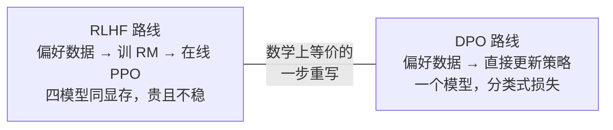
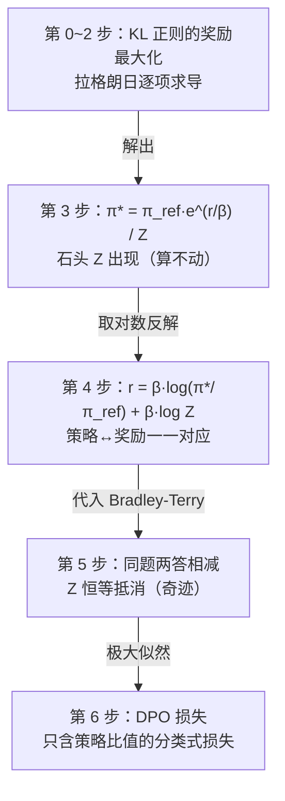
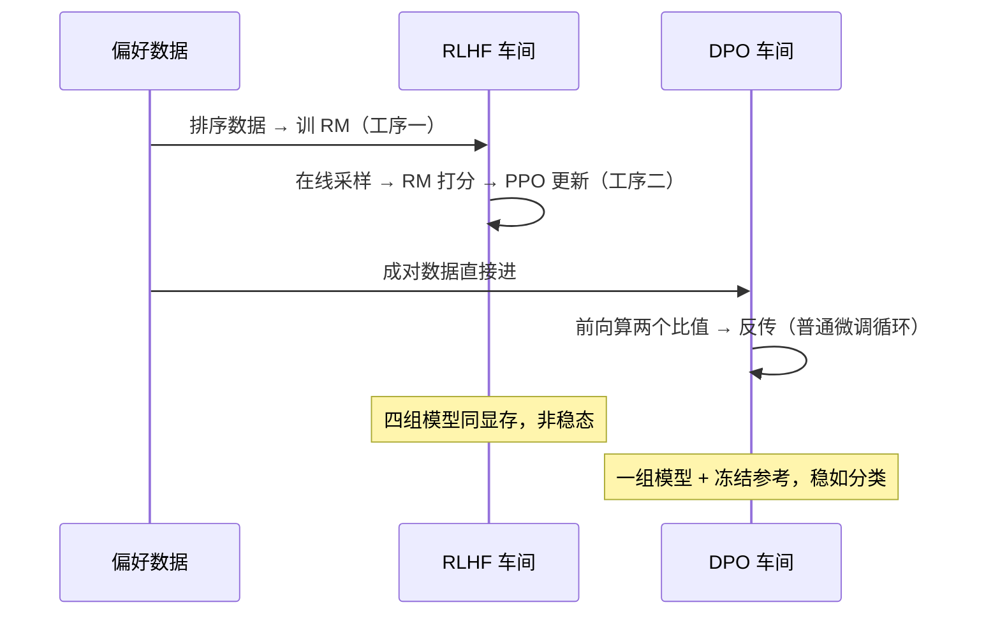
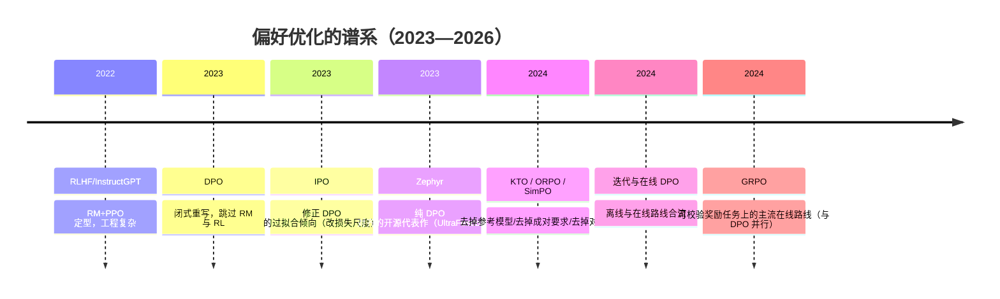

# 08 · DPO 精读 —— 跳过奖励模型的偏好优化

> **一句话理解**：RLHF 绕了两道弯（先训奖励模型、再跑强化学习），DPO 把这条弯路**解析地解到底**——奖励模型的最优策略有闭式解、闭式解能反解出奖励、反解出的奖励代入偏好模型时配分函数恰好相消，于是偏好数据可以**直接**变成对策略的损失函数，一个模型、一步训练、没有 RL。

[⬆️ 返回总目录](../README.md) · [⬅️ 返回专栏目录](./README.md)

---

## 📌 论文速览

| 项目 | 内容 |
|------|------|
| 论文 | Direct Preference Optimization: Your Language Model is Secretly a Reward Model |
| 作者/机构 | Rafailov, Sharma, Mitchell, Ermon, Manning, Finn（Stanford） |
| 时间 | 2023 年 5 月挂 arXiv；NeurIPS 2023（获 Outstanding Paper Award） |
| 链接 | https://arxiv.org/abs/2305.18290 |
| 解决什么 | RLHF 的两道工序（训 RM + 跑 PPO）工程贵、调参娇气、训练不稳 |
| 核心机制 | 从 RLHF 目标推出闭式最优策略，反解奖励代入 Bradley-Terry，配分函数相消 → 只含策略比值的偏好损失 |
| 关键数字 | IMDb 情感控制上 reward-KL 前沿支配 PPO（含拿真奖励的 PPO-GT）；TL;DR 摘要 GPT-4 评测胜率约 61% 对 PPO 约 57%（温度 0） |
| 一句话地位 | 把"偏好对齐"从强化学习问题变成分类式问题，开源对齐的事实标准之一 |

> 读法提醒：本页是本专栏推导最重的一篇——完整链共六步、每步配直觉注解；正文 [微调与对齐](../docs/4-专业方向/07-自然语言处理与LLM/05-微调与对齐.md) 的数学深潜是它的精简版，本页是"论文完整版"（补齐假设陈述、边界与梯度解剖）。推导全部自写重述，图表自绘。

## 🌱 一句话核心思想

**"你的语言模型 secretly 就是一个奖励模型"——策略与奖励一一对应，所以训奖励模型这道工序在数学上是多余的：偏好数据直接约束策略本身。**

展开半页：[07 · InstructGPT 精读](./07-InstructGPT.md) 的三阶段里，最贵最娇气的是"PPO 阶段"：四组模型同显存、在线采样、非稳态。DPO 问了一个更根本的问题：**我们到底为什么需要在线 RL？**

答案藏在 InstructGPT 机制三的闭式解里：KL 正则的最优策略 $\pi^*(y|x) \propto \pi_{\mathrm{ref}}(y|x)\,e^{r(x,y)/\beta}$ 说明**每个奖励函数都对应一个闭式策略，每个（严格为正的）策略也反对应一个奖励**——两套语言可以互相翻译。而人类偏好只关心**奖励的差**，差会把翻译中唯一的麻烦（配分函数 $Z$）抵消掉。于是：

👉 人话：RLHF 与 DPO 不是"复杂版与简化版"的关系，而是**同一目标函数的两种求解路线**——RLHF 用数值方法（RL）解，DPO 用解析方法（代入消元）解。这是它标题里"secretly"的全部含义。

## 🧠 方法精读

### 0. 记号翻译表

| 论文记号 | 本库记号 | 人话 |
|----------|----------|------|
| $\pi_\theta$ | 同 | 待优化的语言模型（策略） |
| $\pi_{\mathrm{ref}}$ | 同 | 参考模型（SFT 完成后冻结），与 InstructGPT 的 $\pi^{SFT}$ 同 |
| $r(x, y)$ / $r^*(x, y)$ | 同 | 奖励（函数）/ 某策略反解出的隐式奖励 |
| $Z(x)$ | 同 | 配分函数：$\sum_y \pi_{\mathrm{ref}}(y\mid x) e^{r(x,y)/\beta}$，对全部回答求和 |
| $y_w, y_l$（论文 $y^{+}, y^{-}$） | 同 | 同一提示下人类判定更好/更差的回答 |
| $\hat{r}_\theta$ | 同 | 隐式奖励：$\beta \log \frac{\pi_\theta}{\pi_{\mathrm{ref}}}$（DPO 的核心中间量） |
| $\beta$ | 同 | KL 的汇率（与 InstructGPT 同一个 β） |
| $\sigma$ | 同 | sigmoid 函数 |

### 机制一（核心）：完整推导链——从 RLHF 目标到 DPO 损失，六步不跳步

**严格陈述（推导要串起来的三件套）**：

1. **RLHF 目标**（固定 $x$，离散回答空间；与 InstructGPT 论文的目标等价——KL 正则的奖励最大化）：

$$
\max_{\pi}\;\; \mathbb{E}_{y \sim \pi(\cdot \mid x)}\big[r(x, y)\big] \;-\; \beta\, \mathrm{KL}\big(\pi(\cdot\mid x)\,\|\,\pi_{\mathrm{ref}}(\cdot\mid x)\big)
$$

2. **Bradley-Terry 偏好模型**（人类比较的生成假设，见 [07 精读](./07-InstructGPT.md)机制二）：

$$
P(y_w \succ y_l \mid x) = \sigma\big(r(x, y_w) - r(x, y_l)\big)
$$

3. **数据**：离线偏好对集合 $\{(x^{(i)}, y_w^{(i)}, y_l^{(i)})\}_{i=1}^{N}$，同一提示 $x$ 的一对好/坏回答。

**结论（六步要证明的）**：存在一个只含策略比值的闭式偏好概率

$$
P(y_w \succ y_l \mid x) = \sigma\!\left(\beta \log\frac{\pi^*(y_w \mid x)}{\pi_{\mathrm{ref}}(y_w \mid x)} - \beta \log\frac{\pi^*(y_l \mid x)}{\pi_{\mathrm{ref}}(y_l \mid x)}\right)
$$

于是对策略做极大似然，就得到 DPO 损失（下文机制一第六步）。**逐步展开**：

🧮 六步完整推导（每步带直觉注解，不跳步——本页核心折叠）

**【第 0 步】把 RLHF 目标写成显式求和**（固定 $x$，下文略 $\mid x$）：

$$
J(\pi) = \sum_y \pi(y)\left[ r(y) - \beta \log\frac{\pi(y)}{\pi_{\mathrm{ref}}(y)} \right]
\qquad \text{约束：} \sum_y \pi(y) = 1
$$

👉 注解：这是"期望奖励减 KL"的展开形态——对每个可能的回答 $y$，拿到它的概率 $\pi(y)$ 乘上（它的奖励 $r(y)$ 减去偏离参考模型的罚分）。

**【第 1 步】拉格朗日乘子法引入约束。** 乘子 $\lambda$：

$$
\mathcal{L}(\pi, \lambda) = \sum_y \pi(y)\Big[r(y) - \beta\log\frac{\pi(y)}{\pi_{\mathrm{ref}}(y)}\Big] + \lambda\Big(\sum_y \pi(y) - 1\Big)
$$

👉 注解：策略是概率分布，必须归一；乘子法把约束并进目标，变成无约束优化。

**【第 2 步】对每个 $\pi(y)$ 求偏导置零（关键一行，乘积法则）**。核心求导：

$$
\frac{\partial}{\partial \pi}\Big[\pi \cdot \big(-\beta \log \pi\big)\Big] = -\beta\log\pi - \beta
\qquad\left(\text{因为 } \frac{\partial(\pi\log\pi)}{\partial\pi} = \log\pi + 1\right)
$$

于是：

$$
\frac{\partial \mathcal{L}}{\partial \pi(y)} = r(y) - \beta\log\frac{\pi(y)}{\pi_{\mathrm{ref}}(y)} - \beta + \lambda \stackrel{!}{=} 0
$$

👉 注解：$-\beta$ 与 $\lambda$ 都是与 $y$ 无关的常数——**每个 $y$ 的方程只在 $r(y)$ 与对数比值上不同**，这决定了第 3 步解的形状。

**【第 3 步】解出形状并用归一化定常数。** 移项、除以 $\beta$、取指数：

$$
\pi(y) = \pi_{\mathrm{ref}}(y)\, e^{r(y)/\beta} \cdot e^{(\lambda - \beta)/\beta}
$$

由 $\sum_y \pi(y) = 1$ 定出常数必须等于 $1/Z$，其中

$$
Z(x) = \sum_y \pi_{\mathrm{ref}}(y)\, e^{r(x,y)/\beta}
\;\;\Longrightarrow\;\;
\boxed{\;\pi^*(y \mid x) = \frac{1}{Z(x)}\, \pi_{\mathrm{ref}}(y \mid x)\, e^{r(x,y)/\beta}\;}
$$

**凹性检查**（驻点=最大值）：$\partial^2 J / \partial \pi(y)^2 = -\beta/\pi(y) < 0$，$J$ 严格凹，唯一全局最大。

👉 注解：最优策略 = 参考分布按奖励**指数重新加权**。奖励高 → 概率指数放大；但底数仍是 $\pi_{\mathrm{ref}}$——**参考模型给零概率的回答永远无翻身之日**（语言能力的下界）。$Z$ 是对全部回答的求和——天文数字，无法计算。**记住这块石头，第 5 步它会被消掉。**

**【第 4 步】反解奖励——"策略 ↔ 奖励"词典。** 对第 3 步两边取对数并移项：

$$
\log\frac{\pi^*(y \mid x)}{\pi_{\mathrm{ref}}(y \mid x)} = \frac{r(x, y)}{\beta} - \log Z(x)
\;\;\Longrightarrow\;\;
\boxed{\;r(x, y) = \beta \log\frac{\pi^*(y \mid x)}{\pi_{\mathrm{ref}}(y \mid x)} + \beta \log Z(x)\;}
$$

👉 注解：任何一个策略都能反算出它"等价于"什么奖励（差一个只依赖 $x$ 的常数 $\beta\log Z$）。**这就是标题"你的语言模型 secretly 是一个奖励模型"的数学本体**：$\beta \log\frac{\pi_\theta}{\pi_{\mathrm{ref}}}$ 这一项后来被命名为隐式奖励 $\hat{r}_\theta$。

**【第 5 步】代入 Bradley-Terry——奇迹发生。** 偏好概率只依赖奖励**差**，把第 4 步代入 $y_w, y_l$ 相减：

$$
r(x, y_w) - r(x, y_l)
= \beta \log\frac{\pi^*(y_w)}{\pi_{\mathrm{ref}}(y_w)} - \beta \log\frac{\pi^*(y_l)}{\pi_{\mathrm{ref}}(y_l)}
+ \underbrace{\beta\log Z(x) - \beta\log Z(x)}_{\text{同一个 } x\text{，恒等抵消}}
$$

$$
\boxed{\;P(y_w \succ y_l \mid x) = \sigma\!\left(\beta \log\frac{\pi^*(y_w \mid x)}{\pi_{\mathrm{ref}}(y_w \mid x)} - \beta \log\frac{\pi^*(y_l \mid x)}{\pi_{\mathrm{ref}}(y_l \mid x)}\right)\;}
$$

👉 注解：那块算不动的石头 $Z(x)$ 在"同题两答"的偏好结构里**精确消失**——不是近似消掉，是恒等式两边各出现一次、相减为零。RLHF 需要 RM 的全部理由（绕开 $Z$）在这里不复存在。

**【第 6 步】极大似然 → DPO 损失。** 数据 $\{(x, y_w, y_l)\}$ 的对数似然是 $\sum_i \log P(y_w^{(i)} \succ y_l^{(i)} \mid x^{(i)})$；把"最优策略" $\pi^*$ 换成待优化的 $\pi_\theta$，最大化似然 = 最小化负对数：

$$
\boxed{\;\mathcal{L}_{\mathrm{DPO}}(\theta) = -\,\mathbb{E}_{(x, y_w, y_l)}\left[ \log \sigma\!\left(\beta \log\frac{\pi_\theta(y_w \mid x)}{\pi_{\mathrm{ref}}(y_w \mid x)} - \beta \log\frac{\pi_\theta(y_l \mid x)}{\pi_{\mathrm{ref}}(y_l \mid x)}\right) \right]\;}
$$

👉 注解：形式上是个**二分类损失**——"隐式奖励差"为正则损失下降。训练循环与普通微调无异：取一批偏好对，对好答案与坏答案各算一次对数概率比，反向传播。没有 RM、没有采样、没有 critic。

**推导链一张图**（每步消掉/揭示什么）：

### 机制二：梯度解剖——DPO 到底在更新什么

**先用具体数字走一遍损失**（建立手感，再进梯度）：

📊 展开算例：一对偏好 $(x, y_w, y_l)$ 的 DPO 损失与梯度系数（手算）

设参考模型与当前模型对两个回答的概率如下（数字为示意）：

| 量 | 参考模型 $\pi_{\mathrm{ref}}$ | 当前模型 $\pi_\theta$ | 比值对数 $\log\frac{\pi_\theta}{\pi_{\mathrm{ref}}}$ | 隐式奖励 $\hat{r} = \beta \times$ 比值对数（β=0.1） |
|----|------------------------------|------------------------|-----------------------------------------------------|------------------------------------------------------|
| 好答案 $y_w$ | 0.010 | 0.050 | $\log 5 \approx 1.609$ | $\approx 0.161$ |
| 坏答案 $y_l$ | 0.020 | 0.030 | $\log 1.5 \approx 0.405$ | $\approx 0.041$ |

**损失**：

$$
\mathcal{L} = -\log\sigma(\hat{r}_w - \hat{r}_l) = -\log\sigma(0.120) \approx -\log(0.530) \approx 0.635
$$

**梯度系数**：$\sigma(\hat{r}_l - \hat{r}_w) = \sigma(-0.120) \approx 0.470$——接近一半的火力在同时"抬 $y_w$、压 $y_l$"。

**三种情形的读数**（同一对答案，模型状态不同）：

| 情形 | $\hat{r}_w - \hat{r}_l$ | 损失 | 梯度系数 $\sigma(\hat{r}_l - \hat{r}_w)$ | 解读 |
|------|--------------------------|------|------------------------------------------|------|
| 正常（如上） | +0.12 | 0.635 | 0.47 | 略占优，仍在中强度纠偏 |
| 极端：模型偏爱坏答案 | −1.0 | 1.31 | 0.73 | 分错了，火力全开 |
| 极端：已大幅分对 | +4.0 | 0.018 | 0.018 | 学会了，自动熄火 |

👉 人话：损失值不是质量分，**梯度系数才是"该花多少力气"的表**——这就是机制二说的"自动课程"的数值形态。

闭式损失好看，但它更新参数的方式值得单独拆开（论文的梯度分析是理解 DPO 行为的钥匙）。

🧮 展开推导：DPO 梯度与"动态课程"（链式法则全展开）

记隐式奖励 $\hat{r}_\theta(x, y) = \beta \log\frac{\pi_\theta(y \mid x)}{\pi_{\mathrm{ref}}(y \mid x)}$，损失对一对样本为 $\mathcal{L} = -\log\sigma(\hat{r}_w - \hat{r}_l)$（$\hat{r}_w, \hat{r}_l$ 为好/坏答案的隐式奖励）。

**第 1 步：对 logits 差求导**（用 $\sigma' = \sigma(1-\sigma)$ 的等价形式 $\frac{\sigma'}{\sigma} = 1 - \sigma$）：

$$
\frac{\partial \mathcal{L}}{\partial (\hat{r}_w - \hat{r}_l)} = -\big(1 - \sigma(\hat{r}_w - \hat{r}_l)\big) = \sigma(\hat{r}_l - \hat{r}_w)
$$

**第 2 步：链式法则传到参数**（$\nabla_\theta \hat{r}_\theta = \beta \nabla_\theta \log \pi_\theta(y \mid x)$，$\pi_{\mathrm{ref}}$ 与 $\theta$ 无关）：

$$
\nabla_\theta \mathcal{L}_{\mathrm{DPO}}
= -\,\beta\, \sigma(\hat{r}_l - \hat{r}_w)\Big[ \underbrace{\nabla_\theta \log \pi_\theta(y_w \mid x)}_{\text{抬好答案}}
\;-\; \underbrace{\nabla_\theta \log \pi_\theta(y_l \mid x)}_{\text{压坏答案}} \Big]
$$

👉 注解三条：

1. **方向**：梯度同时**抬好答案、压坏答案**（都以参考模型为基准的相对移动）——对比 SFT 只抬示范、RLHF 只推高采样到的回答；
2. **幅度 $\sigma(\hat{r}_l - \hat{r}_w)$ 是自动课程**：模型当前越"偏爱坏答案"（$\hat{r}_l \gg \hat{r}_w$），系数越接近 1，纠正越狠；已经分对了（$\hat{r}_w \gg \hat{r}_l$），系数趋零，**自动停止纠错**——不需要显式的难例挖掘；
3. **隐式奖励的读法**：训练日志里看 $\hat{r}_w, \hat{r}_l$ 的走势，等价于在"免费监控一个奖励模型"——这就是"模型 secretly 是 RM"在工程上的兑现。

### 机制三：β 的双重身份与两个极限

β 在推导里出现两次——KL 的"汇率"与 logits 的"陡峭度"——这是同一个数的两面：

$$
\pi^* = \frac{1}{Z}\pi_{\mathrm{ref}} e^{r/\beta}
\qquad\text{与}\qquad
P(y_w \succ y_l) = \sigma\big(\beta \cdot \Delta\log\text{比值}\big)
$$

**两个极限推导**（各一步）：

- $\beta \to \infty$：$e^{r/\beta} \to e^0 = 1$，$\pi^* \to \pi_{\mathrm{ref}}$（退回参考模型，什么都学不到）；同时 sigmoid 输入被压平，梯度变小——**学不动**；
- $\beta \to 0$：$e^{r/\beta}$ 变得极端陡峭，最优策略全押在奖励最高的回答上；sigmoid 变阶跃，一点偏好信号就剧烈更新——**易钻空、易漂移**（离线数据没见过的怪解概率被快速抬高）。

👉 人话：β 是**风险偏好的总旋钮**——实践中论文与后续社区经验常落在 0.05~0.5 区间起步（量级参考，非圣旨），太小漂、太大钝。它与 InstructGPT 里的 β 是**同一个物理量**：每偏离参考模型一 nat，要多少"奖励"补偿。

### 机制四：DPO 与 RLHF/PPO 的工程对照

| 维度 | RLHF（RM + PPO） | DPO |
|------|------------------|-----|
| 需要训练的模型 | 策略 + RM + 价值模型（+冻结参考），四组同显存 | 策略一组（+冻结参考算比值） |
| 数据形态 | 排序数据训 RM + 在线采样 | 离线成对偏好 $(x, y_w, y_l)$，一遍过 |
| 训练循环 | 生成 → 打分 → 优势 → 裁剪更新（非稳态） | 普通监督学习的循环（前向、反传、步进） |
| 探索能力 | 在线采样能走出参考分布（发现新回答，也是 hacking 温床） | 只能抬/压**数据里出现过的回答** |
| 稳定性 | 对 lr/裁剪/奖励尺度敏感 | 分类式损失，稳定好调 |
| 适用前提 | 大规模在线偏好回流 | 高质量离线偏好对 + 参考模型可负载

👉 人话：两条路线的真实分界是**"探索的边界"**——DPO 的天花板是偏好数据里见过的回答，RLHF 能在训练中自己写出新回答再被评价。不互斥：**迭代式 DPO**（训一轮、采样新回答、再标偏好、再训）正在把两者接起来（正文[微调与对齐](../docs/4-专业方向/07-自然语言处理与LLM/05-微调与对齐.md)的选型表即按此逻辑）。

两条流水线放在一起看更直观（同一天的任务单，两种车间）：

## 📊 实验解读

### 证明了什么（数字均为论文可查）

论文在三个任务上把 DPO 与 RLHF 基线正面对线：

| 任务 | 底座与偏好来源 | 结果 | 读法 |
|------|----------------|------|------|
| 情感控制（IMDb 续写） | GPT-2 级底座；偏好由情感分类器定义（可控真值） | **reward-KL 前沿上 DPO 支配 PPO 与 PPO-GT**——每个 KL 预算下奖励更高 | 真值奖励下仍占优，说明不是"对手 RM 弱"造成的 |
| 摘要（Reddit TL;DR） | GPT-J 级底座；人类偏好数据 | GPT-4 评测胜率 DPO 约 **61%** 对 PPO 约 **57%**（温度 0），且优于 SFT 与参考摘要 | 与最强 RLHF 基线**同台且不落下风** |
| 单轮对话（Anthropic HH） | Pythia-2.8B 底座 | DPO 是与 PPO 基线相当或更好的方法，且对响应长度等扰动稳健 | 泛化到对话场景 |

**范式级的证明**：偏好对齐可以在**不训 RM、不跑 RL** 的情况下达到第一梯队——"RLHF 的两道工序在数学上冗余"从论断变成了实验事实。附带的方法学红利：**隐式奖励 $\hat{r}_\theta$ 可以直接当监控指标**，训练可解释性比 PPO 黑盒好一截。

### 没证明什么（同等重要）

- **没有证明"在线 RL 没用了"**：全部实验是**离线偏好**；策略要走出偏好数据支撑集（探索新回答形态）的场景，DPO 结构上无能为力——论文的对照里 PPO 的优势恰恰需要"在线"才能兑现，而 RLHF 生产系统的偏好数据是持续回流的；
- **没有证明 DPO 在所有规模通吃**：实验底座是 0.3B~6B 量级；百亿千亿级上与 PPO 的相对表现（数据效率、对齐税、reward hacking 抗性）需要后续工作补证（后来开源界的经验大致是"两者都行、各有甜点区"，而非一边倒）；
- **裁判是 GPT-4**：摘要/对话的"人类偏好"由 GPT-4 评估代理——裁判自身的偏差（长度偏好、格式偏好）直接进入结论；论文也做了人类评估子样本对照，但规模有限；
- **没有测对齐税与通用能力回归**：DPO 后模型在公开 NLP 任务上的表现如何，论文不是重点——这一维度在后续实践中被发现需要认真管理（β、数据配比、混合 SFT 损失都是为此发明的新旋钮）。

### 消融怎么读

1. **β 扫描**：论文给出 β 对 reward-KL 前沿的影响——β 太小前沿左移（同等奖励付出更大漂移）、太大压低可达奖励；读法：β 不是"越大越稳"的单调旋钮，是**位置**参数（决定停在前沿哪一段）；
2. **隐式奖励/似然走势分析**：论文展示训练中 $\log \pi_\theta(y_w), \log \pi_\theta(y_l)$ 的轨迹——好答案概率上升、坏答案下降且好答案的升幅存在饱和。⚠️ 一个后来社区反复踩的坑在此埋下：**坏答案概率被压到多低没有内在刹车**，有工作专门研究如何避免过度压低（以及好答案概率也可能**先升后降**的现象——单纯看损失下降不等于两答案都更合理）；
3. **偏好对数量扫描**：更少数据下 DPO 依旧稳健——分类式损失对数据量的弹性比 RL 流程好，这是它在开源社区快速铺开的原因之一。

**把三组实验按"证明强度"排序**（读论文实验章节的通用姿势）：

| 强度 | 实验 | 为什么 |
|------|------|--------|
| 最硬 | IMDb 情感控制（reward-KL 前沿） | 奖励真值可控、指标客观、前沿图把"多好 vs 多偏"的权衡显式画出 |
| 中等 | TL;DR 摘要（GPT-4 裁判 + 人评子样本） | 任务真实但裁判有偏（长度/格式偏好），结论方向可信、数值仅供参考 |
| 较弱 | HH 对话（胜率口径） | 开放任务、无真值，只能看方向与稳健性 |
👉 人话：论文的"胜过 PPO"要按这张表打折着读——**最硬的那组（可控真值）恰好是 DPO 赢得最干净的**，这比在开放任务上险胜更能说明数学本身的贡献。

## 🔁 后世影响与争议

### 谁站在它肩上

- **开源对齐的民主化**：DPO 把偏好对齐的门槛从"四模型 RL 集群"降到"单卡微调"，Zephyr-7B（arXiv 2310.16944）用纯 DPO 配方训出第一梯队开源对话模型，成为路线可行性的标志；此后 Llama 3、Qwen2 等主流开源技术报告普遍把 DPO（或其变体）列入后训练选项；
- **算法谱系的引爆**：既然"偏好→策略"可以解析改写，那么目标函数的每个部件都能换——IPO（2310.12036）修过拟合、KTO（2402.01306）允许"好/坏"单标签不成对、ORPO（2403.07691）把偏好损失并进 SFT 一阶段、SimPO（2405.14734）干脆去掉参考模型——**DPO 是这条流水线的母语法**；
- **理论视角的遗产**："策略即奖励模型"的对偶视角，把对齐研究与分布匹配、隐式奖励估计连接起来，成为 2023 年后对齐理论的一个常用出发点。

### 争议与反思

1. **离线偏好的覆盖问题（最核心的批评）**：DPO 的损失只作用于 $(y_w, y_l)$ 两个点上，策略在数据支撑集**之外**的行为不受任何直接约束——极端情况下，模型可以"在见过的对上分对，在没见过的分布区域漂走"。$\beta$ 提供的是软锚（贴着 $\pi_{\mathrm{ref}}$），不是硬保证。实践中表现为：偏好数据窄时，DPO 后模型在域外提示上风格漂移；
2. **BT 假设与人类偏好的非传递性**：推导第 5 步的前提是偏好由奖励差经 sigmoid 生成——隐含偏好的**传递性**。人类的循环偏好（A>B, B>C, C>A）与标注者分歧会被 DPO 当真信号写进策略（此批评对 RLHF 同样成立，但 DPO 因"直接写进策略"而更显性）；
3. **"DPO 打败 RLHF"的过度传播**：论文证明的是"离线设置下 DPO ≥ 精调过的 PPO 基线"，不是"RLHF 被淘汰"。2023-2026 年的实践共识更接近分工：**可校验奖励、需要在线探索的任务走 PPO/GRPO 系；开放对话、有离线偏好的场景 DPO 系是默认起点**；
4. **过优化与压低坏答案的副作用**：损失不约束 $\log \pi_\theta(y_l)$ 的下界——坏答案概率可以一路压穿，伴随好答案概率也下滑的现象；社区为此发明了混 SFT 项、IPO 式改写、以及"坏答案别压太狠"的工程口诀。**教训：闭式解的最优性是对"偏好概率模型"说的，不是对"真实人类满意度"说的**——与 InstructGPT 的 reward overoptimization 是同一枚硬币的两面。

## 🔗 在本库中的位置

- **正文对照**：[微调与对齐](../docs/4-专业方向/07-自然语言处理与LLM/05-微调与对齐.md)——本页是其"DPO 闭式解完整推导"数学深潜的**论文完整版**（补齐假设、梯度解剖、边界条件与消融）；
- **上游**：[07 · InstructGPT 精读](./07-InstructGPT.md)（本页第 0~3 步的全部原料：RLHF 目标、闭式解、Bradley-Terry）；
- **交叉**：[RL 进阶（RLHF 全栈）](../docs/4-专业方向/10-强化学习/03-进阶专题-RL进阶.md)——在线/离线偏好优化在 RL 视角下的位置；
- **下游**：[09 · LoRA 精读](./09-LoRA.md)——DPO 时代"单卡对齐"的另一半拼图是低成本加载底座。

## 📝 小结与自测

**要点回顾**

- 六步推导链：KL 正则目标 → 拉格朗日闭式解 $\pi^* = \pi_{\mathrm{ref}} e^{r/\beta}/Z$ → 取对数反解奖励 → 代入 BT → $Z$ 同题相消 → 极大似然得只含策略比值的损失；
- $Z$ 的消失是恒等式相减，不是近似——RLHF 需要 RM 的全部理由（绕开 $Z$）在"同题成对"的偏好结构里自动失效；
- 梯度 = $\beta\,\sigma(\hat{r}_l - \hat{r}_w)$ ×（抬好压坏），系数是自动课程：分错越狠纠正越猛，分对了自动熄火；
- β 双重身份：KL 汇率 × logits 陡峭度；极限行为 β→∞ 退回参考、β→0 全押最高奖励；
- 实验与边界：IMDb 前沿支配 PPO/GT、TL;DR 胜率约 61% 对 57%；未证明离线→在线的外推、未测大规模与对齐税、裁判是 GPT-4。

🖱️ 自测 1：为什么 $Z(x)$ 在 DPO 里"自动消失"，而 RLHF 里绕不开？

$Z(x)$ 只依赖提示 $x$（对全部回答求和）。偏好比较发生在**同一提示的两个回答之间**：反解出的奖励代入 Bradley-Terry 后要算 $r(y_w) - r(y_l)$，两边的 $\beta\log Z(x)$ 是同一个数，相减精确为零。RLHF 要的是**单个回答的绝对奖励**（打分器输出），$Z$ 无处可消，只能训一个 RM 绕过它；DPO 把整个问题改写进"偏好差"的世界，$Z$ 随之蒸发——**数据结构（同题成对）恰好匹配了消元条件**。

🖱️ 自测 2：把一对偏好 $(x, y_w, y_l)$ 从两个不同的提示下抽来（跨题比较），DPO 公式还成立吗？

不成立。第 5 步的相消要求两项是**同一个 $x$** 的 $Z(x)$；跨题时是 $Z(x_1) - Z(x_2)$，不相消，闭式偏好概率不成立。所以"同题成对"不是数据格式偏好，是推导的数学前提——工程上混入跨题对会引入系统性噪声。

🖱️ 自测 3：DPO 训练中损失一直在降，但抽查发现好答案概率也在降——矛盾吗？怎么诊断？

不矛盾。损失只约束**隐式奖励差** $\hat{r}_w - \hat{r}_l$：只要坏答案降得比好答案更狠，损失照降——极端时两败俱伤。诊断：直接监控 $\log \pi_\theta(y_w)$ 与 $\log \pi_\theta(y_l)$ 的分轨迹（DPO 的隐式奖励让这种监控免费）；对策：加大 β、混入 SFT 损失锁住好答案、检查偏好数据质量（好答案本身是否可疑，比如纯靠长度取胜）。这也是"看损失曲线"在偏好优化时代失效、必须看中间变量的典型场景。

🖱️ 自测 4：为什么说 DPO 与 RLHF 的分界是"探索的边界"，而不是"简单 vs 复杂"？

数学上两者优化同一目标（KL 正则的奖励最大化），DPO 是解析解路径、RLHF 是数值解路径；真正的能力差异来自数据：DPO 的梯度只作用于偏好数据里出现过的 $(y_w, y_l)$，策略永远走不出这个支撑集；RLHF 在线采样，策略能生成"没人标注过的新回答"并被评价——这就是探索。需要探索（新风格、新推理形态、可校验奖励任务）→ 在线路线；有高质量离线偏好、追求稳定省事 → DPO 系。迭代式 DPO 用"多轮采样再标注"把探索搬回离线世界，正在模糊这条界。

## 📚 延伸阅读（均为真实 arXiv）

- 原论文：Direct Preference Optimization: Your Language Model is Secretly a Reward Model（2023，https://arxiv.org/abs/2305.18290）
- 前置：Training language models to follow instructions with human feedback（InstructGPT，2022，https://arxiv.org/abs/2203.02155）
- 前置：Proximal Policy Optimization Algorithms（2017，https://arxiv.org/abs/1707.06347）
- IPO: Identification Preference Optimization（2023，https://arxiv.org/abs/2310.12036）——修正 DPO 的过拟合倾向
- KTO: Model Alignment as Prospect Theoretic Optimization（2024，https://arxiv.org/abs/2402.01306）——不成对的好/坏信号
- ORPO: Monolithic Preference Optimization without Reference Model（2024，https://arxiv.org/abs/2403.07691）
- SimPO: Preference Optimization with a Reference-Free Reward（2024，https://arxiv.org/abs/2405.14734）
- Zephyr: Direct Distillation of LM Alignment（2023，https://arxiv.org/abs/2310.16944）——纯 DPO 开源对齐代表作
- A Minimaximalist Approach to RLHF（2024，https://arxiv.org/abs/2310.06501）——迭代式在线偏好优化的理论
- Secrets of RLHF in Large Language Models Part II（2024，https://arxiv.org/abs/2401.01335）——DPO 类损失的过优化现象分析

---

[⬅️ 上一页：07 · InstructGPT 精读](./07-InstructGPT.md) · [返回专栏目录](./README.md) · [下一页：09 · LoRA 精读 ➡️](./09-LoRA.md)
