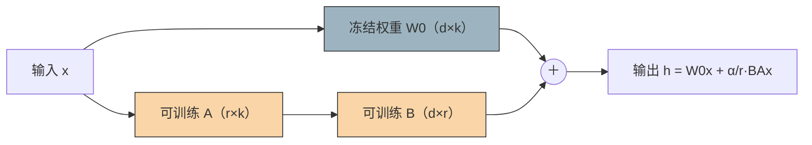
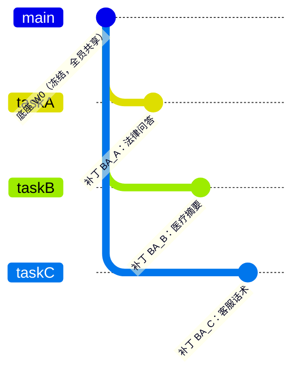
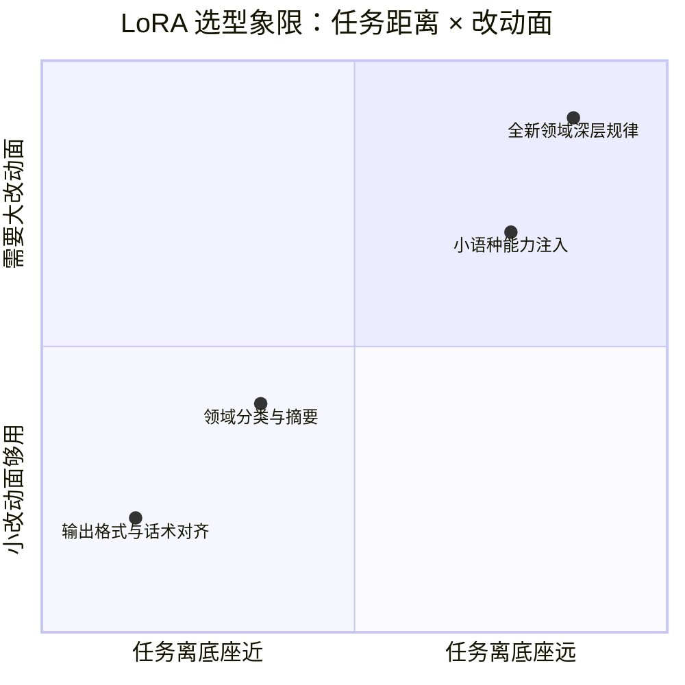
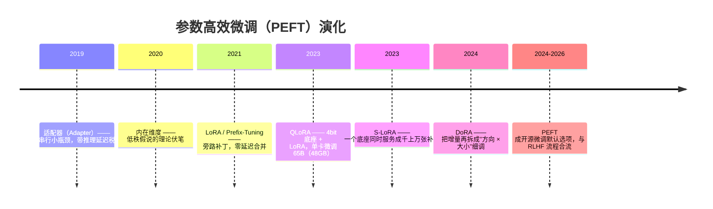

# 09 · LoRA：低秩适配——一张卡微调大模型的工程革命

> **一句话理解**：微调大模型不必重写整本书，只需在冻结的原文旁写一叠薄薄的"批注"——训完把批注一次性贴进原文，推理时零额外开销。

[⬆️ 返回总目录](../README.md) · [⬆️ 返回专栏目录](./README.md)

---

## 📌 论文速览

| 条目 | 内容 |
|------|------|
| 标题 | LoRA: Low-Rank Adaptation of Large Language Models |
| 作者 | Edward J. Hu、Yelong Shen、Phillip Wallis、Zeyuan Allen-Zhu、Yuanzhi Li、Shean Wang、Lu Wang、Weizhu Chen（Microsoft 与 University of Washington） |
| 时间 | 2021 年 6 月（arXiv:2106.09685），ICLR 2022 |
| 解决什么 | 全参微调 GPT-3 175B 贵到不现实；适配器（Adapter）拖慢推理；前缀微调难优化还挤占序列长度 |
| 核心方法 | 冻结预训练权重 $W_0$，把权重增量重参数化为低秩矩阵之积：$W = W_0 + BA$，只训 $A$、$B$ |
| 头条数字 | GPT-3 175B 上可训练参数 175B → 4.7M（约三万七千分之一，论文摘要口径"万倍级"）；训练显存约降至 1/3；三项任务性能持平或超过全参微调 |
| 引用地位 | 数万次量级（2026 年 Google Scholar 口径，仍在快速增长）；参数高效微调（PEFT）的事实标准 |
| 官方代码 | github.com/microsoft/LoRA |

---

## 🌱 一句话核心思想

**微调时权重的"改动量"其实很低维，所以不值得为它付出全参数的代价。**

2020 年前后的一批工作（内在维度，Intrinsic Dimensionality）发现：把一个预训练模型微调到新任务时，优化器真正需要自由移动的方向远少于参数总数——好比一栋装修完的大楼要改造成办公室，不需要砸承重墙，挪家具、贴墙纸就够。LoRA 把这个观察变成工程方案：原权重 $W_0$ 整体冻结（承重墙不动），另学一块低秩"补丁" $\Delta W = BA$（墙纸想撕就撕），训完还能把补丁合并进原权重，部署时和原模型一模一样快。

一句话：**LoRA 之前，"微调"意味着"重训所有参数"；LoRA 之后，"微调"变成"给每个任务存一张几十 MB 的补丁"。**

---

## 🧠 方法精读

### 记号翻译表（论文原文 → 本库第 7 章）

| 论文记号 | 含义 | 本库说法 |
|----------|------|----------|
| $W_0 \in \mathbb{R}^{d \times k}$ | 冻结的预训练权重 | 底座权重 / 原权重 |
| $\Delta W = BA$ | 低秩增量，$B \in \mathbb{R}^{d \times r}$、$A \in \mathbb{R}^{r \times k}$ | 补丁 / 墙纸 |
| $r$ | 秩，$r \ll \min(d, k)$ | 秩，补丁的"容量旋钮" |
| $h = W_0 x + \frac{\alpha}{r} BAx$ | 前向计算（$\alpha$ 为缩放系数） | 实际生效增量 = $\frac{\alpha}{r} \cdot BA$ |
| $W_q, W_k, W_v, W_o$ | 注意力四投影矩阵 | 挂 LoRA 的默认目标模块 |

---

### 机制一：低秩重参数化——为什么 $BA$ 的参数这么少

对预训练权重 $W_0 \in \mathbb{R}^{d \times k}$，LoRA 不直接学增量 $\Delta W$（那有 $d \times k$ 个自由度），而是约束它必须是两个"瘦长"矩阵的乘积：

$$
W = W_0 + \Delta W = W_0 + BA, \quad B \in \mathbb{R}^{d \times r},\ A \in \mathbb{R}^{r \times k},\quad r \ll \min(d, k)
$$

> 👉 **人话**：增量矩阵 $\Delta W$ 被迫只能表达"秩至多为 $r$"的改动——它有 $d \times k$ 个格子，但这些格子由 $B$ 和 $A$ 总共 $r(d+k)$ 个数字决定。好比一张 4096×4096 的改动图，其实是 4096×8 和 8×4096 两张小图的乘积，信息量骤减。

前向传播时（$\alpha$ 是缩放系数，实际增量按 $\alpha/r$ 缩放）：

$$
h = W_0 x + \frac{\alpha}{r} \cdot B(Ax)
$$

> 👉 **人话**：输入 $x$ 走两条路——冻结的"大路" $W_0 x$ 照常通行，旁边一条"小路"先被 $A$ 压到 $r$ 维、再被 $B$ 拉回 $d$ 维。两条路的结果相加。注意 $BA$ 永远不显式相乘，训练时算的是 $B(Ax)$（先算括号），代价只有 $r(d+k)$ 次乘加。

参数账（一张表看懂量级）：

| 场景 | 全量增量 $\Delta W$ | 低秩增量 $BA$ | 占比 |
|------|---------------------|----------------|------|
| 单个矩阵 $d = k = 4096$，$r = 8$ | $16{,}777{,}216$ | $2 \times 8 \times 4096 = 65{,}536$ | ≈ 0.39% |
| GPT-3 单个投影 $d = k = 12288$，$r = 1$ | $151{,}047{,}168$ | $2 \times 1 \times 12288 = 24{,}576$ | ≈ 0.016% |

结构示意（自绘）：



> 👉 **人话**：灰色是冻结的"底座"，橙色是唯一在训练的两块小矩阵——梯度只流橙色这条支路，底座纹丝不动。

<details>
<summary>🧮 展开：计算量的账——旁路到底贵多少</summary>

第 1 步（底座支路的算量）。一次 $W_0 x$：矩阵向量乘 $d \times k$，共 $dk$ 次乘加。以 $d = k = 4096$ 计，$dk \approx 1.68 \times 10^7$。

第 2 步（LoRA 支路的算量）。按 $B(Ax)$ 从内往外算：$Ax$ 是 $r \times k$ 乘向量，$rk$ 次乘加；再乘 $B$ 是 $d \times r$ 乘向量，$dr$ 次。合计 $r(d + k)$ 次。$r = 8$ 时：$8 \times (4096 + 4096) = 65{,}536$。

第 3 步（比值）。旁路开销占比：

$$
\frac{r(d+k)}{dk} = r\left(\frac{1}{d} + \frac{1}{k}\right) \;\xrightarrow{d=k}\; \frac{2r}{d} = \frac{2 \times 8}{4096} \approx 0.39\%
$$

> 👉 **人话**：秩每翻一倍，训练开销线性涨；维度越大，低秩越"白嫖"。同一个公式也告诉你参数占比——$2r/d$ 一式两用。若反向操作把 $\Delta W$ 全量学起来，参数与算量回到 $dk$ 量级，还多出优化器状态——低秩省的不只是参数，是整条训练流水线。

</details>

---

### 机制二：推理零开销——合并只需一次矩阵加法

LoRA 最被低估的卖点在部署端。因为增量是以**线性映射**的身份进入网络的，而矩阵加法对输入是分配的，训练结束后可以直接做一次加法：

$$
W' = W_0 + \frac{\alpha}{r} \cdot BA
$$

> 👉 **人话**：推理时给输入 $x$ 的永远是 $(W_0 + \frac{\alpha}{r}BA)x = W_0x + \frac{\alpha}{r}(BA)x$——两条支路的效果与"合并成一个大矩阵再乘"逐点相等。所以部署前把补丁"焊"进底座，推理结构、算量、延迟与原模型**完全一致**。

<details>
<summary>🧮 展开：为什么适配器（Adapter）做不到这一点</summary>

适配器在冻结层之间**串行插入**一个小型带非线性激活的瓶颈网络：

$$
h = W_0 x + W_{\mathrm{up}}\,\sigma\!\left(W_{\mathrm{down}} x\right)
$$

第 1 步：适配器里有激活函数 $\sigma$，输出是输入的非线性函数，**不存在**一个矩阵 $W'$ 使得 $\forall x:\ W'x = W_0x + W_{\mathrm{up}}\sigma(W_{\mathrm{down}}x)$——非线性打断了"合并进线性层"的代数可能。

第 2 步：既然拆不掉，串行结构就必须在每次前向时逐层执行。LoRA 论文在 GPT-2 medium 上实测（论文 Table 1）：batch 为 1、序列长 128 的在线推理场景下，两种适配器结构分别带来 **+20.7% 与 +30.3%** 的延迟；batch 大、序列长时降到 +2%~+3%。在线服务恰恰常是小批量短序列——适配器的税在最疼的地方最重。

第 3 步：LoRA 的支路是纯线性的旁路（parallel），训完可加法合并，所以延迟恒为 0 增量。**"低秩"解决了参数量，"旁路 + 线性"解决了部署**——两件事缺一不可。

</details>

顺带得到**任务切换的热插拔**：底座 $W_0$ 只存一份，每个任务只存自己的 $B A$（几 MB 到几十 MB），切换任务 = 换一张补丁，互不干扰：



> 👉 **人话**：所有任务共享同一个主干，各自的"批注"挂在分支上——想服务哪个任务就把哪个补丁合并或并行加载，存储与切换成本都是补丁级别的。

---

### 机制三：初始化——为什么 $B = 0$、$A$ 用高斯（不是随便选的）

LoRA 的初始化是不对称的：$A \sim \mathcal{N}(0, \sigma^2)$（随机初始化），$B = 0$（全零）。这带来两个性质：

1. **训练起点 = 预训练模型**：第 0 步 $\Delta W = BA = 0 \cdot A = 0$，模型行为与底座分毫不差——微调从"已经很好"的地方出发；
2. **梯度不会死锁**：如果 $A$、$B$ **同时**初始化为零，梯度会恒为零，永远训不动。$B=0$、$A$ 随机则能避开这个陷阱。

<details>
<summary>📐 数学深潜：初始化的梯度推导——"死锁"到底死在哪一步</summary>

**严格陈述**。记损失 $\mathcal{L}$ 对增量矩阵的梯度为 $G := \dfrac{\partial \mathcal{L}}{\partial \Delta W} \in \mathbb{R}^{d \times k}$，增量 $\Delta W = BA$。求 $\dfrac{\partial \mathcal{L}}{\partial A}$ 与 $\dfrac{\partial \mathcal{L}}{\partial B}$，并讨论 $A = 0,\ B = 0$ 与 $B = 0,\ A \neq 0$ 两种初始化。

**完整推导**。

第 1 步（链式法则按矩阵展开）。$\mathcal{L}$ 通过 $\Delta W = BA$ 依赖于 $A$、$B$。对 $B$ 的 $(i, j)$ 元：

$$
\frac{\partial \mathcal{L}}{\partial B_{ij}} = \sum_{m, n} \frac{\partial \mathcal{L}}{\partial \Delta W_{mn}} \cdot \frac{\partial \Delta W_{mn}}{\partial B_{ij}} = \sum_{m, n} G_{mn} \cdot \frac{\partial (BA)_{mn}}{\partial B_{ij}}
$$

第 2 步（算出局部导数）。$(BA)_{mn} = \sum_{l=1}^{r} B_{ml} A_{ln}$，对 $B_{ij}$ 求偏导，只有 $m = i,\ l = j$ 的项存活，得 $\dfrac{\partial (BA)_{mn}}{\partial B_{ij}} = A_{jn}$（当 $m = i$，否则为 0）。于是：

$$
\frac{\partial \mathcal{L}}{\partial B_{ij}} = \sum_{n} G_{in} A_{jn} \quad\Longleftrightarrow\quad \boxed{\frac{\partial \mathcal{L}}{\partial B} = G A^{\top}}
$$

对称地（对 $A_{ij}$，只有 $l = i,\ n = j$ 的项存活）：

$$
\boxed{\frac{\partial \mathcal{L}}{\partial A} = B^{\top} G}
$$

第 3 步（代入两种初始化）。

- 若 $A = 0$ **且** $B = 0$：$\frac{\partial \mathcal{L}}{\partial B} = G \cdot 0 = 0$，$\frac{\partial \mathcal{L}}{\partial A} = 0 \cdot G = 0$——**两个梯度同时为零**，优化器在任何损失下都拿不到方向，训练死锁。这是双零初始化的"对称性陷阱"：$\Delta W = 0$ 且它对两个因子的依赖都断在零因子上。
- 若 $B = 0$、$A \sim \mathcal{N}(0, \sigma^2)$：$\frac{\partial \mathcal{L}}{\partial A} = 0^{\top} G = 0$（$A$ 第一步不动），但 $\frac{\partial \mathcal{L}}{\partial B} = G A^{\top}$。$A$ 随机非零、各行方向杂乱，只要 $G \neq 0$，矩阵乘积 $G A^{\top}$ 一般非零——**$B$ 先拿到梯度动起来**；$B$ 一旦非零，下一步 $A$ 的梯度 $B^{\top}G$ 也活了。

**几何解释**。把 $\Delta W$ 的 $d \times k$ 个元素想成一张改动图，$A$ 决定"改动发生在哪 $r$ 个方向上"（行空间的基底），$B$ 决定"每个方向上改多少"。随机 $A$ 相当于预先撒下一把随机方向作候选，$B = 0$ 表示"先一个都不用"。梯度先更新"用多少"（$B$），再回头修剪"用哪些方向"（$A$）。

**反例与边界**。若 $A$ 也初始化为零，唯一出路是数值噪声或额外机制（如给某一方加偏置项）打破对称；LoRA 选择了最小改动——只把一半清零。另一侧边界：谁清零在数学上可互换（$A=0$、$B$ 随机同样能训），但"零起点"性质要求至少一方为零。

> 👉 **一句人话**：$B = 0$ 保证出发点就是预训练模型，$A$ 随机保证梯度有路可走——一半清零、一半随机，是"起点不动"与"训练能动"的唯一便宜解。

</details>

---

### 机制四：低秩假说的证据——补丁到底学到了什么

LoRA 效果好的前提是"微调增量确实近似低秩"。论文第 7 章用 GPT-3 上训好的 LoRA 补丁做了拆解（论文口径）：

- **$\Delta W$ 放大了 $W_0$ 中不突出的方向**。在 WikiSQL 适配的模型上，$r = 4$ 时 $\|\Delta W_q\|_F \approx 6.91$，而把 $W_0$ 投影到 $\Delta W$ 的 top-$r$ 奇异子空间后只剩 $\approx 0.32$——**放大因子约 21.5**。即补丁不是复制底座已有的方向，而是在底座"弱信号"的方向上做大幅加强（论文还观察到这是把任务相关方向调尖，模型借此区分"任务要的类间差异"）。
- **小秩与大秩学到的子空间高度重叠**：$r = 8$ 与 $r = 64$ 的补丁，top 奇异方向夹角很小（论文方向性度量 $\phi$ 读数接近 1）；而 $r = 64$ 的 $\Delta W$ 投影到 $r = 8$ 子空间后范数占比也不低——**前几个方向承接了大部分改动**，所以小秩够用。
- **失效边界**：这些证据来自 NLP 分类/摘要类任务。任务与底座分布差异越大（教英文代码底座说小语种、全新领域深层规律），需要的"改动自由度"越多，低秩假设逐渐吃力——这正是[第 7 章正文](../docs/4-专业方向/07-自然语言处理与LLM/05-微调与对齐.md)讨论的"低秩不够用怎么办"（加秩、加目标模块、或承认该上全参）。

任务离底座多远、该配多大的改动面（自绘选型象限，经验参考）：



> 👉 **人话**：越靠右下角（任务远、改动大），低秩越吃力——加秩、加挂载模块，直至换全参；左上角是 LoRA 的甜点区，几百条样本、r=8 就能贴好一张墙纸。

---

## 📋 举个例子：GPT-3 175B 的补丁账本（数字能对上）

GPT-3 175B 的公开规格：96 层 Transformer，隐藏维 $d = 12288$，每层注意力的 $W_q, W_v$ 各为 $12288 \times 12288$。

只给全部 96 层的 $W_q, W_v$ 挂 LoRA、秩 $r = 1$：

- 每个矩阵的可训练参数：$2 \times r \times d = 2 \times 1 \times 12288 = 24{,}576$；
- 挂了 $96 \times 2 = 192$ 个矩阵，共 $192 \times 24{,}576 = 4{,}718{,}592 \approx 4.7\text{M}$。

——与论文 Table 4 中 LoRA（4.7M 可训练参数）逐位对上。相对全参数 $175{,}255.8\text{M}$：$\frac{4.7}{175255.8} \approx 0.0027\%$，即**三万七千分之一**（论文摘要的"万倍级减少"是保守写法）。省掉的还不只是参数：全参微调用 Adam 时，优化器状态（一阶、二阶动量）还要再占两倍参数显存——这正是论文说训练显存约降至 1/3 的主要来源。

> 👉 **人话**：一张 35MB 的"墙纸"，贴在一栋 350GB 的大楼上，效果不输把大楼重装修一遍。

---

## 📊 实验解读

论文 Table 4（GPT-3 175B，论文口径数字）：

| 方法 | 可训练参数 | WikiSQL（Acc） | MNLI-m（Acc） | SAMSum（R1/R2/RL） |
|------|-----------|----------------|----------------|---------------------|
| 全参微调 | 175,255.8M | 73.8 | 89.5 | 52.0 / 28.0 / 44.5 |
| BitFit（只训偏置） | 14.2M | 71.3 | 91.0 | 51.3 / 27.4 / 43.5 |
| 前缀层（PreLayer） | 20.2M | 70.1 | 89.5 | 50.8 / 27.3 / 43.5 |
| 适配器（Adapter$^H$） | 7.1M | 71.9 | 89.8 | 53.0 / 28.9 / 44.8 |
| **LoRA** | **4.7M** | **73.4** | **91.7** | **53.8 / 29.8 / 45.9** |
| LoRA（加大预算） | 37.7M | 74.0 | 91.6 | 53.4 / 29.2 / 45.1 |

**证明了什么**：

- 万倍级减少可训练参数后，三项任务**全部持平或超过全参微调**（WikiSQL 73.4 vs 73.8 略低；MNLI-m 91.7 vs 89.5 反而更高；SAMSum 三项全面领先）——在"分类/摘要"这类任务上，低秩容量绰绰有余；
- 同参数预算下整体优于前缀类与偏置类方法，且没有它们"难优化、挤占序列长度"的毛病。

**没证明什么**（防神话清单）：

- 只在 GPT-3 与 3 个 NLP 任务上验证——**没测**代码生成、长上下文、多任务混合、小语种迁移等更难的场景；
- "10,000×"是**可训练参数**之比（含全参微调本就全量可训的口径），不是"显存变为万分之一"——显存口径是约 3 倍降幅；
- 没有回答"秩该多大"的理论问题——消融只显示 $r$ 从 1 涨到 64 性能变化不大（说明该任务低秩就够），不说明所有任务都如此。

**消融怎么读**：论文扫了秩与挂载位置（只挂 $W_q$、只挂 $W_v$、都挂）的组合，结论是**"多个矩阵挂小秩"优于"单个矩阵挂大秩"**（改动自由度分散到多处更划算）——这成了社区"先挂 q/v，不够再加 FFN"经验配方的出处。

**三条消融细读**（论文第 6~7 章，定性结论）：

1. **秩扫平了就别加**：$r$ 从 1 一路加到 64，三项任务精度基本不动——说明这些任务的"改动自由度"用极小的秩就装下了；加秩买不到精度，只买到显存开销；
2. **挂载位置比秩更敏感**：只给 $W_q$ 挂大秩，不如给 $W_q$、$W_v$ 都挂小秩——自由度"摊开用"效率更高，这也是后来社区默认 all-linear 挂法的源头；
3. **补丁之间在"互相配合"**：同层 $W_q$ 与 $W_v$ 学到的补丁，其 top 奇异方向高度相关（论文用方向一致性度量验证）——两个补丁在放大同一批任务相关方向，而不是各干各的。这是"低秩但协同"的直接证据。

---

## 💻 动手试试：20 行实现一个能合并的 LoRA

```python
import torch
import torch.nn as nn

class LoRALinear(nn.Module):
    """冻结底座 + 低秩旁路：论文公式的最小实现"""
    def __init__(self, base: nn.Linear, r=4, alpha=8):
        super().__init__()
        self.base = base
        for p in self.base.parameters():
            p.requires_grad = False                    # 冻结 W0
        self.r, self.alpha = r, alpha
        # 论文初始化：A 高斯随机、B 全零（保证起点 = 底座，且梯度不死锁）
        self.A = nn.Parameter(torch.randn(r, base.in_features) * 0.01)
        self.B = nn.Parameter(torch.zeros(base.out_features, r))

    def forward(self, x):
        # h = W0 x + alpha/r · B(Ax)：先算括号，只有 r(d+k) 次乘加
        return self.base(x) + (self.alpha / self.r) * (x @ self.A.T @ self.B.T)

torch.manual_seed(0)
layer = LoRALinear(nn.Linear(512, 512), r=4, alpha=8)
x = torch.randn(2, 512)

# 1) 初始输出与底座逐点一致（B=0 ⇒ BA=0）
print("起点等于底座:", torch.allclose(layer(x), layer.base(x)))   # True

# 2) 可训练参数占比（分母含底座与偏置，预期约 1.5%，即 2r/d 量级）
n_train = sum(p.numel() for p in layer.parameters() if p.requires_grad)
n_all   = sum(p.numel() for p in layer.parameters())
print(f"可训练参数占比: {n_train / n_all:.2%}")                    # ≈ 1.54%

# 3) 合并验证：W0 + alpha/r·BA 之后一次乘法，输出逐点不变
W_merged = layer.base.weight.data + (layer.alpha / layer.r) * (layer.B @ layer.A)
y_before = layer(x)
y_merged = x @ W_merged.T + layer.base.bias
print("合并前后输出一致:", torch.allclose(y_before, y_merged))     # True
```

> 🧪 **改什么、看什么**：① `r=4` 改成 `64`——参数占比从 1.5% 涨到约 20%，体会"秩 = 容量旋钮"；② 把 `self.B` 也初始化成 `randn`——第 1 行的 `True` 变 `False`：起点偏离底座，"可撕墙纸"的起点性质丢失；③ `alpha=8` 改成 `64`——同一补丁的生效增量放大 8 倍，训练初期梯度随之变大（为什么 $\alpha/r$ 常按比例配，道理在此）。

---

## 🖱️ 动手玩

> 🕹️ [Transformer Explainer](https://poloclub.github.io/transformer-explainer/)——在交互式注意力里找到 Q/K/V 投影的位置，想想 LoRA 的补丁就挂在哪些矩阵旁边（本库暂无 LoRA 专属实验场，先借注意力实验建立坐标）。

---

## 🔁 后世影响与争议



**谁站在它肩上**：

- **QLoRA**（arXiv:2305.14314）：把冻结底座量化到 4bit（NF4）再挂 LoRA，65B 模型微调压进单张 48GB 显卡——"一张卡微调大模型"从此字面成立；
- **AdaLoRA**（arXiv:2303.10512）按重要性动态分配各层的秩；**DoRA**（arXiv:2402.09353）把权重分解为幅值与方向分别适配，小秩下更贴近全参表现；
- **生态级影响**：Hugging Face 的 PEFT 库把 LoRA 做成几行配置；Stable Diffusion 社区把"LoRA"变成风格插件的代名词（ Civitai 上数以万计的公开补丁）；推理服务端 S-LoRA（arXiv:2311.03285）实现了一个底座并发挂载大量补丁的服务形态。

**争议与反思**：

- **"学得少"与"忘得少"是同一枚硬币**：后续研究《LoRA Learns Less and Forgets Less》（arXiv:2405.09673）系统对比发现，LoRA 在大数据量任务上欠拟合（学得少），但对分布外数据的遗忘也显著更少（忘得少）——低秩既是刹车也是天花板，怎么用取决于你要哪一头；
- **低秩假设何时不够**：任务与底座差太远时补丁容量不足，症状是训不动、严重欠拟合；补救是加秩（64+）、加目标模块，或承认该换全参/换底座——机制与决策表见[第 7 章 · 微调与对齐](../docs/4-专业方向/07-自然语言处理与LLM/05-微调与对齐.md)；
- **超参偏经验**：$\alpha$、秩、挂哪些层、学习率（LoRA 常用 1e-4 量级，约为全参的 10 倍）至今没有理论最优解，社区配方是经验共识而非推导结论。

**给后来者的两条路标**（2026 年回看）：

- LoRA 的胜利是**工程胜利**而非理论胜利——"低秩够用"始终是经验命题，论文自己给出的证据（放大因子 21.5、子空间重叠）是事后解释而非事前保证；
- 它改写了"一个模型 = 一套权重"的部署常识——底座与补丁分离存储、按需热插拔，这个"基座 + 适配器"的形态如今从手机端侧模型一路贯穿到云上多租户推理服务。

---

## 🔗 在本库中的位置

- **上游**：[Transformer 与注意力机制](../docs/4-专业方向/07-自然语言处理与LLM/02-Transformer与注意力机制.md)——LoRA 挂载的 $W_q/W_v/W_k/W_o$ 就是注意力的投影矩阵；[大语言模型全景](../docs/4-专业方向/07-自然语言处理与LLM/04-大语言模型LLM全景.md)——为什么 175B 级模型必须换微调姿势
- **本页精读的论文完整版 ↔ 正文**：[第 7 章 · 微调与对齐](../docs/4-专业方向/07-自然语言处理与LLM/05-微调与对齐.md)——正文给出工程决策表（提示 → RAG → LoRA → 全参）与失效场景；本页补全三处推导（重参数化、合并、初始化）与论文实验细节
- **下游**：[LLM 训练与推理全栈](../docs/4-专业方向/07-自然语言处理与LLM/07-进阶专题-LLM训练与推理全栈.md)——多 LoRA 服务、量化与部署的组合拳

---

## 📝 自测（先答再看）

<details>
<summary>🖱️ 自测：四道题检验有没有读懂</summary>

**Q1：为什么 LoRA 推理时没有额外延迟，而适配器有？**
A：LoRA 的增量是纯线性旁路，训完可用一次矩阵加法 $W' = W_0 + \frac{\alpha}{r}BA$ 合并进冻结权重，推理结构与原模型完全一致；适配器含非线性激活且串行插入，无法合并，每次前向都要额外计算（论文实测小批量在线场景延迟 +20%~+30%）。

**Q2：把 $A$、$B$ 都初始化为零会发生什么？**
A：梯度 $\frac{\partial \mathcal{L}}{\partial B} = GA^{\top}$ 与 $\frac{\partial \mathcal{L}}{\partial A} = B^{\top}G$ 同时为零，训练死锁。LoRA 用 $B=0$（保证起点等于底座）+ $A$ 高斯随机（保证 $B$ 的第一步梯度非零）破解。

**Q3：4.7M 相对 175B 是"万分之一"吗？**
A：不是，是约三万七千分之一（0.0027%）。论文摘要写"万倍级（10,000×）"是保守量级表述；另外显存降幅口径是约 3 倍，别混用。

**Q4：任务与底座差异极大时 LoRA 训不动，先试什么？**
A：按代价从小到大：加秩（8 → 64+）、把 FFN 等更多线性层纳入挂载、混入通用数据早停；仍不行则承认低秩假设不成立，上全参或换更近的底座。

</details>

---

## ✍️ 延伸阅读（真实 arXiv）

- LoRA 原论文：Low-Rank Adaptation of Large Language Models（2021）— https://arxiv.org/abs/2106.09685
- 理论伏笔：Intrinsic Dimensionality Explains the Effectiveness of Language Model Fine-Tuning（2020）— https://arxiv.org/abs/2012.13255
- 更早的内在维度：Measuring the Intrinsic Dimension of Objective Landscapes（2018）— https://arxiv.org/abs/1804.08838
- 前作对比：Parameter-Efficient Transfer Learning for NLP / Adapter（2019）— https://arxiv.org/abs/1902.00751；Prefix-Tuning（2021）— https://arxiv.org/abs/2101.00190
- 后续演进：QLoRA（2023）— https://arxiv.org/abs/2305.14314；AdaLoRA（2023）— https://arxiv.org/abs/2303.10512；DoRA（2024）— https://arxiv.org/abs/2402.09353
- 批判性研究：LoRA Learns Less and Forgets Less（2024）— https://arxiv.org/abs/2405.09673
- 工程化：S-LoRA: Serving Thousands of Concurrent LoRA Adapters（2023）— https://arxiv.org/abs/2311.03285

---

[⬅️ 上一页：08 · DPO 精读](./08-DPO.md) · [返回专栏目录](./README.md) · [下一页：10 · GAN ➡️](./10-GAN.md)
