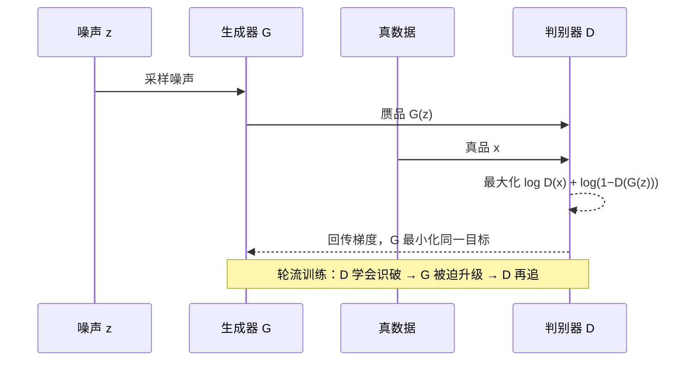
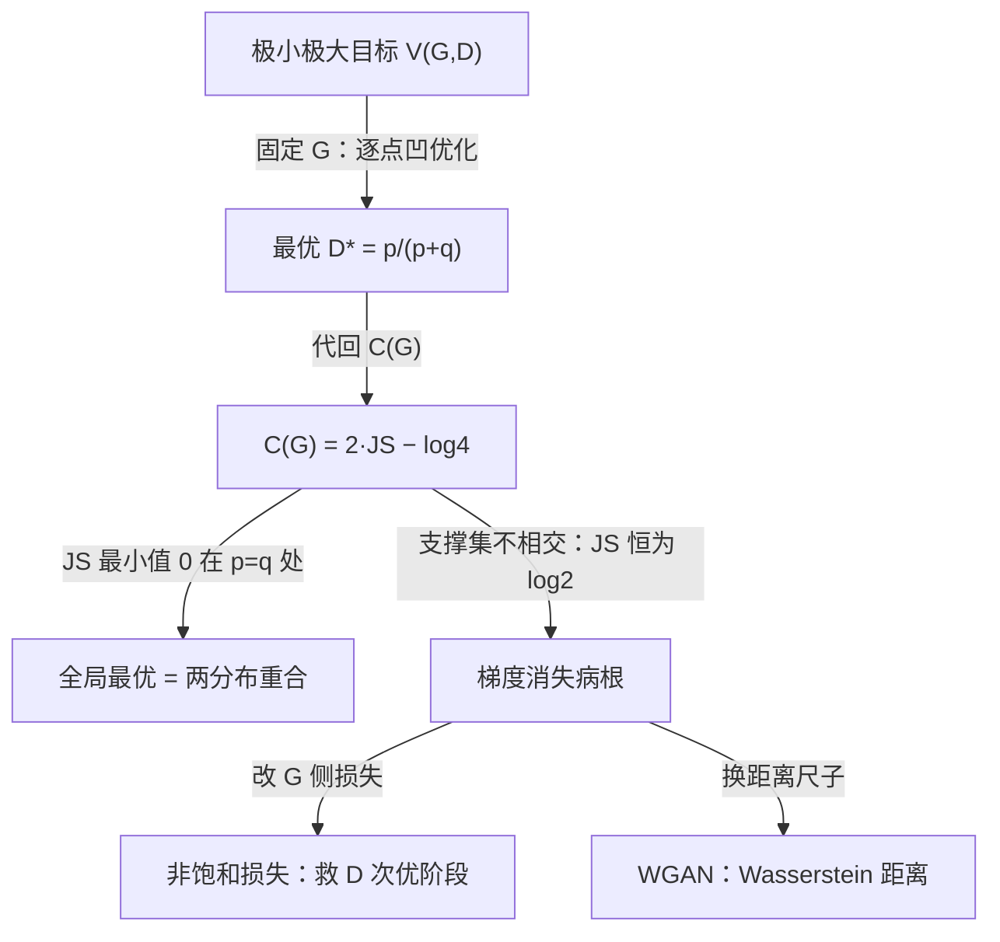
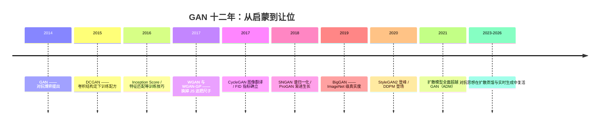

# 10 · GAN：生成对抗网络——生成式 AI 的启蒙

> **一句话理解**：让一个"造假者"网络和一个"鉴定师"网络互相博弈——鉴定师学会分辨真假，造假者被迫越造越像，最终理想状态下鉴定师只能抛硬币。

[⬆️ 返回总目录](../README.md) · [⬆️ 返回专栏目录](./README.md)

---

## 📌 论文速览

| 条目 | 内容 |
|------|------|
| 标题 | Generative Adversarial Nets |
| 作者 | Ian J. Goodfellow、Jean Pouget-Abadie、Mehdi Mirza、Bing Xu、David Warde-Farley、Sherjil Ozair、Aaron Courville、Yoshua Bengio（蒙特利尔大学等） |
| 时间 | 2014 年 6 月（arXiv:1406.2661），NIPS 2014 |
| 解决什么 | 当时的生成模型两难：显式写密度的模型（玻尔兹曼机等）似然算不动、采样要 MCMC 慢得离谱；变分自编码器（VAE）快但样本模糊 |
| 核心方法 | 生成器 $G$ 从噪声造样本、判别器 $D$ 辨真假，两者在极小极大目标下交替训练 |
| 头条数字 | MNIST 上 Parzen 窗对数似然 225±2、TFD 2057±26（论文口径，当时的评估手段）；生成与训练无需 MCMC、无需显式似然 |
| 引用地位 | 十万量级（2026 年 Google Scholar 口径）——深度生成模型被引用最多的论文之一 |
| 官方代码 | 论文未附官方实现（Theano 时代），社区复现以 DCGAN 等后续仓库为准 |

---

## 🌱 一句话核心思想

**把"生成"变成一场零和博弈：不再计算数据分布是什么，而是让一个网络去骗过另一个不断进步的网络。**

此前学生成模型的路线都要正面回答"数据分布 $p_{\text{data}}$ 的数学形式"：玻尔兹曼机写能量函数但配分函数算不动，VAE 写变分下界但高斯假设导致模糊。GAN 的取巧之处：只要求能**采样**、不需要能**算密度**。造假者 $G$ 从噪声里造样本，鉴定师 $D$ 输出"是真数据的概率"；$D$ 越厉害，$G$ 的造假就被迫越精。理想终点是 $G$ 的样本分布与数据分布完全重合，$D$ 对任何样本都只能说"五五开"——博弈没有赢家，生成就学会了。

这个框架的优雅在于：$D$ 本质上是一个**可学习的损失函数**——$G$ 不再对着人手写的距离（如均方误差）优化，而是对着一个同步进化的"考官"优化。这是它对后世最持久的启发。

---

## 🧠 方法精读

### 记号翻译表（论文原文 → 本库第 12 章）

| 论文记号 | 含义 | 本库说法 |
|----------|------|----------|
| $G(z;\theta_g)$ | 生成器，把噪声 $z \sim p_z$ 映成样本 | 造假者 |
| $D(x;\theta_d)$ | 判别器，输出 $x$ 来自真实数据的概率 | 鉴定师 |
| $p_{\text{data}}$ | 真实数据分布 | 真品分布 |
| $p_g$ | $G$ 生成样本服从的分布 | 赝品分布 |
| $V(G, D)$ | 极小极大目标函数 | 博弈记分牌 |
| $\log$ | **自然对数**（论文口径） | 注意与 log₂ 口径的 JS 值差一个常数因子 |

> ⚠️ 对数口径说明：论文全文用自然对数，因此 JS 散度上界是 $\log 2 \approx 0.693$、$C(G)$ 全局最小值是 $-\log 4 \approx -1.386$。很多教材用 log₂，此时 JS 上界恰为 1——读到不同数字先查口径。

---

### 机制一：极小极大目标——博弈的记分牌

$$
\min_G \ \max_D \ V(G, D) = \mathbb{E}_{x \sim p_{\text{data}}}[\log D(x)] + \mathbb{E}_{z \sim p_z}[\log(1 - D(G(z)))]
$$

> 👉 **人话**：$D$ 想最大化"给真品打高分 + 给赝品打低分"（两项对数都取大）；$G$ 想最小化同一目标——即让第二项 $\log(1 - D(G(z)))$ 尽可能小，也就是骗过 $D$。同一个记分牌，一个想推高、一个想压低，这就是"极小极大"。

训练时不是解这个博弈的解析解，而是交替随机梯度下降（论文算法 1）：先训 $D$ 若干步（论文实验用 $k=1$），再训 $G$ 一步，循环往复：



---

### 机制二：判别器的最优解——逐点解一道微积分题

固定 $G$，$D$ 的最优解有闭式（论文定理 1）：

$$
D^*(x) = \frac{p_{\text{data}}(x)}{p_{\text{data}}(x) + p_g(x)}
$$

> 👉 **人话**：最优鉴定师给 $x$ 打的分，是"此点真品密度占真假总密度的比例"。若某点真品密度是赝品的两倍，最优判别是 $2/3$；两者处处相等时（生成完美），$D^* \equiv 1/2$——只能抛硬币。

<details>
<summary>🧮 展开推导：$D^*$ 逐项求极值（不跳步）</summary>

**第 1 步（把期望拆成逐点积分）**。固定 $G$ 后，$p_g$ 是固定分布。按期望定义展开（记 $p = p_{\text{data}},\ q = p_g$）：

$$
V(D) = \int p(x) \log D(x)\, dx + \int q(x) \log(1 - D(x))\, dx
$$

积分是逐点被积函数的相加——**每个 $x$ 处的 $D(x)$ 各管各的**，互不牵连。于是全局最大化可以拆成逐点最大化：

$$
\max_{D(x) \in (0,1)} \ f(D(x)) := p(x) \log D(x) + q(x) \log(1 - D(x))
$$

**第 2 步（求驻点）**。对 $D(x)$ 求导（注意 $p(x), q(x)$ 在该点是常数）：

$$
f'(D) = \frac{p}{D} - \frac{q}{1 - D}
$$

令 $f'(D) = 0$：

$$
\frac{p}{D} = \frac{q}{1-D} \;\Rightarrow\; p(1 - D) = qD \;\Rightarrow\; p = (p + q) D \;\Rightarrow\; D^* = \frac{p}{p+q}
$$

**第 3 步（确认是极大）**。二阶导：

$$
f''(D) = -\frac{p}{D^2} - \frac{q}{(1-D)^2} < 0
$$

处处为负——凹函数，驻点即最大值点。由于 $D \in (0,1)$ 端点处 $f \to -\infty$（对数发散），最大值必在内部驻点取得。

**第 4 步（代两个极端读结论）**。

- $p = q$（生成完美）：$D^* = \frac{p}{2p} = \frac{1}{2}$——对任何样本都答"一半一半"；
- 支撑集不相交（$x$ 处 $p > 0, q = 0$）：$D^* = \frac{p}{p} = 1$——真品处满分、赝品处 $0$，**完美判别**。这个极端情形就是后面"梯度消失"病根的入口。

</details>

---

### 机制三：代回目标——博弈的真面目是 JS 散度

把 $D^*$ 代回 $V$，得到只关于 $G$ 的函数 $C(G)$（论文定理 1 的后半）：

$$
C(G) = -\log 4 + 2 \cdot \mathrm{JS}(p_{\text{data}} \,\|\, p_g)
$$

> 👉 **人话**：鉴定师火力全开之后，记分牌上只剩一件事：真品分布与赝品分布的 JS 散度（Jensen–Shannon Divergence，一种对称的分布距离，恒非负、两分布相等时为 0）。$G$ 的"最小化博弈目标"**恰好等价于**"把 JS 散度压到零"——理论上的全局最优解就是两分布重合。博弈的外壳，下面是距离的最小化。

<details>
<summary>📐 数学深潜：从 $D^*$ 到 $-\log 4 + 2\,\mathrm{JS}$ 的完整代数链</summary>

**严格陈述**。定义 $C(G) = \max_D V(G,D)$，则 $C(G) = -\log 4 + 2\,\mathrm{JS}(p_{\text{data}} \| p_g)$，且其全局最小值 $-\log 4$ **当且仅当** $p_g = p_{\text{data}}$ 处取得（论文定理 2）。

**完整推导**。

**第 1 步（代回逐点最优）**。$D^*(x) = \frac{p}{p+q}$，于是 $1 - D^* = \frac{q}{p+q}$：

$$
C(G) = \int p \log \frac{p}{p+q}\,dx + \int q \log \frac{q}{p+q}\,dx
$$

**第 2 步（凑出混合分布）**。定义 $m(x) := \frac{p(x) + q(x)}{2}$（两分布的平均）。则 $p + q = 2m$，代入第一项：

$$
\int p \log \frac{p}{2m}\,dx = \int p \left[\log \frac{p}{m} - \log 2\right] dx = \int p \log\frac{p}{m}\,dx - \log 2 \int p\,dx
$$

概率密度积分为 1（$\int p\,dx = 1$），第一项化简为 $\mathrm{KL}(p \| m) - \log 2$。同理第二项 $= \mathrm{KL}(q \| m) - \log 2$。

**第 3 步（合并）**。

$$
C(G) = \mathrm{KL}(p \| m) + \mathrm{KL}(q \| m) - \log 4 = 2\,\mathrm{JS}(p \| q) - \log 4
$$

最后一步用了 JS 散度的定义：

$$
\mathrm{JS}(p \| q) := \frac{1}{2}\,\mathrm{KL}\!\left(p \,\Big\|\, \frac{p+q}{2}\right) + \frac{1}{2}\,\mathrm{KL}\!\left(q \,\Big\|\, \frac{p+q}{2}\right)
$$

**第 4 步（读出全局最优）**。KL 散度恒非负、当且仅当两分布相等时为 0，因此 $\mathrm{JS} \geq 0$ 且仅当 $p = q$ 时为 0。所以：

$$
C(G) \geq -\log 4, \quad \text{等号成立} \iff p_g = p_{\text{data}}
$$

博弈的全局最优解 = 生成分布与数据分布完全重合，与第 2 步"$p = q$ 时 $D^* = 1/2$"的直觉严格一致。

**几何/概率解释**。JS 散度是"以平均分布 $m$ 为镜子"的两个 KL 之和：把 $p$ 和 $q$ 分别与它们的中间地带比较，两边差距之和就是 JS。它是**对称**的（KL 不对称）、**有界**的（自然对数口径下 $\leq \log 2$）——有界这一点，正是下一节病根的来源。

**反例与边界**。整条链的"当且仅当"建立在两个理想化假设上：$D$ 有足够容量逼近 $D^*$、目标按期望而非小批量估计。真实训练中两者都不成立——所以"理论上全局最优存在且唯一"**不等于**"SGD 会收敛到那里"。论文自己的定理 3、4 也只是在"每步 $D$ 训到最优、概率比可直接估计"的假设下证明不动点是 $p_g = p_{\text{data}}$。理论与训练动力学之间的这条裂缝，是 GAN 后续十年研究的主题。

> 👉 **一句人话**：把最优鉴定师代入记分牌，博弈退化为"最小化真赝分布的 JS 距离"，最优解就是两分布重合——但这个解是数学上的存在，不是训练保证能走到的终点。

</details>

推导链全景（自绘）：



---

### 机制四：病根与第一副药——梯度消失和非饱和损失

**病根：当两个分布的支撑集不相交时，JS 散度是常数。** 高维空间里，真实数据集中在低维流形上；随机初始化的 $G$ 产生的分布几乎必然落在**另一个**不相交的流形上。此时（机制二第 4 步的极端情形）$D^*$ 完美分开两者，$\mathrm{JS} = \log 2$ 恒定——**记分牌读数不随 $G$ 移动而变化，梯度为零**。$G$ 断粮，训练卡死。

论文给了第一副药：$G$ 不再最小化 $\log(1 - D(G(z)))$，改为最大化 $\log D(G(z))$（非饱和损失，non-saturating loss）。两者在理论最优处等价（同一单调变换），但训练初期的梯度行为天差地别。

<details>
<summary>🧮 展开推导：两种 G 侧损失的梯度对比</summary>

**第 1 步（写出两条 G 损失对 $\theta_g$ 的梯度通式）**。记 $D' = \frac{\partial D}{\partial x}$（判别器对输入的雅可比），链式法则穿过 $G$：

- 原始（饱和）损失 $L_s = \mathbb{E}_z[\log(1 - D(G(z)))]$：

$$
\nabla_{\theta_g} L_s = -\,\mathbb{E}_z\!\left[\frac{D'(G(z))}{1 - D(G(z))}\, \nabla_{\theta_g} G(z)\right]
$$

- 非饱和损失 $L_n = -\mathbb{E}_z[\log D(G(z))]$：

$$
\nabla_{\theta_g} L_n = -\,\mathbb{E}_z\!\left[\frac{D'(G(z))}{D(G(z))}\, \nabla_{\theta_g} G(z)\right]
$$

唯一的差别是分母：$1 - D$ 换成了 $D$。

**第 2 步（代入训练初期 $D(G(z)) \approx 0$）**。

- 饱和版：分母 $1 - D \approx 1$，系数 $\approx D'$。而初期 $D$ 极易区分真假（支撑集不相交时 $D$ 趋于完美），其输出对输入的变化**不敏感**（$D'$ 小）——梯度整体趋零，$\log(1-D)$ 曲线在 $D \approx 0$ 处平得像地板；
- 非饱和版：分母 $D \approx 0$，系数 $\approx D'/D$——**分母趋零反而放大梯度**，$-\log D$ 在 $D \approx 0$ 处是陡峭的山崖，$G$ 拿到清晰的"往哪改"信号。

**第 3 步（诚实地标注药效边界）**。非饱和损失救的是 **$D$ 次优阶段**（真实 SGD 训练的大部分时间）的梯度供给。它**没有改变**"$D = D^*$ 且支撑集不相交 ⇒ 梯度为零"的理论结论——那需要换尺子（WGAN 系，见[第 12 章 · 02 页](../docs/5-前沿与融合/12-生成模型与多模态/02-对抗生成网络GAN.md)的病根与药方清单）。两副药对付的是链条的不同环节。

</details>

**一贯的顽疾：模式崩塌（Mode Collapse）与振荡。** $G$ 可能发现"只造一批最像的样本"最划算——$D$ 锁死后 $G$ 跳去下一个模式，$D$ 再追，损失曲线"按下葫芦浮起瓢"，极小极大（先 $G$ 后 $D$）与极大极小（先 $D$ 后 $G$）的值不相等，博弈可以停在循环追逐里。这些现象在第 12 章正文有完整的症状与救治清单，本页只锚定出处：**它们在 2014 年原论文里就埋着**——论文报告了训练不稳、需要精心控制 $D$ 与 $G$ 的更新节奏。

---

## 📋 举个例子：两个数字看懂 $D^*$ 与病根

**例 1（正常情形）**。某像素点上 $p_{\text{data}}(x) = 2$、$p_g(x) = 1$：

$$
D^*(x) = \frac{2}{2+1} = \frac{2}{3} \approx 0.67
$$

真品密度占优，最优判别偏向真品，但不是满分——因为赝品也在此处出现。

**例 2（极端情形：支撑集不相交）**。$x$ 处 $p_{\text{data}}(x) = 2$、$p_g(x) = 0$：

$$
D^*(x) = \frac{2}{2+0} = 1, \qquad \mathrm{JS} = \log 2 \;\text{（常数，与 } G \text{ 的微小移动无关）}
$$

判别器在此完美、JS 读数封顶且**不再变化**——$G$ 无论怎么挪，只要还没"搭上"数据流形的边，梯度恒为零。这就是"训练初期 G 断粮"的微缩现场。

> 👉 **人话**：$D^*$ 是"真假密度之比"的读数表——两边都有的地方读中间值，只有一边有的地方读满格。满格之时，就是梯度断供之日。

---

## 📊 实验解读

原论文的实验放在 2026 年看非常朴素：三个数据集（MNIST、TFD 多伦多人脸库、CIFAR-10），生成器与判别器都是多层感知机（判别器用 maxout 激活与 dropout），**没有卷积、没有归一化层**——真正的"概念验证"。

**定量结果（论文口径）**：由于 GAN 无法计算似然，论文用 Parzen 窗（对生成样本做核密度估计，再在测试集上读对数似然）间接评估——MNIST 上约 **225 ± 2**、TFD 上约 **2057 ± 26**，数量级与当时的其他生成模型可比。

**Parzen 窗为什么是弱评估**：核密度在高维空间本身就极不可靠（带宽超参敏感）；它衡量"样本落在数据密集区附近"，**不衡量多样性**——$G$ 只会造一类样本时 Parzen 分数可能依然体面。模式崩塌在这把尺子下是隐形的。这也是后来 Inception Score（arXiv:1606.03498）与 FID（arXiv:1706.08500）取而代之的原因。

**证明了什么**：

- 对抗训练**可行**：无需显式密度、无需 MCMC 采样，纯反向传播就能训出生成器，MNIST/TFD 的样本肉眼可辨；
- 框架**通用**：论文在同一框架下讨论了条件生成、判别器可复用做特征提取等扩展方向——后来都长成了独立方向。

**没证明什么**：

- 没证明训练**稳定**或**收敛**——所有定理依赖"容量无限、样本无限、$D$ 每步最优"的理想化；论文自己报告需要平衡 $G$ 与 $D$ 的更新次数，训练不稳是经验事实而非例外；
- 没证明能逼近**全部**模式——实验规模与评估手段（Parzen 窗）根本看不见模式崩塌；
- 没有高分辨率、条件控制的证据——那是 DCGAN（arXiv:1511.06434）之后的故事。

---

## 🔁 后世影响与争议



**谁站在它肩上**：

- **训练配方线**：DCGAN 给出卷积 GAN 的标准配置；SNGAN（arXiv:1802.05957）用谱归一化管住 $D$ 的 Lipschitz 常数；BigGAN（arXiv:1809.11096）证明 GAN 也能吃下 ImageNet 级规模；
- **理论诊治线**：WGAN（arXiv:1701.07875）指出病根在 JS 这把尺子，换成几乎处处连续可导的 Wasserstein 距离；WGAN-GP（arXiv:1704.00028）用梯度惩罚替代权重裁剪——"换尺子"成为一代论文的标准开场；
- **应用爆发线**：ProGAN/StyleGAN（arXiv:1710.10196、1812.04948）的逼真人脸、CycleGAN（arXiv:1703.10593）的图像风格翻译、SRGAN（arXiv:1609.04802）的超分辨率——"thispersondoesnotexist"一度是 AI 出圈的名片；
- **思想外溢**：对抗训练作为通用技术流向模型鲁棒性（对抗样本防御）、域对抗学习（Domain-Adversarial Networks）、去偏与公平性（对抗去除敏感属性）、数据增强——**"用一个网络考另一个网络"** 这个动作本身比 GAN 的生成任务活得更广。

**被扩散取代的历程（诚实的编年史）**：2020 年 DDPM（arXiv:2006.11239）在 CIFAR-10 上 FID 追平最强 GAN；2021 年 ADM（arXiv:2105.05233，标题即"扩散模型击败 GAN"）在 ImageNet 128×128 上以 FID 4.59 明显超过最强 BigGAN（论文口径），宣告图像生成主战场易主。到 2026 年，文生图、视频生成的主流管线都是扩散或其变体——原因在第 12 章 03 页有系统分析：**GAN 的博弈结构没有稳定的损失地形，扩散把生成改写成单一回归损失，用算力换稳定性**。

**但 GAN 没有谢幕**：

- 判别器作为**可学习损失函数**的思想在扩散蒸馏中复活——对抗扩散蒸馏（ADD，arXiv:2311.17042）用判别器把扩散采样压到少步甚至一步，支撑了实时文生图；
- CycleGAN 式图像翻译因"成对数据零要求 + 推理快"仍在部分生产场景使用；
- 对 GAN 均衡与模式崩塌的理论刻画（是否存在解环、如何收敛）至今仍是半开垦地——一篇 2014 年论文留下的开放问题清单，本身是它重要性的证明。

**争议与反思**：

- **不稳定是结构性的**：极小极大目标没有凸性保证，两个网络互相追逐的动力学至今没有完整理论——这催生了 WGAN 等一整条"换尺子"谱系；
- **评估难题**：从 Parzen 窗到 IS 再到 FID，GAN 的每把评估尺子都被指出盲区（FID 对类内多样性、对图像先处理都敏感）；
- **滥用之问**：逼真人脸与换脸从第一天起就伴随深伪（Deepfake）治理难题——生成能力与滥用的距离，是这个范式给社会出的第一道题。

---

## 💻 动手试试：40 行复现博弈与模式崩塌

```python
import torch
import torch.nn as nn

torch.manual_seed(0)

# ---- 真数据：故意选"双模态"——两个高斯团，方便观察模式崩塌 ----
def sample_real(n):
    mode = torch.randint(0, 2, (n, 1))            # 模态 0 或 1
    x = mode * 6 + torch.randn(n, 1) * 0.5        # 两团中心分别在 x=0 和 x=6
    y = torch.randn(n, 1) * 0.5
    return torch.cat([x, y], dim=1)

G = nn.Sequential(nn.Linear(2, 32), nn.ReLU(), nn.Linear(32, 2))          # 造假者
D = nn.Sequential(nn.Linear(2, 32), nn.ReLU(), nn.Linear(32, 1),
                  nn.Sigmoid())                                           # 鉴定师
optG = torch.optim.Adam(G.parameters(), lr=1e-3)
optD = torch.optim.Adam(D.parameters(), lr=1e-3)
bce = nn.BCELoss()

for step in range(3000):
    # ① 训 D：真样本目标 1，假样本目标 0（detach 防止梯度漏进 G）
    real = sample_real(128)
    z = torch.randn(128, 2)
    lossD = bce(D(real), torch.ones(128, 1)) + bce(D(G(z).detach()), torch.zeros(128, 1))
    optD.zero_grad(); lossD.backward(); optD.step()
    # ② 训 G：非饱和损失 −log D(G(z))（论文的药方，用 BCE 实现）
    z = torch.randn(128, 2)
    lossG = bce(D(G(z)), torch.ones(128, 1))
    optG.zero_grad(); lossG.backward(); optG.step()

with torch.no_grad():
    samples = G(torch.randn(2000, 2))
left  = (samples[:, 0] <  3).float().mean()      # 落在模态 0 一侧的比例
right = (samples[:, 0] >= 3).float().mean()      # 落在模态 1 一侧的比例
print(f"训练末段 D loss: {lossD.item():.3f}")
print(f"两模态样本占比: 左 {left:.1%} / 右 {right:.1%}")
# 理想情况各约 50%；多换几个种子跑，常见一侧接近 0%——GAN 只学会了"半边世界"，
# 这就是模式崩塌的现场。也正是这不稳定，催生了后来的扩散模型（下一页）。
```

> 🧪 **改什么、看什么**：① 换种子跑 5 次——统计左右占比，亲眼看见"同样的代码、不同的崩法"；② 把 G 的损失换成 `torch.log(1 - D(G(z))).mean()`（饱和版原式）——初期 G 几乎学不动，体会论文为什么换药；③ 只给 D 每 1 步、G 每 5 步——博弈节奏失衡时崩得更凶，"按住葫芦浮起瓢"的曲线就长这样。

---

## 🖱️ 动手玩

> 🎮 **本库实验场**：[扩散去噪实验室](../playground/diffusion.html)——亲手体验"接替者"扩散模型的去噪过程，再回头体会 GAN 的博弈式训练少了哪份稳定；[卷积核滑动可视化](../playground/conv.html)——DCGAN 训练配方的主角就是卷积，看懂核怎么滑，就看懂了造假者的画笔。

---

## 🔗 在本库中的位置

- **本页精读的论文完整版 ↔ 正文**：[第 12 章 · 对抗生成网络 GAN](../docs/5-前沿与融合/12-生成模型与多模态/02-对抗生成网络GAN.md)——正文给出训练配方、模式崩塌救治清单与"尺子的病"深潜；本页补全 2014 年原论文的完整推导链与实验现场
- **上游**：[生成模型全景](../docs/5-前沿与融合/12-生成模型与多模态/01-生成模型全景.md)——GAN 在"四流派"里的位置（显式密度 / 隐式密度之争）
- **下游**：[扩散模型 Diffusion](../docs/5-前沿与融合/12-生成模型与多模态/03-扩散模型Diffusion.md)——接棒者的完整故事；[进阶专题 · 生成模型前沿](../docs/5-前沿与融合/12-生成模型与多模态/06-进阶专题-生成模型前沿.md)——对抗蒸馏等思想的当代去向

---

## 📝 自测（先答再看）

<details>
<summary>🖱️ 自测：四道题检验有没有读懂</summary>

**Q1：为什么最优判别器在 $p_g = p_{\text{data}}$ 时输出 1/2？**
A：$D^* = p_{\text{data}}/(p_{\text{data}} + p_g)$，两分布处处相等时分母是分子的两倍，$D^* = 1/2$——真假不可分，只能抛硬币，这就是博弈的理想终点。

**Q2：代回最优 $D$ 后，$G$ 实际在最小化什么？全局最优是多少？**
A：$C(G) = -\log 4 + 2\,\mathrm{JS}(p_{\text{data}} \| p_g)$（自然对数口径）。JS 恒非负、仅当两分布重合时为 0，故全局最优 $-\log 4$ 在 $p_g = p_{\text{data}}$ 处取得且唯一。

**Q3：训练初期 $G$ 的梯度为什么消失？非饱和损失治好了它吗？**
A：初期两分布支撑集几乎必然不相交，最优 $D$ 完美分开真假，JS 恒为 $\log 2$、读数不再随 $G$ 变化，梯度为零。非饱和损失只在 $D$ 次优（真实训练常态）时供给梯度；"$D = D^*$ 且不相交 ⇒ 零梯度"要靠 WGAN 换距离尺子才能根治。

**Q4：原论文证明了 GAN 训练会收敛到全局最优吗？**
A：没有。定理依赖容量无限、样本无限、$D$ 每步最优等理想化假设；真实 SGD 训练的不稳定与模式崩塌在原论文时代已可见。理论最优的存在性 ≠ 训练动力学的收敛性——这是 GAN 十年研究的核心裂缝。

</details>

---

## ✍️ 延伸阅读（真实 arXiv）

- GAN 原论文：Generative Adversarial Nets（2014）— https://arxiv.org/abs/1406.2661
- 综述入门：NIPS 2016 Tutorial: Generative Adversarial Networks（2016）— https://arxiv.org/abs/1701.00160
- 训练配方：DCGAN（2015）— https://arxiv.org/abs/1511.06434
- 理论诊治：WGAN（2017）— https://arxiv.org/abs/1701.07875；WGAN-GP（2017）— https://arxiv.org/abs/1704.00028；Towards Principled Methods for Training GANs（2017）— https://arxiv.org/abs/1701.04856
- 评估指标：Improved Techniques for Training GANs / Inception Score（2016）— https://arxiv.org/abs/1606.03498；FID（2017）— https://arxiv.org/abs/1706.08500
- 应用名作：CycleGAN（2017）— https://arxiv.org/abs/1703.10593；StyleGAN（2018）— https://arxiv.org/abs/1812.04948；BigGAN（2018）— https://arxiv.org/abs/1809.11096
- 接棒与复活：DDPM（2020）— https://arxiv.org/abs/2006.11239；Diffusion Models Beat GANs（2021）— https://arxiv.org/abs/2105.05233；对抗扩散蒸馏 ADD（2023）— https://arxiv.org/abs/2311.17042

---

[⬅️ 上一页：09 · LoRA](./09-LoRA.md) · [返回专栏目录](./README.md) · [下一页：11 · DDPM ➡️](./11-DDPM.md)
