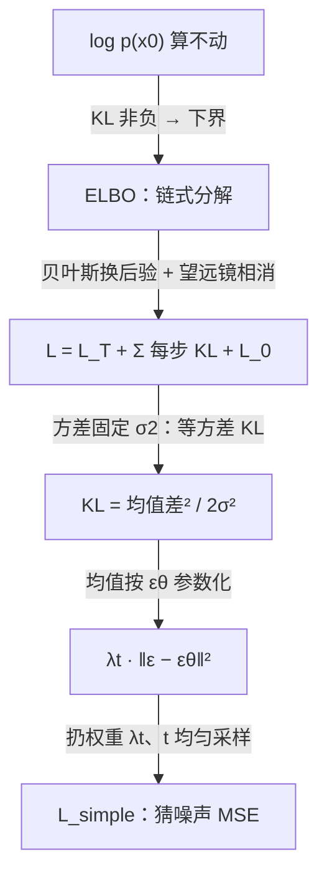
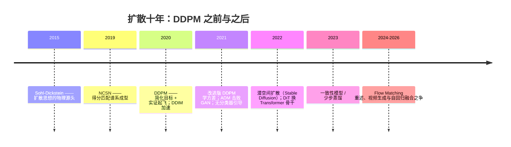

# 11 · DDPM：去噪扩散概率模型——扩散时代的起点

> **一句话理解**：把"生成图像"拆成一千步"从满屏雪花的图里擦掉一点噪声"——每步都是一道答案已知的小回归题，训练稳如老狗，最终从纯噪声里显影出一张图。

[⬆️ 返回总目录](../README.md) · [⬆️ 返回专栏目录](./README.md)

---

## 📌 论文速览

| 条目 | 内容 |
|------|------|
| 标题 | Denoising Diffusion Probabilistic Models |
| 作者 | Jonathan Ho、Ajay Jain、Pieter Abbeel（UC Berkeley） |
| 时间 | 2020 年 6 月（arXiv:2006.11239），NeurIPS 2020 |
| 解决什么 | GAN 训练不稳、模式崩塌；VAE 样本模糊；自回归模型能算似然但逐像素采样极慢 |
| 核心方法 | 固定的前向加噪链（$T=1000$ 步）+ 学习的反向去噪链；变分界化简后训练目标坍缩为"预测噪声的 MSE" |
| 头条数字 | CIFAR-10 无条件生成 FID **3.17**（当时最优）、IS 9.46；LSUN bedroom 4.90（大模型，论文口径）；训练/采样全程无博弈、无 MCMC |
| 引用地位 | 数万次量级（2026 年 Google Scholar 口径）——扩散模型的现代复兴之作，文生图时代的直接源头 |
| 官方代码 | github.com/hojonathanho/diffusion |

---

## 🌱 一句话核心思想

**生成的难点在于"一步从噪声跳到图像"跨度太大；那就铺一千级台阶，每级只学"擦掉一点噪声"。**

前向过程是人为设计的：往图里逐步撒高斯噪声，撒一千步后原图彻底变成白噪声——这一步不需要学习，数学上是固定的。反向过程才是要学的：给定一张噪声图，猜"里面掺了多少噪声"，减掉一点点。这个"猜噪声"的任务有标准答案（训练时噪声是自己撒的），于是整个生成建模变成一个**普通的回归问题**——没有 GAN 那样两个网络互相追逐的博弈，没有模式崩塌，损失曲线平滑得让人感动。

理论包装是变分推断：DDPM 属于隐变量模型，反向链的训练目标严格说是对数似然的证据下界（ELBO）；论文的贡献是证明在下界里**每一项都恰好正比于噪声预测误差**，于是"下界"可以直接换成更简单的"猜噪声 MSE"——而且换了之后，图像质量反而更好。

---

## 🧠 方法精读

### 记号翻译表（论文原文 → 本库第 12 章）

| 论文记号 | 含义 | 本库说法 |
|----------|------|----------|
| $x_0$ | 干净原图 | 原图 |
| $x_t$ | 加噪 $t$ 步后的图 | 第 $t$ 级"雪花照片" |
| $q(x_t \mid x_{t-1})$ | 前向加噪（固定） | 加噪工序 |
| $p_\theta(x_{t-1} \mid x_t)$ | 反向去噪（学习） | 去噪网络 |
| $\beta_t$ | 第 $t$ 步噪声方差（小，$10^{-4} \to 0.02$ 线性） | 噪声预算 |
| $\alpha_t = 1 - \beta_t$，$\bar\alpha_t = \prod_{s=1}^{t} \alpha_s$ | 累积保持率 | 信号还剩多少 |
| $\epsilon_\theta(x_t, t)$ | 网络预测的噪声 | 猜噪声 |
| $\tilde\mu_t, \tilde\beta_t$ | 真后验 $q(x_{t-1}\mid x_t, x_0)$ 的均值/方差 | 反工序的"标准答案" |

---

### 机制一：前向过程与一步到位的闭式

前向是马尔可夫链，每步把图往噪声里推一点：

$$
q(x_t \mid x_{t-1}) = \mathcal{N}\!\left(x_t;\ \sqrt{1 - \beta_t}\, x_{t-1},\ \beta_t I\right)
$$

> 👉 **人话**：每一步做两件事——把原图乘以略小于 1 的系数（信号微降），再叠加一点新高斯噪声。$\beta_t$ 很小（从 $10^{-4}$ 慢慢加到 $0.02$），一千步之后 $\bar\alpha_T \approx 0$，信号归零、只剩噪声。

关键性质是**任意一步都能一步跳到**（训练时不必真跑 $t$ 次循环）：

$$
q(x_t \mid x_0) = \mathcal{N}\!\left(x_t;\ \sqrt{\bar\alpha_t}\, x_0,\ (1 - \bar\alpha_t) I\right)
\quad\Longleftrightarrow\quad x_t = \sqrt{\bar\alpha_t}\, x_0 + \sqrt{1 - \bar\alpha_t}\, \epsilon,\ \ \epsilon \sim \mathcal{N}(0, I)
$$

> 👉 **人话**：想要第 $t$ 步的加噪图，不用一步步加——按公式把"原图成分"和"噪声成分"一次配好。这是训练效率的命根子：每个训练样本随机抽一个 $t$，一步就造出监督对 $(x_t, \epsilon)$。

<details>
<summary>🧮 展开推导：高斯相加的归纳证明（不跳步）</summary>

**命题**：对任意 $t \geq 1$，$x_t = \sqrt{\bar\alpha_t}\, x_0 + \sqrt{1 - \bar\alpha_t}\, \bar\epsilon$，其中 $\bar\epsilon \sim \mathcal{N}(0, I)$ 与 $x_0$ 独立。

**第 1 步（基础情形 $t = 1$）**。前向定义直接给出 $x_1 = \sqrt{1-\beta_1}\, x_0 + \sqrt{\beta_1}\, \epsilon$。由 $\alpha_1 = 1 - \beta_1$、$\bar\alpha_1 = \alpha_1$，恰为命题形式。

**第 2 步（归纳假设）**。设 $x_{t-1} = \sqrt{\bar\alpha_{t-1}}\, x_0 + \sqrt{1 - \bar\alpha_{t-1}}\, \bar\epsilon$，$\bar\epsilon \sim \mathcal{N}(0,I)$ 独立于新撒的噪声 $\epsilon$。

**第 3 步（做一步前向）**。

$$
x_t = \sqrt{\alpha_t}\, x_{t-1} + \sqrt{\beta_t}\, \epsilon
= \sqrt{\alpha_t \bar\alpha_{t-1}}\, x_0 + \underbrace{\sqrt{\alpha_t (1 - \bar\alpha_{t-1})}\, \bar\epsilon + \sqrt{\beta_t}\, \epsilon}_{\text{两个独立高斯之和}}
$$

**第 4 步（合并噪声项）**。独立高斯的线性组合仍是高斯；两个独立标准高斯分别乘系数 $a = \sqrt{\alpha_t (1-\bar\alpha_{t-1})}$ 与 $b = \sqrt{\beta_t}$ 后相加，方差为 $a^2 + b^2$：

$$
a^2 + b^2 = \alpha_t (1 - \bar\alpha_{t-1}) + \beta_t = \alpha_t - \alpha_t \bar\alpha_{t-1} + (1 - \alpha_t) = 1 - \bar\alpha_t
$$

（最后一步用了 $\bar\alpha_t = \alpha_t \bar\alpha_{t-1}$。）于是噪声项 $= \sqrt{1 - \bar\alpha_t}\, \bar\epsilon'$，$\bar\epsilon' \sim \mathcal{N}(0, I)$；信号项系数 $\sqrt{\alpha_t \bar\alpha_{t-1}} = \sqrt{\bar\alpha_t}$。命题对 $t$ 成立，归纳完成。∎

> 👉 **人话**：一千次"乘小系数 + 撒小噪声"的效果，等于一次"乘总系数 + 撒总噪声"——因为独立高斯的方差直接相加，不用管顺序与次数。

</details>

前向与反向的全景（自绘）：


---

### 机制二：真后验的闭式——反工序的"标准答案"

推导训练目标需要知道：如果已知原图 $x_0$ 和加噪图 $x_t$，那么中间的 $x_{t-1}$ 服从什么分布？贝叶斯公式给出闭式（高斯）：

$$
q(x_{t-1} \mid x_t, x_0) = \mathcal{N}\!\left(x_{t-1};\ \tilde\mu_t(x_t, x_0),\ \tilde\beta_t I\right)
$$

$$
\tilde\mu_t = \frac{\sqrt{\bar\alpha_{t-1}}\, \beta_t\, x_0 + \sqrt{\alpha_t}\, (1 - \bar\alpha_{t-1})\, x_t}{1 - \bar\alpha_t},
\qquad
\tilde\beta_t = \frac{1 - \bar\alpha_{t-1}}{1 - \bar\alpha_t}\, \beta_t
$$

> 👉 **人话**：知道了起点和终点，中间那步其实被前向工序**唯一确定成一个高斯**：均值是 $x_0$ 与 $x_t$ 的加权折中（两者按各自"可信度"配比），方差是个只依赖调度的小数。它是后面所有 KL 项里的"标准答案"。

<details>
<summary>🧮 展开推导：贝叶斯 + 高斯乘积配平方</summary>

**第 1 步（贝叶斯 + 马尔可夫性）**。$q(x_{t-1} \mid x_t, x_0) = \dfrac{q(x_t \mid x_{t-1}, x_0)\, q(x_{t-1} \mid x_0)}{q(x_t \mid x_0)}$。由马尔可夫性 $q(x_t \mid x_{t-1}, x_0) = q(x_t \mid x_{t-1})$；分母与 $x_{t-1}$ 无关，当作归一化常数。

**第 2 步（写出两个高斯的密度并相乘）**。作为 $x_{t-1}$ 的函数：

$$
q(x_{t-1} \mid x_t, x_0) \propto \exp\!\left(-\frac{\|x_t - \sqrt{\alpha_t}\, x_{t-1}\|^2}{2\beta_t}\right) \cdot \exp\!\left(-\frac{\|x_{t-1} - \sqrt{\bar\alpha_{t-1}}\, x_0\|^2}{2(1 - \bar\alpha_{t-1})}\right)
$$

**第 3 步（配平方：指数相加 = 二次型相加）**。把指数上的二次型按 $x_{t-1}$ 整理，$x_{t-1}^2$ 项的系数（精度）为：

$$
\Lambda = \frac{\alpha_t}{\beta_t} + \frac{1}{1 - \bar\alpha_{t-1}} = \frac{\alpha_t(1 - \bar\alpha_{t-1}) + \beta_t}{\beta_t (1 - \bar\alpha_{t-1})} = \frac{1 - \bar\alpha_t}{\beta_t (1 - \bar\alpha_{t-1})}
$$

（分子用了机制一第 4 步的恒等式。）方差 $= \Lambda^{-1} = \dfrac{\beta_t (1 - \bar\alpha_{t-1})}{1 - \bar\alpha_t} = \tilde\beta_t$。✓

**第 4 步（线性项定均值）**。一次项系数为 $\dfrac{\sqrt{\alpha_t}}{\beta_t} x_t + \dfrac{\sqrt{\bar\alpha_{t-1}}}{1 - \bar\alpha_{t-1}} x_0$，均值 $= \Lambda^{-1} \times$（一次项系数），通分整理即得 $\tilde\mu_t$。✓

**读一眼结构**：$\tilde\mu_t$ 的两个系数 $\dfrac{\sqrt{\bar\alpha_{t-1}}\beta_t}{1-\bar\alpha_t}$ 与 $\dfrac{\sqrt{\alpha_t}(1-\bar\alpha_{t-1})}{1-\bar\alpha_t}$ 之和在小 $\beta$ 下非常接近 1（下文算例 $\beta=0.1$ 时约为 0.9986；$\beta$ 越小越接近）——**去一步噪声 ≈ 在"原图"与"现状"之间按调度规定的比例插值**，权重全部由调度 $\beta_t$ 决定，没有任何可学参数。

</details>

---

### 机制三：从变分界到"猜噪声 MSE"——本页的主推导链

DDPM 是隐变量模型：隐变量是整条加噪链 $x_{1:T}$。严格训练目标是最大化对数似然的证据下界；下面的推导链证明它如何一步步坍缩成 MSE。这正是[第 12 章 · 03 页](../docs/5-前沿与融合/12-生成模型与多模态/03-扩散模型Diffusion.md)骨架的论文完整版。

<details open>
<summary>📐 数学深潜：ELBO → 每步 KL → 噪声预测 MSE（每步拆解，不跳步）</summary>

**严格陈述**。定义负对数似然上界（负 ELBO）为 $L := -\mathbb{E}_q\!\left[\log \dfrac{p_\theta(x_{0:T})}{q(x_{1:T} \mid x_0)}\right]$，则 $-\log p_\theta(x_0) \leq L$，且 $L$ 可拆为 $T + 1$ 项；在两个设计选择（反向方差固定、均值按噪声参数化）之下，每个中间项正比于噪声预测误差的平方。

**第 1 步（下界从哪来）**。由 KL 散度非负：

$$
\log p_\theta(x_0) = \mathbb{E}_q\!\left[\log \frac{p_\theta(x_{0:T})}{q(x_{1:T} \mid x_0)}\right] + D_{\mathrm{KL}}\!\left(q(x_{1:T} \mid x_0)\ \big\|\ p_\theta(x_{1:T} \mid x_0)\right) \;\geq\; \mathbb{E}_q\!\left[\log \frac{p_\theta(x_{0:T})}{q(x_{1:T} \mid x_0)}\right]
$$

> 人话：似然算不动（要积掉整条链），但"下界"可以逐项算——优化下界就是在"向上逼近"似然。

**第 2 步（两个联合分布按各自的链分解）**。反向生成模型 $p_\theta(x_{0:T}) = p(x_T)\prod_{t=1}^{T} p_\theta(x_{t-1} \mid x_t)$；前向 $q(x_{1:T} \mid x_0) = \prod_{t=1}^{T} q(x_t \mid x_{t-1})$。取负：

$$
L = \mathbb{E}_q\!\left[\underbrace{D_{\mathrm{KL}}\big(q(x_T \mid x_0)\,\big\|\,p(x_T)\big)}_{L_T} + \sum_{t=2}^{T} \underbrace{D_{\mathrm{KL}}\big(q(x_{t-1} \mid x_t, x_0)\,\big\|\,p_\theta(x_{t-1} \mid x_t)\big)}_{L_{t-1}} + \underbrace{\big(-\log p_\theta(x_0 \mid x_1)\big)}_{L_0}\right]
$$

推导要点：对每个 $t \geq 2$，用马尔可夫性写 $q(x_t \mid x_{t-1}) = q(x_t \mid x_{t-1}, x_0)$，再用贝叶斯 $q(x_{t-1} \mid x_t, x_0)\, q(x_t \mid x_0) = q(x_t \mid x_{t-1}, x_0)\, q(x_{t-1} \mid x_0)$ 把"前向因子"替换成"后验因子"；边缘项 $q(x_t \mid x_0)$ 沿 $t$ 望远镜相消（相邻两项的 $q(x_t \mid x_0)$ 一消一留），最后只剩首端 $q(x_T \mid x_0)$ 对先验 $p(x_T) = \mathcal{N}(0, I)$ 的 KL、以及 $t = 1$ 处的重构项 $L_0$。

> 人话：下界 = "终点够不够随机"（$L_T$，调度设计好则 $\approx 0$）+ "每一步反工序学得像不像"（$T - 1$ 个 KL，训练主战场）+ "最后一步还原像素"（$L_0$，离散像素时有专门处理）。**每个中间项都是"真后验 vs 网络输出"的分布对分布比较。**

**第 3 步（设计选择一：方差固定）**。把反向条件取为 $p_\theta(x_{t-1} \mid x_t) = \mathcal{N}\big(\mu_\theta(x_t, t),\ \sigma_t^2 I\big)$，$\sigma_t^2$ 不训练，直接取 $\beta_t$ 或 $\tilde\beta_t$（论文两种都试，结果接近）。于是每项 KL 是**方差相同的两个高斯**之间的 KL，有闭式：

$$
D_{\mathrm{KL}}\big(\mathcal{N}(\mu_1, \sigma^2)\ \big\|\ \mathcal{N}(\mu_2, \sigma^2)\big) = \frac{\|\mu_1 - \mu_2\|^2}{2\sigma^2}
$$

（把 KL 积分定义展开：指数上二次型相减，$\mu$ 无关的项全部相消，只剩均值差的平方。）

> 人话：方差钉死后，"分布对分布"的 KL 塌成"点对点"的欧氏距离——**只剩均值要学**。

**第 4 步（设计选择二：均值按噪声参数化）**。真后验均值 $\tilde\mu_t$ 含有未知的 $x_0$。把机制一的闭式反过来解出 $x_0 = \big(x_t - \sqrt{1-\bar\alpha_t}\, \epsilon\big) / \sqrt{\bar\alpha_t}$，代入 $\tilde\mu_t$ 并用恒等式 $\sqrt{\bar\alpha_{t-1}/\bar\alpha_t} = 1/\sqrt{\alpha_t}$ 化简（完整代数见下方小折叠），得到：

$$
\tilde\mu_t = \frac{1}{\sqrt{\alpha_t}}\left(x_t - \frac{\beta_t}{\sqrt{1-\bar\alpha_t}}\, \epsilon\right)
\quad\Longrightarrow\quad
\mu_\theta(x_t, t) = \frac{1}{\sqrt{\alpha_t}}\left(x_t - \frac{\beta_t}{\sqrt{1-\bar\alpha_t}}\, \epsilon_\theta(x_t, t)\right)
$$

网络不再直接预测均值，而是预测**当初撒进去的那个噪声** $\epsilon$。

**第 5 步（代入第 3 步的 KL）**。两个均值相减时 $x_t$ 项相消（参数化刻意让它俩共享结构），只剩：

$$
L_{t-1} = \mathbb{E}_q\!\left[\frac{\beta_t^2}{2\sigma_t^2\, \alpha_t\, (1 - \bar\alpha_t)}\, \big\|\epsilon - \epsilon_\theta(x_t, t)\big\|^2\right] + C
$$

**第 6 步（论文的临门一脚：简化）**。严格下界里每项带系数 $\lambda_t = \dfrac{\beta_t^2}{2\sigma_t^2 \alpha_t (1-\bar\alpha_t)}$；论文发现**扔掉这些系数、把 $t$ 改为均匀采样**，图像质量反而更好：

$$
L_{\mathrm{simple}} = \mathbb{E}_{t \sim U[1,T],\, x_0,\, \epsilon}\Big[\big\|\epsilon - \epsilon_\theta\big(\sqrt{\bar\alpha_t}\, x_0 + \sqrt{1-\bar\alpha_t}\, \epsilon,\ t\big)\big\|^2\Big]
$$

> 人话：最终训练目标就是"撒一个噪声、造一张雪花图、让网络把噪声猜回来"的 MSE——一个博士生第一周就会写的回归循环。

<details>
<summary>🧮 小折叠：第 4 步的均值代数（三行）</summary>

代入 $x_0 = (x_t - \sqrt{1-\bar\alpha_t}\epsilon)/\sqrt{\bar\alpha_t}$ 与 $\sqrt{\bar\alpha_{t-1}} = \sqrt{\bar\alpha_t}/\sqrt{\alpha_t}$：

$$
\tilde\mu_t = \frac{\frac{\beta_t}{\sqrt{\alpha_t}}\big(x_t - \sqrt{1-\bar\alpha_t}\,\epsilon\big) + \sqrt{\alpha_t}(1-\bar\alpha_{t-1})\, x_t}{1 - \bar\alpha_t}
$$

分子中 $x_t$ 的合并系数：$\dfrac{\beta_t}{\sqrt{\alpha_t}} + \sqrt{\alpha_t}(1-\bar\alpha_{t-1}) = \dfrac{\beta_t + \alpha_t(1-\bar\alpha_{t-1})}{\sqrt{\alpha_t}} = \dfrac{1-\bar\alpha_t}{\sqrt{\alpha_t}}$。于是 $\tilde\mu_t = \dfrac{1}{\sqrt{\alpha_t}}\Big(x_t - \dfrac{\beta_t}{\sqrt{1-\bar\alpha_t}}\epsilon\Big)$。∎

</details>

**反例与边界**。两个"钉死"都是选择而非必然：若学习方差（改进版 DDPM，arXiv:2102.09672），KL 不再是纯均值差；若扔掉 $\lambda_t$，优化的不再是严格的似然下界——下界给出的是**合法的锚**，不是**质量最优的锚**（论文自己的消融就是证据，见实验解读）。这条"设计空间"视角后来被 EDM（arXiv:2206.00364）摊开重设计，见[进阶专题](../docs/5-前沿与融合/12-生成模型与多模态/06-进阶专题-生成模型前沿.md)。

> 👉 **一句人话**：变分界这尊大佛，拆到底是一炷小香——$\|\epsilon - \epsilon_\theta\|^2$；但"拆的过程中丢了什么（权重）"恰恰是这个领域后来十年的论文标题来源。

</details>

推导链全景（自绘）：



**采样（生成）流程**：从 $x_T \sim \mathcal{N}(0, I)$ 出发，循环 $t = T, \dots, 1$：

$$
x_{t-1} = \frac{1}{\sqrt{\alpha_t}}\left(x_t - \frac{\beta_t}{\sqrt{1 - \bar\alpha_t}}\, \epsilon_\theta(x_t, t)\right) + \sigma_t z,\qquad z \sim \mathcal{N}(0, I)
$$

> 👉 **人话**：每步先用网络猜出噪声、按公式减掉，再撒回一点点随机性（保证生成多样）。$T = 1000$ 步，每步一次前向——这就是 DDPM 原始版"慢"的由来。

---

### 机制四：噪声与得分的桥——为什么 DDPM 与 score matching 一家

对前向闭式 $x_t = \sqrt{\bar\alpha_t}\, x_0 + \sqrt{1-\bar\alpha_t}\, \epsilon$ 两边取 $\nabla_{x_t}\log q(x_t \mid x_0)$（高斯密度的梯度有闭式）：

$$
\nabla_{x_t} \log q(x_t \mid x_0) = -\frac{x_t - \sqrt{\bar\alpha_t}\, x_0}{1 - \bar\alpha_t} = -\frac{\epsilon}{\sqrt{1 - \bar\alpha_t}}
\quad\Longrightarrow\quad
\epsilon_\theta(x_t, t) \approx -\sqrt{1-\bar\alpha_t}\; \nabla_{x_t} \log p(x_t)
$$

> 👉 **人话**：**预测噪声 = 预测数据分布的得分（Score，对数密度的梯度）**，只差一个随 $t$ 变化的系数。DDPM（霍等，2020）与同期宋飒的得分匹配谱系（arXiv:1907.05600）看似两条路，实为同一件事的两种参数化——这个统一由 score SDE（arXiv:2011.13456）完成，是后来所有"扩散 = 微分方程"叙事的地基。

---

## 📋 举个例子：两级台阶上的手算

设 $T = 2$、$\beta_1 = \beta_2 = 0.1$（真实的 DDPM 用 1000 步，这里取两级把数字算到底）。则 $\alpha_1 = \alpha_2 = 0.9$，$\bar\alpha_1 = 0.9$，$\bar\alpha_2 = 0.81$。

- **前向**：$x_2 = \sqrt{0.81}\, x_0 + \sqrt{0.19}\, \epsilon \approx 0.9\, x_0 + 0.436\, \epsilon$——两步后信号还剩九成；
- **后验方差**：$\tilde\beta_2 = \dfrac{1 - \bar\alpha_1}{1 - \bar\alpha_2}\, \beta_2 = \dfrac{0.1}{0.19} \times 0.1 \approx 0.0526$——中间步的不确定性比单步加噪（0.1）更小；
- **后验均值**：$\tilde\mu_2 = \dfrac{\sqrt{0.9}\times 0.1 \times x_0 + \sqrt{0.9}\times 0.1 \times x_2}{0.19} \approx 0.499\,(x_0 + x_2)$——几乎就是 $x_0$ 与 $x_2$ 的等权平均；
- **下界权重**（取 $\sigma_t^2 = \beta_t$）：$\lambda_2 = \dfrac{\beta_2^2}{2\beta_2\alpha_2(1-\bar\alpha_2)} = \dfrac{0.01}{2 \times 0.1 \times 0.9 \times 0.19} \approx 0.29$——权重既不是 1，也随 $t$ 大幅变化，这正是论文"扔掉 $\lambda_t$"扔掉的东西。

> 👉 **人话**：两级台阶上每个公式都能笔算出来——真正的 DDPM 只是把台阶铺到一千级、把 $\beta$ 调成先小后大而已，结构一模一样。

---

## 📊 实验解读

**训练配置（论文附录口径）**：$T = 1000$；$\beta_t$ 从 $10^{-4}$ 到 $0.02$ 线性；骨干是 U-Net（带跳跃连接），在 $16\times16$ 特征图分辨率上用自注意力，时间步用正弦位置嵌入（同 Transformer 的做法）注入，权重用指数滑动平均（EMA）；Adam、学习率 $2 \times 10^{-4}$；CIFAR-10 与 LSUN 上使用了随机水平翻转增广。

**主结果表（CIFAR-10 无条件生成，论文 Table 1 口径）**：

| 方法 | IS ↑ | FID ↓ | 测试 NLL（bits/dim）↓ |
|------|------|-------|------------------------|
| Gated PixelCNN（似然流） | 4.60 | 65.93 | 3.03 |
| SNGAN | 8.22 | 21.7 | — |
| SNGAN-DDLS | 9.09 | 15.42 | — |
| NCSN（得分匹配） | 8.87 | 25.32 | — |
| StyleGAN2 + ADA | 9.74 | 3.26 | — |
| **DDPM（严格下界 $L$ 训练）** | 7.67 | 13.51 | **≤ 3.70** |
| **DDPM（$L_{\mathrm{simple}}$ 训练）** | **9.46** | **3.17** | ≤ 3.75 |

**LSUN 256×256（论文 Table 3 口径）**：bedroom FID 6.36（更大模型 4.90，对 StyleGAN 2.65、ProgressiveGAN 8.34）；church FID 7.89（对 StyleGAN2 3.86、ProgressiveGAN 6.42）。

**证明了什么**：

- **FID 登顶但仅限 CIFAR-10**：3.17 首次超过最强 GAN（StyleGAN2+ADA 的 3.26）——扩散第一次在"感知质量"上赢了对抗训练，且训练是单一回归损失，**全程没有出现 GAN 式的振荡与模式崩塌**；
- **似然也有竞争力**：NLL ≤ 3.75 bits/dim，虽不及专用似然模型（Sparse Transformer 2.80），但把"高似然"与"高感知质量"首次装进了同一个模型家族。

**没证明什么**（防神话清单）：

- **"扩散打败 GAN"在当时只成立于 CIFAR-10**：LSUN church 上 7.89 仍明显输给 StyleGAN2 的 3.86——全面超越要到 2021 年的 ADM（arXiv:2105.05233，ImageNet 128×128 FID 4.59，论文口径）；
- **"猜噪声"不是唯一正确目标**：同一张表里，严格下界训练（$L$）FID 只有 13.51、IS 7.67——**下界更忠实于似然、感知质量却更差**；扔掉 $\lambda_t$ 的简化版两者倒挂。论文诚实地报告了这个"理论目标与质量目标打架"的现象（后续 EDM 等把它摊开成显式设计空间）；
- **采样慢是系统自带的**：生成一张图要 1000 次网络前向；加速是后续工作（DDIM、蒸馏、一致性模型）的功劳，原论文只提供了起点；
- 256×256 LSUN 的对比样本规模与训练细节与 GAN 侧不完全对齐，读数时留意口径。

**消融怎么读**（论文 Table 2，方向性结论）：预测 $\epsilon$ 优于直接预测 $\tilde\mu$（数值更稳定）；学习方差（对角 $\Sigma_\theta$）在该论文设置下训练不稳、收益有限——真正把"学方差"做好的是改进版 DDPM（arXiv:2102.09672，把 CIFAR-10 的 NLL 做到约 2.9 bits/dim，该文口径）。

---

## 💻 动手试试：60 行跑通训练与采样

```python
import torch, torch.nn as nn, math

torch.manual_seed(0)
T = 200                                            # 演示用 200 步（论文 1000）
betas = torch.linspace(1e-4, 0.02, T)              # β1..βT 线性调度（论文口径）
alphas = 1.0 - betas
abar = torch.cat([torch.tensor([1.0]), torch.cumprod(alphas, 0)])  # abar[t] = ᾱt，ᾱ0 = 1

def temb(t, dim=16):                               # 正弦时间嵌入（论文做法）
    freqs = torch.exp(-math.log(10000.0) * torch.arange(dim).float() / dim)
    ang = t.float()[:, None] * freqs[None, :]
    return torch.cat([ang.sin(), ang.cos()], dim=1)

eps_net = nn.Sequential(nn.Linear(3, 64), nn.ReLU(),
                        nn.Linear(64, 64), nn.ReLU(), nn.Linear(64, 1))
opt = torch.optim.Adam(eps_net.parameters(), lr=1e-3)

def sample_real(n):                                # 双峰数据：与 GAN 页同款考题
    return torch.randint(0, 2, (n, 1)) * 6.0 + torch.randn(n, 1) * 0.5

for step in range(4000):
    x0 = sample_real(128)
    t = torch.randint(1, T + 1, (128,))            # t ∈ {1..T} 均匀采样
    e = torch.randn_like(x0)                       # 撒噪声（答案）
    xt = abar[t].sqrt().unsqueeze(1) * x0 + (1 - abar[t]).sqrt().unsqueeze(1) * e  # 前向闭式一步到位
    pred = eps_net(torch.cat([xt, temb(t)], dim=1))
    loss = torch.nn.functional.mse_loss(pred, e)   # L_simple：猜噪声
    opt.zero_grad(); loss.backward(); opt.step()

with torch.no_grad():                              # 反向采样：从纯噪声逐步去噪
    x = torch.randn(2000, 1)
    for t in range(T, 0, -1):
        e = eps_net(torch.cat([x, temb(torch.full((2000,), t))], dim=1))
        bt, at, atb = betas[t-1], alphas[t-1], abar[t]
        x = (x - bt / (1 - atb).sqrt() * e) / at.sqrt()
        if t > 1:
            sig = (bt * (1 - abar[t-1]) / (1 - atb)).sqrt()      # σ = √β̃t
            x = x + sig * torch.randn_like(x)
print("两模态样本占比:", (x < 3).float().mean().item(), (x >= 3).float().mean().item())
# 预期：两个比例都接近 0.5——GAN 页同一份双峰考题常崩成单峰，扩散稳稳全保住
```

> 🧪 **改什么、看什么**：① 与 [GAN 页实验](./10-GAN.md)用同一个双峰数据集对比——博弈式训练换种子崩法不同，回归式训练个个保真；② 把 $T$ 从 200 降到 20——台阶太陡，样本质量明显下降，体会"千级台阶"的意义；③ 采样时去掉加噪项 `sig * randn`（令 $\sigma_t = 0$）——得到确定性采样，这正是 DDIM（arXiv:2010.02502）加速思想的雏形。

---

## 🖱️ 动手玩

> 🎮 **本库实验场**：[扩散去噪实验室](../playground/diffusion.html)——用解析后验真实跑反向过程，拖动时间步看"从雪花显影"的每一步，与本文公式逐项对照。

---

## 🔁 后世影响与争议



**谁站在它肩上**：

- **理论统一**：score SDE（arXiv:2011.13456）证明 DDPM 的 $\epsilon_\theta$ 与得分匹配是同一枚硬币（本文机制四），把扩散纳入随机微分方程框架——此后"扩散模型"泛指整个家族；
- **质量与控制**：改进版 DDPM（arXiv:2102.09672）学习方差把似然做上去；ADM（arXiv:2105.05233）用分类器引导全面击败 GAN；无分类器引导 CFG（arXiv:2207.12598）让"文字指挥图像"成为标配；
- **工程起飞**：潜空间扩散 LDM / Stable Diffusion（arXiv:2112.10752）把计算压进潜空间、用 CLIP 类文本编码器接条件，引爆开源文生图；DiT（arXiv:2212.09748）换 Transformer 骨干，成为当代视频扩散模型的直系祖先；一致性模型（arXiv:2303.01469）与蒸馏把 1000 步压到个位数步。

**争议与反思**：

- **"ELBO 是合法的锚，不是最优的锚"**：$L_{\mathrm{simple}}$ 打败 $L$ 说明忠于似然不等于忠于人眼；权重的选择是设计题不是推导题——EDM（arXiv:2206.00364）把这个教训升格为方法论（[进阶专题](../docs/5-前沿与融合/12-生成模型与多模态/06-进阶专题-生成模型前沿.md)的 Flow Matching 一节是它的续集）；
- **算力与版权**：扩散把"训练生成模型"的门槛拉到数据中心级；训练数据（LAION 类网络爬取图文）引发的版权与合规诉讼，是 2023 年以来生成式 AI 治理的核心争点；
- **范式之争未完**：2026 年的视角里，图像几乎尽归扩散，但视频与统一多模态模型上"自回归 vs 扩散 vs 流匹配"的路线之争仍在进行——DDPM 给出的是起点，不是终点。

---

## 🔗 在本库中的位置

- **本页精读的论文完整版 ↔ 正文**：[第 12 章 · 扩散模型 Diffusion](../docs/5-前沿与融合/12-生成模型与多模态/03-扩散模型Diffusion.md)——正文给出骨架推导（含高斯相加归纳的深潜）、DDIM/CFG/潜空间三件生产大事；本页补全 2020 年原论文的完整 ELBO 拆解、实验口径数字与代码
- **上游**：[生成模型全景](../docs/5-前沿与融合/12-生成模型与多模态/01-生成模型全景.md)（VAE 与 ELBO 统一视角是本页第 1~2 步的来源）；[GAN](./10-GAN.md)（被替代者，实验对照的另一侧）
- **下游**：[多模态模型](../docs/5-前沿与融合/12-生成模型与多模态/04-多模态模型.md)（CLIP 文本编码器进扩散的条件入口）；[进阶专题 · 生成模型前沿](../docs/5-前沿与融合/12-生成模型与多模态/06-进阶专题-生成模型前沿.md)（Flow Matching、一致性、视频生成）

---

## 📝 自测（先答再看）

<details>
<summary>🖱️ 自测：四道题检验有没有读懂</summary>

**Q1：为什么训练时可以"一步跳到"任意 $x_t$？**
A：前向每步都是"乘系数 + 撒独立高斯"，独立高斯方差直接相加，归纳可得闭式 $x_t = \sqrt{\bar\alpha_t}\,x_0 + \sqrt{1-\bar\alpha_t}\,\epsilon$——训练只需随机抽 $t$、一步造出 $(x_t, \epsilon)$ 监督对，不必循环 $t$ 次。

**Q2：ELBO 推导里两处"钉死"分别是什么？换掉会怎样？**
A：(i) 反向方差 $\sigma_t^2$ 固定不学——它让每个 KL 塌缩为"均值差²/2σ²"；(ii) 均值按 $\epsilon_\theta$ 参数化——它让均值差正比于噪声预测误差。放宽 (i)（学习方差）可改善似然（改进版 DDPM）；扔掉第 5 步的权重 $\lambda_t$ 就得到 $L_{\mathrm{simple}}$——不再严格优化似然，但感知质量更好。

**Q3：DDPM 论文自己"打败 GAN"了吗？**
A：只在 CIFAR-10 无条件生成上以 FID 3.17 对 3.26 略胜 StyleGAN2+ADA；LSUN church 上 7.89 输给 StyleGAN2 的 3.86。"全面击败"是 2021 年 ADM 的贡献。读二手转述时务必区分这两件事。

**Q4：预测噪声与预测得分（Score）什么关系？**
A：$\nabla_{x_t}\log q(x_t \mid x_0) = -\epsilon/\sqrt{1-\bar\alpha_t}$，即 $\epsilon_\theta \approx -\sqrt{1-\bar\alpha_t}\,\nabla\log p(x_t)$——差一个随 $t$ 变化的系数。DDPM 与 NCSN 两族因此在 score SDE 框架下被统一。

</details>

---

## ✍️ 延伸阅读（真实 arXiv）

- DDPM 原论文：Denoising Diffusion Probabilistic Models（2020）— https://arxiv.org/abs/2006.11239
- 思想源头：Deep Unsupervised Learning using Nonequilibrium Thermodynamics（2015）— https://arxiv.org/abs/1503.03585
- 平行谱系：Generative Modeling by Estimating Gradients of the Data Distribution / NCSN（2019）— https://arxiv.org/abs/1907.05600
- 理论统一：Score-Based Generative Modeling through SDEs（2020）— https://arxiv.org/abs/2011.13456
- 直接后续：Improved DDPM（2021）— https://arxiv.org/abs/2102.09672；DDIM（2020）— https://arxiv.org/abs/2010.02502
- 里程碑：Diffusion Models Beat GANs / ADM（2021）— https://arxiv.org/abs/2105.05233；Classifier-Free Guidance（2022）— https://arxiv.org/abs/2207.12598
- 工程化：Latent Diffusion / Stable Diffusion（2021）— https://arxiv.org/abs/2112.10752；DiT（2022）— https://arxiv.org/abs/2212.09748
- 方法论反思：EDM（2022）— https://arxiv.org/abs/2206.00364；Consistency Models（2023）— https://arxiv.org/abs/2303.01469

---

[⬅️ 上一页：10 · GAN](./10-GAN.md) · [返回专栏目录](./README.md) · [下一页：12 · CLIP ➡️](./12-CLIP.md)
