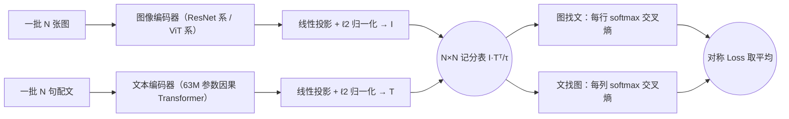
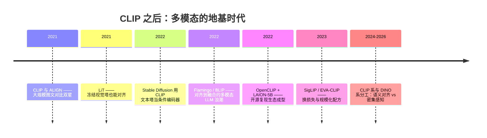

# 12 · CLIP：对比图文预训练——多模态与零样本的地基

> **一句话理解**：拿四亿张"网络图片 + 配文"做填空配对题——图和文各自编码成向量，配对的拉近、错配的推远；学完之后，把类别名写成句子就能直接分类，一个标注样本都不用。

[⬆️ 返回总目录](../README.md) · [⬆️ 返回专栏目录](./README.md)

---

## 📌 论文速览

| 条目 | 内容 |
|------|------|
| 标题 | Learning Transferable Visual Models From Natural-Language Supervision |
| 作者 | Alec Radford、Jong Wook Kim、Chris Hallacy、Aditya Ramesh、Gabriel Goh、Sandhini Agarwal、Girish Sastry、Amanda Askell、Pamela Mishkin、Jack Clark、Gretchen Krueger、Ilya Sutskever（OpenAI，12 人） |
| 时间 | 2021 年（arXiv:2103.00020），ICML 2021 |
| 解决什么 | 视觉模型只会"闭集分类"：一千个类别要一千个标注头，换个任务从头训；视觉表征学不到语言的语义结构 |
| 核心方法 | 图文双塔编码器 + 对称双向对比学习（InfoNCE），在自建 WIT 4 亿图文对上预训练 |
| 头条数字 | 零样本 ImageNet top-1 **76.2%**——与用 128 万张标注图训出来的监督 ResNet-50 同分（论文正文口径）；80 个提示模板集成较单一模板再 +3.5% |
| 引用地位 | 数万次量级（2026 年 Google Scholar 口径）——多模态与零样本分类的地基模型 |
| 官方代码 | github.com/openai/CLIP |

---

## 🌱 一句话核心思想

**监督分类把"图像理解"锁死在固定类别表里；自然语言的监督把类别表换成开放词典，"认东西"与"懂描述"用一次对比学习同时学会。**

此前的视觉预训练两大路线：ImageNet 式监督（标签是离散类别，迁移要换头、易过拟合闭集）和自监督（不碰语言，语义贫乏）。CLIP 的赌注是：**配文本身就是免费标签**——四亿张网络图片的 alt 文本虽嘈杂，却覆盖了几乎整个开放词汇。训练时一批 $N$ 对图文摆上桌，做 $N \times N$ 的配对考试：每张图要在 $N$ 句话里挑出自己的配文，每句话也要在 $N$ 张图里挑出自己的配图。考着考着，"一只柯基的照片"这句话的向量就落到柯基图片向量的邻域——零样本分类不过是把这场考试换个考法：把候选类别名写成句子，看哪句和图最像。

---

## 🌍 背景速写：CLIP 之前的两条路线与困局

| 路线 | 代表做法 | 困局 |
|------|----------|------|
| 监督预训练 | ImageNet 128 万标注图 + 固定类别头 | 标签贵且闭集；换任务要重训头；分布一偏就崩（正文实验：监督 ResNet-101 在 7 个自然偏移集上错误率约 5 倍于 ImageNet 验证集） |
| 自监督预训练 | 旋转预测、对比学习（同模态内拉近推远） | 不碰语言，语义天花板低；下游仍要标注适配 |
| （对照）预测式图文预训练 | 用配文**生成**任务学视觉（VirTex 等） | 任务太"重"：学写整句浪费容量在词序上，零样本迁移效率低（论文对照：慢约 3~12 倍） |

CLIP 的三个设计决定由此读得通：**换监督信号**（配文替代类别标签）、**换任务形态**（配对替代生成）、**换迁移方式**（零样本替代逐任务微调）。同期 ALIGN（arXiv:2102.05918，18 亿对私有数据）独立撞出同一结论——大规模图文对比学习的时机在 2021 年前后同时成熟（数据爬取 + 大 batch 训练基建 + 双塔架构足够强）。

---

## 🧠 方法精读

### 记号翻译表（论文原文 → 本库第 12 章）

| 论文记号 | 含义 | 本库说法 |
|----------|------|----------|
| $I_i$、$T_i$ | 第 $i$ 对图像/文本的归一化嵌入 | 双塔输出、全图向量/整句向量 |
| $I$、$T$ | 批内嵌入矩阵（$N \times d$，已 $\ell_2$ 归一化） | 记分表的原材料 |
| $\text{sim}(I_i, T_j) = \langle I_i, T_j \rangle$ | 余弦相似度 | 打分 |
| $\tau$ | 温度（可学习，初始 0.07） | 温度滤镜/聚焦旋钮 |
| $\text{logits} = I\,T^{\top}/\tau$ | $N \times N$ 相似度矩阵 | 记分表 |
| $y$ | 对角线为正例的"标准答案" | 配对答案 |

### 双塔结构（自绘）



> 👉 **人话**：两塔互不见面，各自把输入压成一个向量；唯一的交流发生在末端的一张 $N \times N$ 记分表上。这个"末端一次点积"的结构决定了它的长处（快、可预存向量做亿级检索）与短处（无元素级交互，见后世影响）。

---

### 机制一：对称双向 InfoNCE——完整的损失形式

一批 $N$ 对图文，嵌入归一化后记相似度 $s_{ij} = \langle I_i, T_j \rangle$。CLIP 的训练损失是**两个方向的交叉熵取平均**：

$$
\mathcal{L} = -\frac{1}{2N}\sum_{i=1}^{N}\left[\underbrace{\log\frac{e^{s_{ii}/\tau}}{\sum_{j=1}^{N} e^{s_{ij}/\tau}}}_{\text{图找文：第 } i \text{ 张图认配文}} + \underbrace{\log\frac{e^{s_{ii}/\tau}}{\sum_{j=1}^{N} e^{s_{ji}/\tau}}}_{\text{文找图：第 } i \text{ 句话认配图}}\right]
$$

> 👉 **人话**：每个方向都是一道 $N$ 选 1 的多选题——分子是正确配对的得分，分母是同一行（列）所有候选的得分总和，除以温度 $\tau$ 再做 softmax、取负对数。图要认出自己的话，话也要认出自己的图，两个方向**必须对称地都学**：只学一个方向，嵌入空间会朝那一侧坍缩（图向量挤成一团去迁就文本），对称约束把两个空间"掰"成彼此对等的形状。

<details>
<summary>🧮 展开：为什么分子分母长这样——它就是 softmax 交叉熵</summary>

**第 1 步（写出单项概率）**。对第 $i$ 张图，把 $N$ 句话按打分排序成"多选题"，选对的概率按 softmax 分配：

$$
p(\text{选中第 } i \text{ 句} \mid I_i) = \frac{e^{\langle I_i, T_i\rangle/\tau}}{\sum_{j=1}^{N} e^{\langle I_i, T_j\rangle/\tau}}
$$

**第 2 步（套交叉熵）**。答案是对角线（one-hot），交叉熵即 $-\log$ 选中概率——第一项得证。第二项把角色对调（文本当查询、图像当候选），对**列**做 softmax。

**第 3 步（矩阵形式）**。令 $\text{logits} = I\,T^{\top}/\tau \in \mathbb{R}^{N\times N}$、$y$ 为对角 one-hot，则：

$$
\mathcal{L} = \frac{1}{2}\Big[\mathrm{CE}\big(\text{logits 的行},\, y\big) + \mathrm{CE}\big(\text{logits 的列},\, y\big)\Big]
$$

——与[第 12 章 · 04 页](../docs/5-前沿与融合/12-生成模型与多模态/04-多模态模型.md)正文写法逐字一致；该页的 InfoNCE 梯度深潜（$\frac{\partial \mathcal{L}}{\partial z_j} = p_j - y_j$）对本公式完全适用。

</details>

---

### 机制二：梯度 = $p - y$——配对拉近、错配推远

<details open>
<summary>📐 数学深潜：三步推出梯度恒等式 + 温度的数值算例</summary>

**严格陈述**。对单个查询（一张图）与 $N$ 个候选句子，记 logits $z_j = s_j / \tau$、softmax 输出 $p$、目标 $y$ 为正例位的 one-hot，则 $\dfrac{\partial \mathcal{L}}{\partial z_j} = p_j - y_j$。

**完整推导（三步）**。

第 1 步（softmax 的雅可比）：$\dfrac{\partial p_i}{\partial z_j} = p_i(\delta_{ij} - p_j)$——对角项 $p_i(1-p_i)$，非对角项 $-p_i p_j$（此式在[第 7 章 · 02 页](../docs/4-专业方向/07-自然语言处理与LLM/02-Transformer与注意力机制.md)的深潜里有逐步展开，两处推导一字适用）。

第 2 步（链式穿过 $\log$）：$\mathcal{L} = -\log p_{+}$（$+$ 为正例位），$\dfrac{\partial \mathcal{L}}{\partial z_j} = -\dfrac{1}{p_+}\, p_+(\delta_{+j} - p_j) = p_j - \delta_{+j}$。

第 3 步（换成 $y$ 的写法）：$y_j = \delta_{+j}$，故 $\dfrac{\partial \mathcal{L}}{\partial z_j} = p_j - y_j$。双向损失是两个方向的和，梯度逐项相加。

> 人话：每个候选的"拉力" = 当前概率 − 应有概率：正例被往 1 拉、所有负例被往 0 推；推拉总量守恒（$\sum_j (p_j - y_j) = 0$），梯度只重新分配概率质量，不凭空增减。打分空间的梯度再乘 $1/\tau$（温度的放大作用）。

**数值算例：温度怎么"点名"难负例**。设三个候选（正例第一），相似度 $s = [0.9,\ 0.7,\ 0.2]$（第二个是"很像但配错"的难负例，第三个是易负例）：

| 温度 | logits $s/\tau$ | softmax $p$ | 梯度 $p - y$ |
|------|------------------|--------------|----------------|
| $\tau = 0.5$ | $[1.8,\ 1.4,\ 0.4]$ | $[0.522,\ 0.350,\ 0.129]$ | $[-0.478,\ \mathbf{0.350},\ 0.129]$ |
| $\tau = 0.07$ | $[12.86,\ 10.0,\ 2.86]$ | $[0.946,\ 0.054,\ 0.00004]$ | $[-0.054,\ \mathbf{0.054},\ 0.00004]$ |

读数：温度从 0.5 降到 0.07——易负例的推力从 0.129 消音到 0.00004（**缩小三千倍**，"已经学会的就不再花力气"），难负例仍握着几乎全部推力。**温度小 = 火力集中在最像的对手身上**；代价是一两个难负例可能包揽全部梯度、方向剧烈抖动——这就是 $\tau$ 太小训练不稳的机制。

**反例与边界**：

- **假负例把 $y$ 标错**：同批里碰巧语义相近的"负例"（两张都是猫的图、各自配文都被对方"错配"）实际该是正例，梯度 $p_j - y_j$ 对它们是负号——**往错误方向硬推**；温度越小，这份错误推力越集中（这是 CLIP 只学"整图对整句"全局匹配的先天性噪声，也是它向"词袋"漂移的推手之一）；
- **可学习温度有自毁倾向**：$\tau \to 0$ 时梯度按 $1/\tau$ 放大直至爆炸。CLIP 的工程处理：$\tau$ 以对数形式参数化、初始 0.07，并**裁剪上限防止 logits 被放大超过 100 倍**（论文附录口径）——让模型自己找锐度，但不许玩火。

> 👉 **一句人话**：InfoNCE 就是"softmax 多选题 + 温度滤镜"，梯度永远是"预测减答案"；温度决定把推力集中在最难缠的干扰项上——CLIP 让模型自己学着拧这个旋钮。

</details>

---

### 机制三：batch 内负例——没有负样本文件，负例来自同批

对比学习要"错配推远"，错配从哪来？**同一批里的其他 $N-1$ 对**。

- 每个锚点（一张图或一句话）自动获得 $N - 1$ 个负例，零标注成本；
- 一批 $N$ 对产生 $2N$ 个锚点，共 $2N(N-1)$ 个有序"锚点—负例"对：$N = 32{,}768$ 时每个锚点有 **32,767 个负例**——这正是 CLIP 训练要顶到这么大的 batch 的根本原因（负例池 = batch 大小）；
- 大 batch 摊到多卡上：全对相似度需要跨卡聚合嵌入（论文附录：混合精度、梯度检查点等工程手段支撑 32768 的全局 batch）。

<details>
<summary>🧮 展开：InfoNCE 与互信息的下界关系（N 越大越紧）</summary>

**结论**：$I(X; Y) \geq \log N - \mathcal{L}_{\mathrm{NCE}}$（源自对比预测编码 CPC，arXiv:1807.03748）。

**三行推导梗概**：把打分函数取到最优（正比于 $\frac{p(x, y)}{p(x)\,p(y)}$，即判别真实联合与边缘乘积），则选中正例的概率为 $\frac{p(x, y_i)}{p(x, y_i) + (N-1)\,p(x)\,p(y_i)}$。对负例按边缘分布抽样求期望，负对数概率的下界恰好是 $\log N - I(X;Y)$——负例全部"看起来像正例"（边缘乘积高）时损失趋近该下界。

**读出两个推论**：

1. $\log N$ 在前头——**负例越多，同样的损失值代表的互信息越大**：batch 大小直接决定这个估计器的分辨率；
2. 互信息是"全局对齐"意义上的信息，**不含元素级对应**——CLIP 的"词袋病"（见后世影响）在目标函数层面就已注定：梯度里从不需要"猫在毯子上"这类词序与空间信息。

</details>

---

### 机制四：零样本分类——把类别名写成句子当权重

预训练完后，分类不需要任何新参数。设 $K$ 个候选类别，把每个类别名 $c_k$ 套进模板（如 "a photo of a {label}"）过文本塔，得到"零样本分类器"的一行行"权重"：

$$
P(y = k \mid \text{图}) = \frac{\exp\big(\langle I,\ g(T_k)\rangle / \tau\big)}{\sum_{k'=1}^{K} \exp\big(\langle I,\ g(T_{k'})\rangle / \tau\big)}
$$

> 👉 **人话**：监督分类最后一层是学出来的权重矩阵；CLIP 的"权重"是**类别名的文本嵌入**——分类头从"训练出来的"变成"写出来的"。要加一个新类别，写一句话即可；要换一套领域，换一套模板即可。

**提示工程与集成的账（论文口径，ImageNet 上）**：

- 只用光秃秃的类别名 → 套上模板 "A photo of a {label}."：**+1.3%**；
- 集成 80 个模板（"a photo of a {}"、"a cartoon of a {}"、"a photo of the large {}"……）取嵌入平均：**再 +3.5%**；
- 合计近 5 个点——论文估算相当于**把训练算力乘 4** 才能靠继续训练追上。免费的午餐，记得拿。

模板为什么有效：预训练语料是网络配文，类别词单独出现时偏离文本塔熟悉的分布；模板把"单词"包装回"句子"的分布里，还顺带注入领域先验（医学图换 "an ultrasound photo of a {}"，手绘换 "a doodle of a {}"）。

<details>
<summary>🧮 展开：模板集成为什么等价于"集成一堆零样本分类器"</summary>

第 1 步（单模板分类器）。模板 $m$ 给出类别句嵌入 $g_m(c_k)$，零样本 logits 为 $\ell_m(k) = \langle I,\ g_m(c_k)\rangle / \tau$。

第 2 步（集成 = 嵌入平均）。CLIP 的做法是把 $M$ 个模板的嵌入**先平均再归一化**：

$$
g(c_k) = \frac{\frac{1}{M}\sum_{m} g_m(c_k)}{\left\|\frac{1}{M}\sum_{m} g_m(c_k)\right\|}
$$

第 3 步（读出等价性）。平均后的内积 $\langle I, \frac{1}{M}\sum_m g_m(c_k)\rangle = \frac{1}{M}\sum_m \langle I, g_m(c_k)\rangle$——**内积对第二变元是线性的，嵌入平均 = logits 平均**（归一化只是重缩放，softmax 对常数缩放敏感、对各方向重加权更接近"软投票"）。所以 80 模板集成本质上是 80 个零样本分类器的平均投票：有的模板在"大物体"上给分高、有的在"卡通风格"上给分高，平均后方差抵消、方向互补。

> 👉 人话：写 80 个模板再取平均，等于让 80 个"考官"分别打分后合议——比只听一个考官稳得多，而这 80 个考官是**零成本**的。

</details>

---

## 📋 举个例子：三对图文的记分表（笔算）

一批 $N = 3$：两只柯基图 + 一辆车图，配文打分（已归一化余弦，假设值）：

| | "柯基照片" $T_1$ | "柯基照片" $T_2$ | "汽车照片" $T_3$ |
|---|---|---|---|
| 图 A（柯基）$I_1$ | **0.95** | 0.61 | 0.05 |
| 图 B（柯基）$I_2$ | 0.58 | **0.93** | 0.08 |
| 图 C（汽车）$I_3$ | 0.03 | 0.07 | **0.90** |

取 $\tau = 0.5$，图 A 找文方向：logits $= [1.9, 1.22, 0.1]$，softmax ≈ $[0.66,\ 0.33,\ 0.012]$，损失 $= -\log 0.66 \approx 0.42$。

> 👉 **人话**：注意中间格——图 A 对 $T_2$（另一张柯基的配文）打了 0.61 的高分，这就是**假负例**：按损失它是"错配要推远"，但语义上它们说的可能是同一回事。CLIP 的目标只要求对角线赢过同行/同列，不要求把语义等价的负例分开——这个"误差"在大 batch 下被稀释（难负例占比小），但从未消失。

---

## 📊 实验解读

**训练账单（论文口径）**：

| 项目 | 数值 |
|------|------|
| 数据集 WIT（WebImageText） | 约 **4 亿**图文对；来自 50 万条搜索查询（维基百科高频词、高 PMI 双词组、WordNet 同义词集等），每查询至多 2 万对做类平衡 |
| 文本量 | 总词数与 GPT-2 的 WebText 相当 |
| batch 大小 | **32,768**（负例池即 batch） |
| 算力 | RN50x64：**18 天 × 592 张 V100**；ViT-L/14：12 天 × 256 张 V100；共训 8 个模型（5 个 ResNet + 3 个 ViT），算力跨近两个数量级 |
| 训练轮数 | 32 个 epoch；最强模型 ViT-L/14@336px 额外高分辨率微训 1 个 epoch |

<details>
<summary>📊 展开：8 个模型的家族账本（官方模型表口径，参数为约数）</summary>

| 图像塔 | 总参数量级 | 零样本 ImageNet top-1（该表口径） | 备注 |
|--------|-----------|-----------------------------------|------|
| RN50 | ~151M | 59.6% | 家族起点 |
| ViT-B/32 | ~151M | 63.2% | 同量级参数，Transformer 更划算 |
| ViT-L/14 | ~428M | 75.5% | 文生图时代被反复复用的那一只 |
| RN50x64 | ~4.28B | 76.4% | 18 天 × 592 V100 的账单主人 |

读法：论文用同一套训练配方把 5 个 ResNet 与 3 个 ViT 拉成一条"算力-性能"曲线——横跨近两个数量级的算力，为的是证明**可预测的扩展规律**（这批曲线正是后来视觉基础模型 scaling 讨论的第一手材料）。ViT 塔在同参数量下普遍压过 ResNet 塔，此后视觉侧默认转向 ViT。

</details>

**主结果：零样本 ImageNet（top-1，各表口径已在行内注明）**：

| 模型/基线 | 零样本 top-1 |
|-----------|--------------|
| 旧范式基线 Visual N-Grams（零样本语言模型分类） | 11.5% |
| CLIP（RN50 图像塔） | 59.6%（官方模型表口径） |
| CLIP（ViT-B/32） | 63.2%（官方模型表口径） |
| CLIP（ViT-L/14） | 75.5%（官方模型表口径） |
| CLIP（RN50x64） | 76.4%（官方模型表口径） |
| 论文正文"效率对标"零样本 CLIP | **76.2%**，top-5 约 95% |
| 监督 ResNet-50（原论文口径，用了 128 万标注图） | 76.2% |

**证明了什么**：

- **自然语言监督能追平标注监督**：零样本 76.2% 对齐监督 ResNet-50，且**没用 ImageNet 的任何一张训练图**——开放词汇的语义从配文里学来了；跨 30 多个数据集的零样本平均表现也普遍超过 ResNet-50 特征的线性探测（论文正文结论）；
- **对比目标远胜预测目标**：论文的对照实验里，63M 参数的**生成式**（预测配文词袋/自回归）模型学 ImageNet 概念比词袋预测基线慢约 3 倍，而把目标换成对比式再快约 4 倍——"猜整句"的生成任务浪费容量，"配对"的判别任务直奔语义；
- **自然语言监督带来鲁棒性**：在 7 个自然分布偏移测试集上，监督 ResNet-101 的错误率约为 ImageNet 验证集的 5 倍，而**零样本 CLIP 把这个"偏移差距"缩小最多 75%**（论文正文口径）；把 CLIP 在 ImageNet 上做线性探测，ImageNet 涨 9.2 个点（到 85.4%）但偏移集反而掉分（ImageNet-R −4.7%、ObjectNet −3.8%、Sketch −2.8%）——监督适配会把模型"焊死"在闭集上，零样本反而更稳。

**没证明什么**：

- **组合性/元素级对应**：计数、空间关系、属性绑定是系统性弱项——双塔末端一次点积的目标函数从不需要这些信息（机制二的深潜已给出目标层面的原因；实证见 Winoground，arXiv:2204.03162 等后续工作）；
- **密集任务与专业领域**：检测、分割等像素级任务不在零样本能力圈里；论文自己报告了若干困难/专业数据集上零样本 CLIP 明显逊于专用模型；
- **可复现性留了口子**：WIT 数据集**未公开**，社区复现靠 LAION-400M/5B 等替代集（质量与毒性问题随之而来，见后世影响）；"4 亿对"的清洗细节外人无法完全审计。

---

## 💻 动手试试：30 行算一遍对称 InfoNCE

```python
import numpy as np
np.random.seed(0)

N, d = 4, 8
# 玩具嵌入：让第 i 张图与第 i 句话天然对齐（真实 CLIP 中由两塔网络产生）
I = np.random.randn(N, d); I /= np.linalg.norm(I, axis=1, keepdims=True)
T = I + 0.1 * np.random.randn(N, d); T /= np.linalg.norm(T, axis=1, keepdims=True)

def softmax(x, axis):
    x = x - x.max(axis=axis, keepdims=True)          # 数值稳定
    e = np.exp(x)
    return e / e.sum(axis=axis, keepdims=True)

def clip_loss(I, T, tau):
    sim = I @ T.T                                    # N×N 余弦相似度记分表
    logits = sim / tau
    p_row = softmax(logits, axis=1)                  # 图找文：对行做 softmax
    p_col = softmax(logits, axis=0)                  # 文找图：对列做 softmax
    return (-np.log(np.diag(p_row)).mean()           # 每张图认对配文
            - np.log(np.diag(p_col)).mean()) / 2     # 每句话认对配图：对称双向

for tau in [1.0, 0.5, 0.07]:
    print(f"tau={tau:<5} 对齐批损失: {clip_loss(I, T, tau):.4f}")
T_shuffled = T[[1, 0, 3, 2]]                          # 故意打乱配对
print("打乱配对后 tau=0.5 损失:", f"{clip_loss(I, T_shuffled, 0.5):.4f}")
# 预期：tau 越小对齐批损失越低（分布更尖、正例更突出）；
# 打乱后损失显著变大——同样的图与句，配错对就"考砸"。
```

> 🧪 **改什么、看什么**：① `tau` 从 1.0 降到 0.07——损失对"配对正确与否"的分辨越来越尖锐（对照机制二的算例表）；② 把 `0.1 * np.random.randn` 的噪声调大——嵌入对齐变弱，各温度下损失都上升；③ 把 `T_shuffled` 改回两两相近的同类内容（假负例）——损失惩罚了本不该被推开的配对。

---

## 🔥 炼丹小灶

> 🔥 **复现/对齐类预训练的常用起点**（经验参考，不是圣旨）：
> - 配方：batch 越大越好（万级起步，负例池即 batch）；可学习温度初始 0.07、对数参数化并设上限；两塔输出先投影再 $\ell_2$ 归一化；数据清洗与去重对最终质量的影响常大于架构选择；
> - 玄学：零样本突然变差先查**模板**（换一组模板集成常常白捡几个点）；检索质量怪异查**假负例**；小 batch 硬上对比学习基本练不动——先扩数据配额或换 SigLIP 类逐对损失。

---

## 🖱️ 动手玩

> 🕹️ [Embedding Projector](https://projector.tensorflow.org)——CLIP 的本质是把图和文压进同一个嵌入空间，用降维投影直观感受"嵌入空间的簇"长什么样（本库暂无 CLIP 专属实验场；[注意力实验场](../playground/attention.html)可对照文本塔内部的机制）。

---

## 🔁 后世影响与争议



**谁站在它肩上**：

- **文生图的地基**：Stable Diffusion / LDM（arXiv:2112.10752）直接采用 CLIP ViT-L/14 文本编码器作条件入口；DALL·E 2（arXiv:2204.06125）以 CLIP 嵌入为生成目标——"会写提示词"这门手艺的存在本身，就是 CLIP 的功劳；
- **多模态 LLM 浪潮**：Flamingo（arXiv:2204.14198）、BLIP（arXiv:2201.12086）等把 CLIP 式对齐与融合架构推向"看图对话"；机器人领域的 RT-2（arXiv:2307.15818）证明网络配文监督甚至能迁出语义到动作；
- **开放词汇感知**：GLIP（arXiv:2112.03857）把检测 phrase 化、"零样本"思想席卷检测与分割——"固定类别表"这个旧世界观被逐步拆除；
- **开源生态**：WIT 不公开反而催生了 LAION-400M/5B（arXiv:2210.08402）与 OpenCLIP 的复现共同体——今天开源世界的每个 CLIP 权重几乎都长在这条支线上；
- **训练配方迭代**：SigLIP（arXiv:2303.15343）把 softmax 对比换成逐对 sigmoid（不必全局大 batch）；EVA-CLIP（arXiv:2303.15389）把规模化训练配方做实——地基好用，改地基的工作也源源不断。

**争议与反思**：

- **"词袋"行为**：系统性实验（arXiv:2210.01936、Winoground arXiv:2204.03162）表明 CLIP 对词序与属性绑定大面积失明（"草地上的斑马"≈"斑马草上的地"）——这不是 bug 而是目标函数的结构性选择（机制三的互信息视角：全局对齐不含元素级对应）；
- **数据之痛**：WIT 与后来的 LAION 都来自网络爬取，Birhane 等（arXiv:2110.01963）对 LAION-400M 的审计发现大量问题内容（色情、恶性刻板印象等）——"用配文当免费标签"的代价，是把网络的偏见与污渍一起灌进地基；版权与退出权诉讼随之而来；
- **提示即超参**：零样本性能随模板措辞大幅波动（近 5 个点的空间）——"调提示"成了新的炼丹，可复现性与稳健性都要打折；
- **算力门槛**：4 亿对 + 592 卡的账单，把"从头训一个 CLIP"挡在大厂之外；开源社区花了两三年才追平——对比学习的"简单"以数据与算力的"重"为前提。

**2026 年的定位**：CLIP 系仍是零样本分类与跨模检索的默认基座之一；密集感知任务里 DINO 类自监督编码器更强（语义对齐与空间感知分工）；多模态 LLM 的视觉前端走向多样化。但"用自然语言监督视觉、用对比目标对齐模态"这个 CLIP 定下的范式，仍是整个多模态时代的出厂设置。

---

## 🔗 在本库中的位置

- **本页精读的论文完整版 ↔ 正文**：[第 12 章 · 多模态模型](../docs/5-前沿与融合/12-生成模型与多模态/04-多模态模型.md)——正文的 InfoNCE 梯度深潜（$p - y$）、温度机制、假负例与双塔/融合对比是本页机制部分的骨架；本页补全论文的完整损失推导、训练账单与实验口径
- **上游**：[词向量与 Embedding](../docs/4-专业方向/07-自然语言处理与LLM/01-词向量与embedding.md)（"向量空间承载语义"的源头思想）；[Transformer 与注意力机制](../docs/4-专业方向/07-自然语言处理与LLM/02-Transformer与注意力机制.md)（文本塔骨架与 softmax 梯度深潜）
- **下游**：[扩散模型](../docs/5-前沿与融合/12-生成模型与多模态/03-扩散模型Diffusion.md)（CLIP 文本塔是文生图的条件入口，见上一页）；[进阶专题 · 生成模型前沿](../docs/5-前沿与融合/12-生成模型与多模态/06-进阶专题-生成模型前沿.md)（视频生成与多模态融合的去向）

---

## 📝 自测（先答再看）

<details>
<summary>🖱️ 自测：四道题检验有没有读懂</summary>

**Q1：CLIP 的负例从哪来？为什么要 32768 的 batch？**
A：负例来自同批的其他样本——每个锚点把批内其余 $N-1$ 个配对当负例，零标注成本；负例池大小等于 batch，InfoNCE 的互信息下界随 $\log N$ 变紧，所以 batch 直接决定语义空间的分辨率，32768 意味着每个锚点 32,767 个负例。

**Q2：损失为什么必须双向对称？**
A：单向（只图找文）只约束"给定图找对文"，嵌入空间会向查询侧偏斜；双向取平均把两个空间掰成对等形状——图文双方都要在记分表的行和列上赢过所有错误配对。

**Q3：温度 $\tau$ 起什么作用？CLIP 怎么处理它？**
A：logits 相似度除以 $\tau$ 再进 softmax：$\tau$ 小分布尖、梯度集中在"难负例"（与正例相似的负例）上；太小则少数样本垄断梯度、训练不稳。CLIP 把 $\tau$ 设为可学习参数（初始 0.07、对数参数化），并裁剪上限防止 logits 放大超过 100 倍。

**Q4：零样本 76.2% 持平监督 ResNet-50，能说"CLIP 达到了 ImageNet 监督水平"吗？**
A：不能直接外推。它只说明 ImageNet 这一闭集上零样本可用；计数、空间关系、密集任务、专业领域仍是系统性弱项，且该数字依赖提示模板工程（光模板与 80 模板集成差近 5 个点）。零样本的强项是开放词汇与分布偏移下的稳健，不是全面替代监督学习。

**Q5：为什么 CLIP 的双塔结构天然适合亿级图库检索？**
A：两塔独立编码，图像向量可以离线预存建索引；查询时只需编码一次查询（一句话或一张图），再做最近邻搜索——交互只发生在"末端一次点积"。融合式模型（视觉 token 进 LLM 逐层交互）做不到这一点，每对查询-候选都要跑一次完整前向，只能用于粗筛后的精排。

</details>

---

## ✍️ 延伸阅读（真实 arXiv）

- CLIP 原论文：Learning Transferable Visual Models From Natural-Language Supervision（2021）— https://arxiv.org/abs/2103.00020
- 损失源头：Representation Learning with Contrastive Predictive Coding / InfoNCE（2018）— https://arxiv.org/abs/1807.03748
- 同期双星：ALIGN（2021）— https://arxiv.org/abs/2102.05918；对照基线 VirTex（2020）— https://arxiv.org/abs/2006.06666
- 直接后续：LiT（2021）— https://arxiv.org/abs/2111.07991；SigLIP（2023）— https://arxiv.org/abs/2303.15343；EVA-CLIP（2023）— https://arxiv.org/abs/2303.15389
- 应用辐射：LDM / Stable Diffusion（2021）— https://arxiv.org/abs/2112.10752；DALL·E 2（2022）— https://arxiv.org/abs/2204.06125；Flamingo（2022）— https://arxiv.org/abs/2204.14198；GLIP（2021）— https://arxiv.org/abs/2112.03857；RT-2（2023）— https://arxiv.org/abs/2307.15818
- 数据与批判：LAION-5B（2022）— https://arxiv.org/abs/2210.08402；Birhane 等《Multimodal datasets》数据审计（2021）— https://arxiv.org/abs/2110.01963
- 组合性批评：Winoground（2022）— https://arxiv.org/abs/2204.03162；When and why VLMs behave like bags-of-words（2022）— https://arxiv.org/abs/2210.01936

---

[⬅️ 上一页：11 · DDPM](./11-DDPM.md) · [返回专栏目录](./README.md) · [下一页：13 · GCN ➡️](./13-GCN.md)
