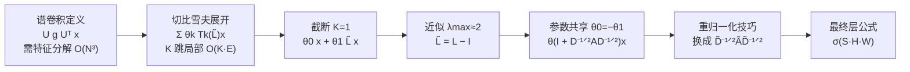
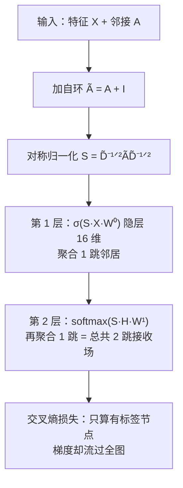

# 论文 13 | GCN：把谱图卷积砍成一行"邻居平均"

> **一句话理解**：GCN 把"图上做卷积"这个定义在频域的严格数学，一路近似、截断、再简化，最后落成一行"度归一化的邻居加权平均 + 线性变换"——理论血统纯正的公式，落地成小学生都懂的邻居投票，从此图神经网络（GNN）从理论玩具变成工程标配。

[⬆️ 返回总目录](../README.md) · [⬆️ 返回专栏目录](./README.md)

---

## 📌 论文速览

| 条目 | 内容 |
|------|------|
| 标题 | Semi-Supervised Classification with Graph Convolutional Networks |
| 作者 / 机构 | Thomas N. Kipf、Max Welling（阿姆斯特丹大学，University of Amsterdam） |
| 时间 / 发表 | 2016 年 9 月挂 arXiv（[arXiv:1609.02907](https://arxiv.org/abs/1609.02907)）；ICLR 2017 |
| 解决什么 | 图上的**半监督节点分类**：绝大多数节点没有标签，只有特征和图结构时怎么学 |
| 一句话方法 | 谱图卷积 → 切比雪夫展开 → 一阶近似 → 重归一化，得到 $H^{(l+1)} = \sigma(\tilde D^{-1/2}\tilde A\tilde D^{-1/2} H^{(l)} W^{(l)})$ |
| 代表数字 | Cora 引文图 **81.5%**（此前最好方法 75.7%），三个基准全胜，且训练只要几秒 |
| 引用地位 | GNN 实用化的公认起点，引用数以万计（2026 年口径），此后"图卷积层"成了图学习的默认组件 |

## 🌱 一句话核心思想

**先在频域把"图上的卷积"定义严格，再把这份严格一路砍掉，砍到只剩"一跳邻居加权平均"——砍掉的不是理论，是不可计算性。**

直觉版：你要给论文分类（引文图上每篇论文是一个节点，引用关系是边），但只有极少数论文有标签。老办法要么只信"连在一起的论文标签相似"（标签传播），要么先把节点嵌入成向量再单独训分类器（DeepWalk）——两条路都是"两段式"，嵌入目标与分类目标脱节。GCN 的答案是：**让"听邻居的"这个动作本身变成神经网络的一层，端到端地朝着分类损失去学**。而为了让这一层在数学上配得上"卷积"这个名字，作者从频域定义出发，证明了这个看似拍脑袋的邻居平均，其实是严格谱卷积的最简一阶近似。

---

## 🧠 方法精读

### 记号翻译表（论文记号 → 本库记号）

| 论文记号 | 含义 | 本库（第 9 章）记号 |
|----------|------|---------------------|
| $A \in \mathbb{R}^{N\times N}$ | 邻接矩阵（无向、无权即可） | $A$ |
| $\tilde A = A + I_N$ | 加自环的邻接矩阵 | $\tilde A$ |
| $D$、$\tilde D$ | 度矩阵（$\tilde D$ 对应 $\tilde A$） | $D$、$\tilde D$ |
| $L = I_N - D^{-1/2} A D^{-1/2}$ | 归一化图拉普拉斯 | $L$ |
| $U$、$\Lambda$ | $L$ 的特征向量矩阵与特征值对角阵 | 同左 |
| $g_\theta = \mathrm{diag}(\theta)$ | 谱滤波器（每个频率一个可学增益） | —— |
| $T_k(\cdot)$ | 切比雪夫多项式（递推定义） | —— |
| $\lambda_{\max}$ | $L$ 的最大特征值 | —— |
| $\Theta$ | 一层的权重矩阵 | $W^{(l)}$ |
| $H^{(l)}$ | 第 $l$ 层的节点表示矩阵 | $H^{(k)}$ |
| $Z$ | 输出层激活前的矩阵 | —— |

### 机制一：图上为什么没有现成的"卷积"——谱域的迂回定义

CNN 的卷积 = **平移**核 + 加权求和。但图上没有"平移"这个操作：把核从节点 A 挪到节点 B，邻域结构完全不同，"同一个核"没有定义。经典对策是绕道**频域（谱域）**，靠卷积定理硬造一个定义。

**卷积定理**：时域的卷积等价于傅里叶域的逐点相乘。经典傅里叶变换的基 $e^{-i\omega t}$ 恰好是**拉普拉斯算子**的特征函数——那么在图上，把"拉普拉斯算子"换成"图拉普拉斯矩阵"，它的特征向量就充当图上的"频率基"。

对归一化图拉普拉斯做特征分解：

$$
L = U \Lambda U^{\top}, \qquad U = [u_1, \dots, u_N],\ \Lambda = \mathrm{diag}(\lambda_1 \le \dots \le \lambda_N)
$$

> 👉 **人话**：$L$ 是对称矩阵，一定可以分解成"旋转（$U$）+ 拉伸（$\Lambda$）+ 转回来"三步。$U$ 的每一列是图上的一个"基频振荡模式"——小特征值对应低频（图上相邻节点取值接近的平滑模式），大特征值对应高频（相邻节点取值剧烈相反的模式）。**谱域，就是"把图信号拆到这些振荡模式上"的视角。**

图傅里叶变换定义为 $\hat x = U^{\top} x$（把 $x$ 投影到各"频率"上），逆变换 $x = U\hat x$。于是**谱图卷积**定义为：先变换到频域，乘一个可学习的频率响应 $g_\theta$，再变换回来：

$$
g_\theta \star x = U\, g_\theta\, U^{\top} x, \qquad g_\theta = \mathrm{diag}(\theta_0, \dots, \theta_{N-1})
$$

> 👉 **人话**：把图信号"翻译"到频率语言，对每个频率单独调音量（$N$ 个可学旋钮），再翻译回节点语言——这就是"在图上滤波"。数学上严格了，但代价爆炸。

🧮 展开推导：为什么谱卷积是"卷积"——从卷积定理到 $U g_\theta U^{\top} x$

1. **连续卷积定理**：$(f \star g)(t) = \mathcal{F}^{-1}\big[\hat f(\omega)\cdot \hat g(\omega)\big]$，其中 $\mathcal F$ 是傅里叶变换。核心：时域卷积 ⇔ 频域乘积。
2. **为什么用 $L$ 的特征向量当基**：连续情形 $e^{-i\omega t}$ 满足 $\Delta e^{-i\omega t} = -\omega^2 e^{-i\omega t}$（拉普拉斯算子的特征函数）。离散图上的"$\Delta$"就是拉普拉斯矩阵 $L$，其特征向量 $u_k$ 就是图上的"振荡基"。把"特征值 $\lambda_k$"读作"频率的平方"，全套傅里叶机器照搬。
3. **定义图傅里叶变换**：$\hat x_k = u_k^{\top} x$（信号在频率 $k$ 上的分量），写成矩阵 $\hat x = U^{\top} x$；逆变换 $x = U \hat x$。
4. **定义图滤波器 $g$**：滤波 = 在每个频率上乘增益 $g(\lambda_k)$，即 $\hat y_k = g(\lambda_k)\hat x_k$。把 $g(\lambda_k)$ 记作对角阵 $g_\theta = \mathrm{diag}(\theta_k)$。
5. **合成**：$y = U\,\hat y = U\, g_\theta\, \hat x = U g_\theta U^{\top} x$。这就是谱图卷积的定义式。

**代价账**：特征分解 $O(N^3)$，与 $U$ 相乘 $O(N^2)$。$N = 10^6$ 的工业图（社交网络、推荐场景）连分解都做不动——定义严格，但**不可计算**。

**一个 2 节点小算例**：两点互连，$A = \begin{pmatrix}0&1\\1&0\end{pmatrix}$，度为 1，归一化拉普拉斯 $L = I - A = \begin{pmatrix}1&-1\\-1&1\end{pmatrix}$。特征分解：$\lambda_1 = 0$（特征向量 $\tfrac{1}{\sqrt2}(1,1)^{\top}$，低频——两点同向），$\lambda_2 = 2$（特征向量 $\tfrac{1}{\sqrt2}(1,-1)^{\top}$，高频——两点反向）。一个信号 $x = (3, 1)^{\top}$ 投影：$\hat x_1 = \tfrac{1}{\sqrt2}(3+1) = 2.83$（低频分量），$\hat x_2 = \tfrac{1}{\sqrt2}(3-1) = 1.41$（高频分量）。若滤波器 $\theta = (1, 0)$（只留低频），输出 $y = 2.83 \cdot \tfrac{1}{\sqrt2}(1,1)^{\top} = (2, 2)^{\top}$——"把两点平均"就是最朴素的低通滤波。**邻居平均的种子，在最小算例里已经发芽。**

### 机制二：切比雪夫展开——用多项式滤波器换掉特征分解

让滤波器有 $N$ 个自由旋钮（每个频率一个）既算不动也学不动。**Hammond 等（2011）的思路**：把 $g_\theta$ 限制为"关于 $L$ 的 $K$ 阶多项式"，并选**切比雪夫多项式**做基。先把 $L$ 缩放到切比雪夫的定义域 $[-1, 1]$：

$$
\tilde L = \frac{2}{\lambda_{\max}} L - I_N
$$

滤波器取 $K$ 阶截断：

$$
g_{\theta'} \star x \approx \sum_{k=0}^{K} \theta'_k\, T_k(\tilde L)\, x,
\qquad
T_0(x) = 1,\ T_1(x) = x,\ T_k(x) = 2x\,T_{k-1}(x) - T_{k-2}(x)
$$

> 👉 **人话**：不再每个频率单独调音，而是用 $K{+}1$ 个系数的多项式去逼近整条"调音曲线"。切比雪夫基的好处：一是数值稳定（振荡幅值被钉死，不会溢出）；二是**递推可乘**——$T_k(\tilde L)x$ 可以用低一阶的结果递推算出，全程只做"稀疏矩阵 × 向量"，永远不碰特征分解。

两条关键性质（推导见折叠）：

1. **K-局部性**：$T_k(\tilde L)x$ 只混合 $k$ 跳以内的邻居——卷积从"全域频域操作"变回"局部空域操作"；
2. **复杂度 $O(K|E|)$**：每阶递推是稀疏 $L$ 乘向量 $O(|E|)$，与节点数 $N$ 解耦。

🧮 展开推导：K-局部性从哪来——为什么多项式滤波器只看 K 跳邻居

**第 1 步：$L$ 的一次幂连通一跳。** 归一化拉普拉斯可写成 $L = I - D^{-1/2}AD^{-1/2}$，所以 $(Lx)_i = x_i - \sum_{j \in \mathcal N(i)} \tfrac{1}{\sqrt{d_i d_j}} x_j$——**只用到 $i$ 的直接邻居** $\mathcal N(i)$。

**第 2 步：幂次叠加跳数。** $(L^2 x)_i = \sum_j L_{ij}(Lx)_j$：要算 $Lx$ 在邻居 $j$ 处的值，又用到 $j$ 的邻居——所以 $L^2$ 触达二跳。归纳地，$L^k$ 触达 $k$ 跳。

**第 3 步：切比雪夫是多项式。** $T_k(\tilde L)$ 是 $\tilde L$（从而是 $L$）的 $k$ 次多项式，所以 $T_k(\tilde L)x$ 最多用 $k$ 跳邻居的信息。取和上限 $K$，整个滤波器是 **K 跳局部卷积**。

**第 4 步：复杂度。** 递推 $z_{k} = 2\tilde L z_{k-1} - z_{k-2}$，每步一次稀疏矩阵-向量乘：$L$ 的非零元个数 $\approx |E|$（边数），所以每步 $O(|E|)$，总 $O(K|E|)$。对照机制一的 $O(N^3)$：**Cora（2708 节点）无感，百万节点的工业图从"做不了"变"能做"**。

**为什么非要切比雪夫基**：切比雪夫多项式在 $[-1,1]$ 上以等幅振荡著称（$|T_k(x)| \le 1$），多项式系数的微小扰动不会在某个频率上被放大成灾难——这是它对一般幂基 $\{1, x, x^2, \dots\}$（在 $x$ 接近边界时高次项数值爆炸）的核心优势。缩放 $\tilde L = \tfrac{2}{\lambda_{\max}}L - I$ 正是为了把谱搬进 $[-1, 1]$。

### 机制三：一阶近似 + 重归一化——论文的"一刀切"完整简化链

这是全文最核心的一步：Kipf & Welling 发现，**把 $K$ 砍到 1**，不但没伤精度反而更好（消融见实验节）。以下是论文从谱卷积到最终层公式的**完整简化链，一步不跳**。

**第 1 步（截断）**：令 $K = 1$，滤波器只剩两项：

$$
g_{\theta'} \star x \approx \theta'_0\, T_0(\tilde L)\, x + \theta'_1\, T_1(\tilde L)\, x = \theta'_0\, x + \theta'_1\, \tilde L\, x
$$

> 👉 **人话**：只听一跳邻居的——邻居平均的雏形。

**第 2 步（近似最大特征值）**：计算 $\lambda_{\max}$ 本身就是一次谱计算，干脆近似 $\lambda_{\max} \approx 2$（拉普拉斯谱上界），则 $\tilde L = \tfrac{2}{\lambda_{\max}}L - I \approx L - I$，代入：

$$
g_{\theta'} \star x \approx \theta'_0\, x + \theta'_1\, (L - I)\, x
$$

**第 3 步（代入拉普拉斯）**：用 $L = I_N - D^{-1/2} A D^{-1/2}$：

$$
L - I_N = -\,D^{-1/2} A D^{-1/2}
\quad\Longrightarrow\quad
g_{\theta'} \star x \approx \theta'_0\, x - \theta'_1\, D^{-1/2} A D^{-1/2}\, x
$$

> 👉 **人话**：一阶切比雪夫滤波器 = "自己 × θ0 − 邻居（度归一化）× θ1"。只剩两个可学系数。

**第 4 步（参数共享）**：$\theta'_0$ 与 $-\theta'_1$ 分别约束"自身"与"邻居"两路，过参数化；论文令 $\theta = \theta'_0 = -\theta'_1$（两路共用一个系数，权重完全由结构承担）：

$$
g_{\theta} \star x \approx \theta\, \big(I_N + D^{-1/2} A D^{-1/2}\big)\, x
$$

一层只看一跳没关系——**堆 $L$ 层就是 $L$ 跳接收场**，截断损失由深度补回（这是"砍 $K$"不亏的第二重理由）。

**第 5 步（重归一化技巧，renormalization trick）**：矩阵 $I_N + D^{-1/2} A D^{-1/2}$ 的特征值落在 $[0, 2]$——二部图上两端都取得到（0 与 2），接近二部的图会贴着 2：反复传播时，特征值大于 1 的分量被指数放大，深度网络里这就是数值不稳、梯度爆炸的谱版本。论文的手术：给 $A$ 加自环 $\tilde A = A + I_N$，把"自己一路 + 邻居一路"两个矩阵**捏成一个矩阵**：

$$
I_N + D^{-1/2} A D^{-1/2} \;\longrightarrow\; \tilde D^{-1/2} \tilde A \tilde D^{-1/2},
\qquad \tilde A = A + I_N
$$

改用 $\tilde D$（含自环的度）归一化后，传播矩阵 $S = \tilde D^{-1/2}\tilde A\tilde D^{-1/2}$ 的谱被钉在 $(−1, 1]$：最大特征值恰为 1、其余严格更小（不会爆），且 $-1$ 打不穿（自环破坏二部性，消除永久振荡）——**不算任何特征值就把"不爆不荡"白拿了**（严格论证见下方数学深潜）。**正文第 9 章的同名深潜**给了这套论证的教科书版（链接见文末），本页是论文视角的补充。注意"不爆不荡"管不住"趋同"——过平滑是另一个问题，见反思一节。

**第 6 步（向量化）**：单通道信号 $x$ 推广到特征矩阵 $X \in \mathbb{R}^{N \times C}$、$F$ 个滤波器（权重矩阵 $\Theta \in \mathbb{R}^{C \times F}$），再加激活函数堆层——**图卷积层（GCN layer）**诞生：

$$
H^{(l+1)} = \sigma\!\Big( \tilde D^{-1/2} \tilde A \tilde D^{-1/2}\, H^{(l)}\, W^{(l)} \Big)
$$

> 👉 **人话**：每一层 = "按双方度归一地平均邻居（含自己）→ 乘权重矩阵 → 过激活函数"。就这么一行。前面五步的所有谱数学，都浓缩在 $D^{-1/2}$ 那两个指数里。

### 机制四：两层 GCN 与半监督端到端训练

论文的模型就两层（隐层 16 维、ReLU）：

$$
Z = f(X, A) = \mathrm{softmax}\!\big( \hat A\, \mathrm{ReLU}\big( \hat A X W^{(0)} \big) W^{(1)} \big),
\qquad \hat A = \tilde D^{-1/2} \tilde A \tilde D^{-1/2}
$$

损失只在**有标签的节点**上算交叉熵：

$$
\mathcal{L} = -\sum_{l \in \mathcal{Y}_L} \sum_{c=1}^{C} Y_{lc}\, \ln Z_{lc}
$$

> 👉 **人话**：图上 1000 个节点，可能只有 140 个有标签——没关系，损失只看这 140 个，但**梯度会流过整张图**：因为每个节点的表示都是"邻居平均"来的，监督信号顺着边扩散给无标签节点。这就是"半监督"的机关：结构当了免费的信息通道。两层 = 每个节点看得见 2 跳邻居——正好覆盖"引文的好朋友还是好朋友"的典型范围。

📊 展开算例：3 节点链上手算一遍传播矩阵

3 节点链 1–2–3（无向），

$$
A = \begin{pmatrix}0&1&0\\1&0&1\\0&1&0\end{pmatrix},
\quad
\tilde A = A + I = \begin{pmatrix}1&1&0\\1&1&1\\0&1&1\end{pmatrix},
\quad
\tilde D = \mathrm{diag}(2, 3, 2),
\quad
\tilde D^{-1/2} = \mathrm{diag}\big(\tfrac{1}{\sqrt2}, \tfrac{1}{\sqrt3}, \tfrac{1}{\sqrt2}\big)
$$

逐元素乘出 $S = \tilde D^{-1/2} \tilde A \tilde D^{-1/2}$（注意两侧都要乘）：

$$
S = \begin{pmatrix}
1/2 & 1/\sqrt 6 & 0 \\
1/\sqrt 6 & 1/3 & 1/\sqrt 6 \\
0 & 1/\sqrt 6 & 1/2
\end{pmatrix}
\approx
\begin{pmatrix}
0.500 & 0.408 & 0 \\
0.408 & 0.333 & 0.408 \\
0 & 0.408 & 0.500
\end{pmatrix}
$$

设三节点的特征 $x_1 = (2, 0),\ x_2 = (0, 4),\ x_3 = (1, 1)$，则一层传播 $SX$：

- 节点 1（新表示）：$0.5 \cdot (2,0) + 0.408 \cdot (0,4) = (1.00,\ 1.63)$
- 节点 2：$0.408 \cdot (2,0) + 0.333 \cdot (0,4) + 0.408 \cdot (1,1) = (1.22,\ 1.74)$
- 节点 3：$0.408 \cdot (0,4) + 0.5 \cdot (1,1) = (0.50,\ 2.13)$

**三个值得亲手验证的观察**：

1. **不是每行恰好加到 1**：第 1 行和 $\approx 0.908$，第 2 行 $\approx 1.150$。对称归一化（$D^{-1/2}$ 两侧）牺牲了行随机性，换来的是**矩阵对称**——谱干净（特征值全实、有正交特征基），这是它区别于随机游走归一化 $D^{-1}A$ 的本质（正文第 9 章深潜有专题讨论）。
2. **度大被削弱**：节点 2 的邻居在它的表示里权重只有 $0.408$，而端点节点收到邻居的权重是 $0.5$——热门节点的话没人全信，这正是"度归一化"的用意。
3. **自环在场**：对角元 $0.5, 0.333$ 就是"自己也算自己的邻居"——保住自身信息，同时（碰巧）修复二部图上的振荡问题。

### 📐 数学深潜：重归一化的谱带——"不爆不荡"是白送的

**严格陈述。** 设 $S = \tilde D^{-1/2} \tilde A \tilde D^{-1/2}$（$\tilde A = A + I_N$，无向图，每个连通分量至少一条边）。则 $S$ 的特征值全为实数，且落在 $(−1, 1]$；$1$ 是每个连通分量一个的简单特征值，$-1$ 永远取不到。

**完整推导（折叠不跳步）。**

🧮 展开证明：相似变换 + Perron–Frobenius，两步拿谱带

**第 1 步：$S$ 相似于带自环的随机游走矩阵。** 直接验证：

$$
D^{1/2}\big(\tilde D^{-1} \tilde A\big) D^{-1/2} = \tilde D^{-1/2} \tilde A \tilde D^{-1/2} = S
$$

（中间的矩阵取 $\tilde D$，把两侧的 $\tilde D^{1/2}$、$\tilde D^{-1/2}$ 乘进去即得。）所以 $S$ 与 $P = \tilde D^{-1}\tilde A$ **特征值完全相同**。而 $P$ 每行的元素和 = $\tilde A$ 第 $i$ 行和 / $\tilde D_{ii}$ = $\tilde D_{ii}/\tilde D_{ii} = 1$——$P$ 是**行随机矩阵**。

**第 2 步：随机矩阵的模长上界。** 行随机矩阵的谱半径 = 1（行和为 1 的非负矩阵，Perron–Frobenius 定理给出最大模特征值恰为 1）。又因为 $S$ 对称，特征值全是实数，所以每个特征值 $\lambda \in [-1, 1]$。

**第 3 步：自环踢掉 $-1$。** $\tilde A$ 对角线全为 1（每个节点有自环）——非负、每个连通分量不可约且**非周期**（自环让周期变成 1）。Perron–Frobenius：$-1$ 不是特征值，且模 1 的特征值只剩 1 本身。合并得谱带 $(−1, 1]$。

**第 4 步：反例体检——$S$ 不是半正定的。** 常见误读是"重归一化把谱压进 $[0, 2)$"。星形图（中心 + 3 个叶子，含自环）：$\tilde D = \mathrm{diag}(4,2,2,2)$，代入算出 $S$，在对称子空间里化简成 $2\times 2$ 矩阵 $\begin{pmatrix} 1/4 & 0.612 \\ 0.612 & 1/2 \end{pmatrix}$，行列式 $= 0.125 - 0.375 = -0.25 < 0$——**有一个负特征值**（解出来约 $-0.25$）。所以正确的谱带是 $(−1, 1]$，不是 $[0, 2)$；$[0,2]$ 是另一个矩阵 $I + D^{-1/2}AD^{-1/2}$ 的谱带（对它而言，二部图在两端取 0 和 2，端点同样惹麻烦）。两个矩阵别混。

**几何/概率解释。** $P = \tilde D^{-1}\tilde A$ 是"带自环的随机游走"：从节点 $i$ 出发，等概率跳到 $\tilde A$ 的邻居或原地不动。$S$ 与它相似，只是把"概率"换了套坐标（对称化），方便与谱分析、傅里叶视角接轨。**"不爆"**：谱半径 1，任何信号传播任意多步，各频率分量幅度不增；**"不荡"**：$-1$ 打不穿（无自环的传播矩阵在二部图上会以 $(-1)^k$ 永久翻转信号，自环把周期 2 破坏掉）；**"会糊"**：除 1 以外的特征值模长严格小于 1，第 $j$ 个频率分量每传播一步乘 $|\lambda_j|$——叠很多层后只剩主方向，这就是过平滑的谱根源，换归一化救不了。

> 👉 **一句人话**：重归一化的传播矩阵是一台"音域受限"的机器——任何信号经它传播，各"频率"分量的放大倍数都被夹在 $(−1, 1]$ 里：不会爆炸，也不会永久振荡；代价是除主方向外全都几何衰减——这是"为什么这样归一化而不是简单平均"的定理版答案，也是本库正文第 9 章"谱动机深潜"的同一结论、论文视角重讲。

---

## 📊 实验解读

### 基准设定（论文表 1 口径）

| 数据集 | 节点 | 边 | 类别数 | 特征维 | 标签率 |
|--------|------|-----|--------|--------|--------|
| Cora | 2,708 | 5,429 | 7 | 1,433 | 0.052 |
| Citeseer | 3,327 | 4,732 | 6 | 3,703 | 0.036 |
| Pubmed | 19,717 | 44,338 | 3 | 500 | 0.003 |
| NELL | 65,755 | 266,144 | 210 | 5,414（稀疏扩展到 61,278） | 0.001 |

### 主结果（分类准确率 %，论文表 2 / 表 3 口径）

| 方法 | 思路 | Cora | Citeseer | Pubmed |
|------|------|------|----------|--------|
| 标签传播（Zhu et al., 2003） | 只用图平滑假设 | 68.0 | 45.3 | 63.0 |
| SemiEmb（Weston et al., 2012） | 半监督嵌入 | 59.0 | 59.6 | 71.7 |
| DeepWalk（Perozzi et al., 2014） | 无监督嵌入 + 外接分类器 | 67.2 | 43.2 | 65.7 |
| Planetoid（Yang et al., 2016） | 嵌入与标签联合建模 | 75.7 | 64.7 | 77.2 |
| **GCN（本文）** | **端到端一阶谱卷积** | **81.5** | **70.3** | **79.0** |

NELL（每类仅 1 个标签的极限稀疏设定）：GCN 66.0 对 Planetoid 61.9（论文用 64 隐藏维的更大网络）。训练时间也是卖点：Cora 上 GCN 约 4 秒，Planetoid 约 13 秒（论文表 2 括号内数字）。

### 消融怎么读（论文表 3 的核心结论）

论文比较了同框架下的传播变体，这是"简化链是否砍对了"的自证：

| 变体 | 结论 |
|------|------|
| 切比雪夫 $K=2$ / $K=3$（完整局部谱滤波） | **不如一阶重归一化版**——砍到 $K{=}1$ 不是妥协，是改进 |
| 一阶两参数（$\theta_0, \theta_1$ 分开） | 略逊于共享单参数版 |
| 去掉自环（只用 $D^{-1/2}AD^{-1/2}$，"纯邻居"） | 更差——自身信息必须保留 |
| 纯 MLP（$X W$，不传播） | 46.5 / 55.1 / 71.4，**断崖式落后**——增益主要来自图结构，不是特征本身 |

### 训练配方（论文超参，炼丹小灶式备注）

> 🔥 **炼丹小灶**：2 层、隐层 16 维（NELL 用 64）；dropout 0.5；L2 正则 $5\times10^{-4}$ 只加在第一层；Adam，学习率 0.01；最多 200 轮 + 早停（验证损失 10 轮不降即停）；Glorot 初始化；输入特征先做行归一化。经验参考：这一套到今天仍是 Cora 类小图的默认起点配方，"2~3 层、加深不如加宽"是 GCN 留下的第一条行业直觉。

### 证明了什么 / 没证明什么

**证明了**：

1. 谱卷积的一阶近似在三个引文基准上全面超过两段式方法（嵌入类 + 传播类），且更快更省；
2. 简化方向正确：$K{=}1$ + 参数共享 + 重归一化，每一刀消融都站在赢的一边；
3. 图结构本身就是强监督信号源——MLP 对照组说明增益不是网络容量带来的。

**没证明**：

1. **可扩展性**：全图一次前向，几千到几万节点是舒适区；十万级以上要靠邻居采样（GraphSAGE、PinSage 后来补上这一课）；
2. **更深更好**：论文自己只测到浅层，没探索深度上限——后来发现深了会过平滑（见下节）；
3. **异质图与有向图**：实验全是同质的引文图（相连节点大概率同类），这条"同质性假设"不成立时 GCN 未必赢，论文未检验；
4. **大规模真实业务分布**：引文图与工业图（十亿边、异质、时变）分布差异巨大——GCN 的数字是学术基准口径。

**复现口径注意**：81.5% 是论文自己划分的口径；后续论文（如 GAT）用不同随机划分复现 GCN 在 Cora 上常报 81~83 区间。数字随划分漂移 1~2 个点是这类小基准的常态，别把小数点后一位当圣旨。

---

## 🔁 后世影响与争议

### 影响：GNN 实用化的起点

- **范式转移**：GCN 之后，GNN 主流从"谱方法"整体搬到"空域消息传递"（aggregate → combine），谱理论退居设计工具——但几乎所有空域模型都自觉与 GCN 对齐（它成了默认基线与精度的锚点）。
- **直接后裔**：GraphSAGE（2017，邻居采样，工业大图）、GAT（2018，把"固定度归一化权重"换成可学注意力）、PinSage（Pinterest 2018，十亿边级推荐落地）——三者分别解决 GCN 的扩展性、权重不可学与工业落地问题。
- **生态**：PyTorch Geometric（PyG）与 DGL 把 `GCNConv` 做成一等公民，今天几行代码就能跑通 Cora——这行代码的理论出处就是本文。

### 争议与反思

1. **过平滑（over-smoothing）**：堆多层 GCN，所有节点表示趋同——传播矩阵每乘一次就把信号抹平一次。理论化工作（如 Li et al. 2018、Oono & Suzuki 2020）证明层数趋于无穷时表示收敛到与输入特征无关的极限。**这是 GCN"加深不如加宽"的病根**，也是残差连接、DropEdge 等补丁的对象。本库正文第 9 章的"过平滑五件套"深潜有完整推导。
2. **表达力上界 = 1-WL 测试**：消息传递 GNN（含 GCN）区分图的能力不超过一维 Weisfeiler-Leman 同构测试（GIN 论文 Xu et al. 2019 等给出证明系）。GCN 分不开 WL 分不开的图——表达力的天花板是结构性的，不是层数问题。
3. **SGC 的反问**：2019 年 SGC 把 GCN 的非线性拿掉、多层传播折叠成 $\hat A^K X$ 再训线性分类器，在引文基准上逼近 GCN。它不是"GNN 没用"，而是暴露**基准太浅**——浅层统计能解的任务上，端到端图学习没有增量。工程教训：上 GNN 前先打"邻居统计特征 + MLP/GBDT"基线。
4. **同质性假设**：GCN 的平滑先验隐含"相连者相似"。反同质图（如欺诈网络——坏人抱团但与好人也交错相连）上，GCN 可能被结构带偏，这也是异质图 GNN 方向的起点。

---

## 🔗 在本库中的位置

- **正文主场**：[GNN 核心模型](../docs/4-专业方向/09-图神经网络/02-GNN核心模型.md)——本页是它"谱动机深潜"的**论文级完整版**（正文给动机与结论，本页补齐从谱定义到最终公式的每一步代数）；同页还有"过平滑收敛定理"深潜，对应本文反思一节。
- **前置**：[图数据入门](../docs/4-专业方向/09-图神经网络/01-图数据入门.md)——邻接矩阵、度、拉普拉斯的直觉版。
- **下游深水区**：[GNN 深水区](../docs/4-专业方向/09-图神经网络/03-进阶专题-GNN深水区.md)——WL 表达力上界、Graph Transformer、大规模图训练。
- **横向对照**：本专栏第 15 篇 XGBoost——"表格特征 + 树模型"与"特征 + 图结构 + 神经网络"是工业上处理结构化关系的两条路线，正文第 9 章生产实战页的选型纪律"先跑通 GBDT 再谈 GNN"把两者接在一起。

## 🖱️ 自测一下（点击展开答案）

问题 1：GCN 的公式看起来就是"邻居加权平均"，凭什么叫"卷积"？

因为它可以从卷积的严格定义推导出来：图上没有平移不变性，卷积只能定义在频域（谱域）——$U g_\theta U^{\top} x$；用切比雪夫多项式近似滤波器（避免特征分解），再截断到一阶（$K{=}1$）、近似 $\lambda_{\max} \approx 2$、共享参数、重归一化——四步简化后，谱卷积恰好塌缩成 $\tilde D^{-1/2}\tilde A\tilde D^{-1/2} X W$。**"邻居平均"是谱卷积的最简一阶近似**，这就是"卷积"名字的血统证明。反过来它也解释了为什么这个看似拍脑袋的公式带两个 $D^{-1/2}$——那是谱稳定性的代价。

问题 2：把自环去掉（用 $D^{-1/2}AD^{-1/2}$ 传播）会发生什么？

两个后果。其一，丢掉自身信息，每层表示完全被邻居覆盖（论文消融：无自环版更差）。其二，谱上失去"非周期"保证：在二部图（或接近二部的图）上，$D^{-1/2}AD^{-1/2}$ 的特征值可以取到 $-1$，信号传播时以 $(-1)^k$ 振荡不衰减——数值与训练都不稳。自环一举两得：既保自身信息，又把谱带钉进 $(−1, 1]$（见上文数学深潜）。

问题 3：为什么 GCN 实践中只叠 2~3 层，而不像 CNN 那样越深越好？

传播矩阵除最大特征值 1 外的分量模长严格小于 1，每传播一层就把"非主方向"的信号几何衰减一次——层多了所有节点表示趋同（过平滑），节点分不出彼此。2~3 层对应 2~3 跳接收场，恰好覆盖引文图等同质图的有效信息范围。加宽（增大隐藏维）而不是加深，是 GCN 留下的行业直觉；残差、DropEdge 等补丁都是在"抹平"这道乘法里掺沙子。

## 📚 延伸阅读

- 原论文：[Semi-Supervised Classification with Graph Convolutional Networks（arXiv:1609.02907）](https://arxiv.org/abs/1609.02907)
- 作者博客（Kipf 亲自写的直觉版推导）：[Graph Convolutional Networks](https://tkipf.github.io/graph-convolutional-networks/)
- 可视化入门：[A Gentle Introduction to Graph Neural Networks（Distill, 2021）](https://distill.pub/2021/gnn-intro/)
- 谱方法源头：Hammond et al., [Wavelets on Graphs via Spectral Graph Theory（arXiv:0912.3848）](https://arxiv.org/abs/0912.3848)；Defferrard et al., [ChebNet（arXiv:1606.09375）](https://arxiv.org/abs/1606.09375)
- 后裔与反思：[GraphSAGE（arXiv:1706.02216）](https://arxiv.org/abs/1706.02216) · [GAT（arXiv:1710.10903）](https://arxiv.org/abs/1710.10903) · [GIN（arXiv:1810.00826）](https://arxiv.org/abs/1810.00826) · [SGC（arXiv:1902.07153）](https://arxiv.org/abs/1902.07153)
- 工具库：[PyTorch Geometric](https://www.pyg.org) · [DGL](https://www.dgl.ai)

---

[⬅️ 上一页：12 · CLIP](./12-CLIP.md) · [返回专栏目录](./README.md) · [下一页：14 · DQN + PPO ➡️](./14-DQN-PPO.md)
