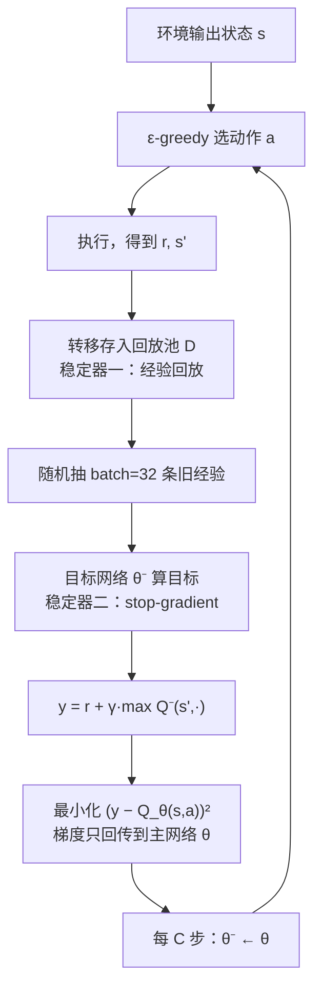
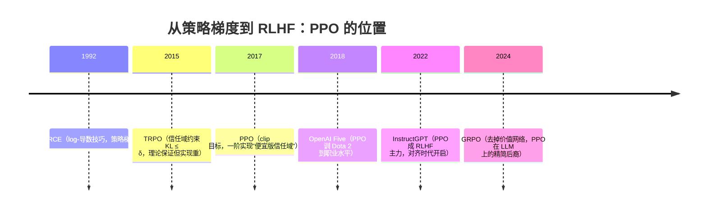

# 论文 14 | DQN × PPO：深度强化学习的两次关键跨越（合读）

> **一句话理解**：DQN（2015）证明"深度网络 + 强化学习"能从原始像素学出超人类策略——靠经验回放和目标网络两根稳定器；PPO（2017）把"别一步迈太大"做成一行 clip 公式——稳健、便宜、好调，后来成了 RLHF 的主力引擎。两篇合读，正好是深度强化学习（Deep RL）的"从能跑，到好用"。

[⬆️ 返回总目录](../README.md) · [⬆️ 返回专栏目录](./README.md)

---

## 📌 论文速览（两篇合表）

| 条目 | DQN | PPO |
|------|-----|-----|
| 标题 | Human-level control through deep reinforcement learning | Proximal Policy Optimization Algorithms |
| 作者 / 机构 | Mnih 等 19 人，DeepMind | Schulman、Wolski、Dhariwal、Radford、Klimov，OpenAI |
| 时间 / 发表 | 2015 年 2 月，**Nature** 518: 529–533 | 2017 年 7 月，arXiv:1707.06347 |
| 解决什么 | 高维感知输入（像素）直接到动作的控制学习，且**不逐游戏调参** | 策略梯度"一步迈太大就崩"——既要比 TRPO 便宜，又要稳 |
| 一句话方法 | 卷积网络逼近 Q 函数 + **经验回放** + **目标网络** | 对新旧策略概率比做 **clip** 的代理目标，一阶优化实现"信任域" |
| 代表数字 | 49 款 Atari、同一套网络与超参：43 款超过此前最好学习算法，29 款达到人类测试员 75% 以上水平，其中 22 款超过人类 | MuJoCo 连续控制与 TRPO 相当或更好、训练代价大降；后来支撑 OpenAI Five 与 InstructGPT 的 RLHF |
| 引用地位 | 深度 RL 纪元的开端；两个稳定器至今是值函数系的标配 | 工业界最常用的 RL 算法；RLHF 时代的事实标准 |

## 🌱 一句话核心思想

**DQN**：Q 表存不下 Atari（状态是像素），就用网络学 Q 函数；但"Q 表换网络"几乎必崩——于是用**经验回放**把样本打散复用、用**目标网络**把学习目标冻结，两根稳定器把致命的发散压住。

**PPO**：策略梯度最怕一次更新过猛——策略突然变差，采到的数据跟着变差，越学越崩。PPO 用**clip 把每次更新的幅度封顶**：朝好的方向每步最多迈 ε（常取 0.2），稳健小步走。它不是理论上最强的算法，是最不容易把模型训坏的算法。

---

## 🧠 方法精读 · Part A：DQN

### 记号翻译表（论文记号 → 本库记号）

| 论文记号 | 含义 | 本库（第 10 章）记号 |
|----------|------|----------------------|
| $Q(s, a; \theta)$ | 状态-动作价值网络的输出 | 同左（$Q_\theta(s,a)$） |
| $\theta^-$ | 目标网络参数（隔 $C$ 步从 $\theta$ 同步） | 同左 |
| $\mathcal{D}$ | 经验回放池（最近 100 万条转移） | 经验池 |
| $U(\mathcal{D})$ | 从池中均匀随机采样 | 随机抽样 |
| $y_i$ | TD 目标（由目标网络算出） | 目标值 $y$ |
| $r + \gamma \max_{a'} Q$ | 自举目标 | 贝尔曼备份 |
| $\phi(s)$ | 预处理后的 4 帧堆叠输入 | 状态特征 |

### 背景：为什么"Q 表换网络"几乎必崩

Q-learning 的表格版很稳，但换成网络逼近后，三块病根同时发作——学界称**致命三件套（Deadly Triad）**：**函数逼近**（估值处处带噪声且相互耦合）+ **自举**（用估值更新估值，错误自我复制）+ **离策略**（学的与采的不是同一策略）。DQN 三项全占，所以论文的全部设计，本质是给三件套配的"降压药"。本页把三个机制各自防什么、数学上怎么防，逐一推导。

### 机制一：从贝尔曼最优到损失函数——目标值为什么必须 stop-gradient

出发点是贝尔曼最优方程（Bellman optimality）：

$$
Q^*(s, a) = \mathbb{E}_{s' \sim \mathcal{E}}\Big[\, r + \gamma \max_{a'} Q^*(s', a') \,\Big]
$$

> 👉 **人话**：一个动作的"真实价值" = 眼下拿到的奖励 + 打折后的"下一状态里挑最好的那个值"。这是不动点方程——右边的 $Q^*$ 和左边是同一个函数，我们只是在"解"它。

用网络 $Q(s, a; \theta)$ 逼近时，自然的训练目标是让网络输出靠近自举目标（bootstrap，用估值造目标）。DQN 的损失函数（Nature 论文式 (3) 口径）：

$$
L_i(\theta_i) = \mathbb{E}_{(s, a) \sim U(\mathcal{D})}\Big[\big( y_i - Q(s, a; \theta_i) \big)^2 \Big],
\qquad
y_i = \mathbb{E}_{s' \sim \mathcal{E}}\Big[\, r + \gamma \max_{a'} Q(s', a'; \theta_i^{-}) \,\Big]
$$

> 👉 **人话**：损失就是"预测的价值"与"目标价值"的平方差。注意 $y_i$ 用的是 $\theta_i^-$（目标网络），不是正在训练的 $\theta_i$——这一个上标减号，就是 stop-gradient（切断梯度）的全部机关。

<details>
<summary>🧮 展开推导：为什么目标必须 stop-gradient——"追自己尾巴"的反馈环</summary>

**第 1 步：错误的做法。** 若目标与被训网络共用参数 $\theta$：

$$
L(\theta) = \mathbb{E}\Big[\big( \underbrace{r + \gamma \max_{a'} Q(s', a'; \theta)}_{y(\theta)} - Q(s, a; \theta) \big)^2\Big]
$$

对 $\theta$ 求梯度（注意 $y$ 也含 $\theta$）：

$$
\nabla_\theta L = -2\,\mathbb{E}\Big[\big(y(\theta) - Q_\theta\big)\cdot\big(\nabla_\theta Q(s,a;\theta)\Big|_{\text{预测项}} - \gamma\,\nabla_\theta \max_{a'} Q(s',a';\theta)\Big|_{\text{目标项}}\big)\Big]
$$

**第 2 步：解读两个梯度项。** 预测项 $\nabla_\theta Q(s,a;\theta)$ 是"把预测拉向目标"的回归力——这是我们要的。目标项 $\gamma \nabla_\theta \max_{a'} Q(s',a';\theta)$ 是什么？它在**移动目标本身**：网络每更新一次，所有状态的目标值同时跟着抖。你在追一个会跑的靶子，而靶子跑的方向还取决于你追的姿势。

**第 3 步：反馈环为什么致命。** 考察一次典型的正向更新：某个 $(s,a)$ 的目标里含 $\max Q(s', \cdot)$，网络把 $Q(s,a)$ 抬上去；下一次采样中，同一片状态的 $\max Q$ 又因为这个抬升而更高——**估值上涨沿自举链条自我传播**（一次 TD 更新让邻居涨，邻居的邻居下次也涨）。表格版里每个格子的目标只在被访问时逐格更新、且真值有界收敛；网络版里参数共享让**所有状态的目标一起动**，且 max 只记好话（噪声里挑最高），正反馈没有自然的天花板——训练曲线上看到的就是 Q 值一路膨胀、策略振荡、最后发散。

**第 4 步：stop-gradient 的手术。** 用冻结的 $\theta^-$ 算目标：$y = r + \gamma\max_{a'} Q(s', a'; \theta^-)$。此时 $\nabla_{\theta} y = 0$（$\theta^-$ 对 $\theta$ 而言是常数），梯度退化成干净的回归梯度：

$$
\nabla_\theta L = -2\,\mathbb{E}\Big[\big(y - Q_\theta\big)\cdot \nabla_\theta Q(s, a; \theta)\Big]
$$

**目标被钉住，回归有了不动点**。工程实现上就是一行"目标不回传梯度"（PyTorch 的 `detach()`、JAX 的 `stop_gradient`），配上"每隔 $C$ 步把 $\theta$ 拷给 $\theta^-$"（论文 $C = 10{,}000$ 量级）——目标像幻灯片一样一格一格换，而不是连续播放。

</details>

**一个数字小算例**：设 $\gamma = 0.9$，某转移 $(s, a, r{=}0, s')$，目标网络在 $s'$ 的两个动作估值为 $Q^-(s', a_1) = 1.0$、$Q^-(s', a_2) = 0.6$，主网络当前 $Q_\theta(s, a) = 0.2$。则目标 $y = 0 + 0.9 \times \max(1.0, 0.6) = 0.9$，损失 $(0.9 - 0.2)^2 = 0.49$，梯度把 $Q_\theta(s,a)$ 往 0.9 方向拉。若没有目标网络，同一次更新里 $s'$ 处的估值也会被这个梯度带着变——$y$ 当场就不再是 0.9 了。

### 机制二：经验回放——治"样本相关"与"样本浪费"

游戏里连续的帧高度相关（这一帧和上一帧几乎一样），而 SGD 的无偏性依赖"样本近似独立同分布"。DQN 的做法：把最近 100 万条转移 $(s, a, r, s')$ 存进回放池，训练时**均匀随机抽 minibatch（32 条）**，而不是用刚发生的这步。

$$
(s, a, r, s') \sim U(\mathcal{D}) \quad\text{而不是}\quad (s_t, a_t, r_t, s_{t+1}) \text{（当前时刻）}
$$

> 👉 **人话**：不吃"刚出锅的烫饭"，吃"随机抓的陈年旧账"——连续序列里相邻样本说的是同一件事，随机抽取后一个 batch 里混着不同时期、不同情形的经验，梯度估计更接近真实的期望。

它一石三鸟：**（1）打散时间相关性**，近似满足 i.i.d. 前提；**（2）样本复用**，每条经验被学很多次（每 4 帧才训一次 batch=32，一条数据可被反复抽到）；**（3）平滑数据分布**，防止策略刚一变好就把旧经验全忘光。另有一层"身份"上的必要条件——见下面折叠。

<details>
<summary>🧮 展开推导：回放为什么"合法"——Q-learning 的离策略身份</summary>

**问题**：回放池里是**旧策略**（几百万步之前的 ε-greedy 行为）采的数据，用它训练**当前**策略的价值函数，凭什么可以？

**关键：Q-learning 的目标是 $Q^*$，它的贝尔曼最优方程对数据的策略来源不敏感。** 逐项检查：

$$
Q^*(s, a) = \mathbb{E}_{s' \sim \mathcal{P}}\Big[\, r + \gamma \max_{a'} Q^*(s', a') \,\Big]
$$

- 期望只对**环境**的转移分布 $\mathcal{P}(s' \mid s, a)$ 取——这是环境的属性，不随采样策略变；
- 右边的 $\max$ 是对**所有**动作取的——不是"行为策略接下来会做什么"，而是"如果挑最优会值多少"。

所以只要回放数据**覆盖**了 $(s, a)$（行为策略的 ε 随机保证了一定的覆盖），用旧数据估这个期望就是合法的。这叫**离策略（off-policy）**。对照 Sarsa：它的目标是 $r + \gamma Q(s', a')$，其中 $a'$ 是**行为策略实际会执行**的下一步动作——期望依赖行为策略，旧数据就不再匹配，回放非法。**DQN 选 Q-learning 而不是 Sarsa 系，回放兼容性是硬理由之一。**

**边界的账**：合法 ≠ 白嫖。回放池里 $(s, a)$ 的访问分布由历代旧策略决定，用它近似"均匀覆盖"仍有偏差（很久没访问的状态估值变陈旧）；池太大存"远古经验"、池太小丢覆盖——100 万条是论文在 Atari 上摸出来的工程折中。

</details>

### 机制三：目标网络——把学习目标钉在幻灯片上

第二个稳定器在上文推导中已经出场，这里把**两个稳定器各防什么**一次说清（这是本篇最重要的对照表）：

| 稳定器 | 防的病 | 机制 | 类比 |
|--------|--------|------|------|
| 经验回放 | 样本时间相关（SGD 的 i.i.d. 前提被破坏）+ 样本浪费 | 均匀随机抽历史经验、一鱼多吃 | 吃随机抓的旧账，不吃刚出锅的烫饭 |
| 目标网络 | 目标值随参数抖动（自举反馈环、Q 值膨胀） | 目标用冻结的 $\theta^-$，每 $C$ 步同步一次 | 靶子每 $C$ 步挪一格，而不是跟着你跑 |

注意两者**不可互换**：回放解决的是"数据分布"问题，目标网络解决的是"优化目标"问题——只留一个，另一个病照样发作。正文第 10 章"深度强化学习"页把这两个位置画在同一张训练循环图上，本页是它的论文级完整版。



**网络与输入**：$210 \times 160$ 彩色帧降采样为 $84 \times 84$ 灰度、堆 4 帧作为输入（给运动信息）；3 个卷积层（32 个 8×8 步长 4 → 64 个 4×4 步长 2 → 64 个 3×3 步长 1）+ 512 维全连接 + 每个动作一个输出（Atari 每游戏 4~18 个动作）。**49 款游戏共用同一套架构与超参**——这是论文"通用性"主张的关键设定。

**训练侧的工程决定（Nature 论文口径，均有消融或对照支撑）**：

| 决定 | 设定 | 为什么 |
|------|------|--------|
| 帧跳过（frame skip） | 每 4 帧决策一次 | 省算力；4 帧间隔让动作后果显现 |
| 奖励裁剪 | 裁到 $[-1, 1]$ | 不同游戏分数量纲悬殊（1 分 vs 十万分），裁剪后**同一套学习率通吃** |
| ε-贪婪退火 | 从 1.0 线性退到 0.1（前 100 万帧） | 前期重探索，后期重利用；评估时用 0.05 |
| 采样-训练节奏 | 每 4 帧训一次，batch 32 | 训练开销与数据新鲜度的折中 |
| 回放池容量 | 最近 100 万条转移 | 覆盖新旧经验的窗口 |

> 👉 **人话**：奖励裁剪这条最容易被忽略却最见功力——它把"分数量纲"这个游戏间的最大差异抹平，是"一套超参跑 49 款游戏"能成立的隐形前提。做跨任务通用 RL 时，先问"我的信号量纲统一了吗"。

---

## 🧠 方法精读 · Part B：PPO

### 谱系定位：PPO 站在谁肩上



### 记号翻译表（论文记号 → 本库记号）

| 论文记号 | 含义 | 本库（第 10 章）记号 |
|----------|------|----------------------|
| $r_t(\theta)$ | 新旧策略概率比 $\pi_\theta(a_t\mid s_t)/\pi_{\theta_{\text{old}}}(a_t\mid s_t)$ | 同左（$r$） |
| $\hat A_t$ | 优势估计（GAE(λ) 算出） | 优势 $A_t$ |
| $L^{\mathrm{CLIP}}$ | clip 代理目标 | clip 目标 |
| $L^{VF}$ | 价值函数损失（可裁剪版） | 价值损失 |
| $S[\pi_\theta]$ | 策略熵 | 熵奖励 |
| $\epsilon$ | clip 幅度（常 0.2） | 同左 |
| $c_1, c_2$ | 价值损失 / 熵项系数（$c_1$ 常取 0.5） | 系数 |

### 机制一：从策略梯度到代理目标——概率比的身份

策略梯度（REINFORCE 系）给出梯度形式：

$$
\nabla_\theta J(\theta) = \mathbb{E}_{\tau \sim \pi_\theta}\Big[\sum_t \nabla_\theta \log \pi_\theta(a_t \mid s_t)\, \hat A_t \Big]
$$

> 👉 **人话**：把"比平均好多少"（优势 $\hat A_t$）的动作的概率往上推，把差的往下压。**但它是同策略（on-policy）的**：数据必须由当前策略采，采一批只能更新一次就扔——样本浪费严重。

PPO 的第一步是用**重要性采样**改写成"代理目标"（surrogate objective），让旧数据能复用几个 epoch：

$$
J^{\mathrm{surr}}(\theta) = \mathbb{E}_{t \sim \pi_{\theta_{\text{old}}}}\big[\, r_t(\theta)\, \hat A_t \,\big]
$$

<details>
<summary>🧮 展开推导：重要性采样恒等式——概率比的身份证</summary>

**第 1 步：恒等式。** 对任意函数 $f$，

$$
\mathbb{E}_{a \sim \pi_{\theta_{\text{old}}}}\Big[\frac{\pi_\theta(a \mid s)}{\pi_{\theta_{\text{old}}}(a \mid s)}\, f(a)\Big] = \sum_a \pi_{\theta_{\text{old}}}(a\mid s) \cdot \frac{\pi_\theta(a \mid s)}{\pi_{\theta_{\text{old}}}(a \mid s)} f(a) = \sum_a \pi_\theta(a\mid s) f(a) = \mathbb{E}_{a \sim \pi_\theta}[f(a)]
$$

权重分子分母相消——**用旧策略的数据，配上概率比修正，可以无偏地评估新策略下的期望**。取 $f = \hat A$ 即得代理目标。

**第 2 步：一阶等价。** 在 $\theta = \theta_{\text{old}}$ 处（$r = 1$）：$\nabla_\theta J^{\mathrm{surr}}\big|_{\theta_{\text{old}}} = \mathbb{E}[\nabla_\theta \log \pi_\theta \cdot \hat A]$（对 $r$ 求导，$\pi_{\theta_{\text{old}}}$ 是常数，$\nabla r = \pi_\theta/\pi_{\theta_{\text{old}}} \cdot \nabla\log\pi_\theta$，在 $r{=}1$ 处化简）——**与真实策略梯度完全一致**。

**第 3 步：离得越远越失真。** 两件事同时变坏：其一，$J^{\mathrm{surr}}$ 只保证一阶近似，$\theta$ 离 $\theta_{\text{old}}$ 远了，代理目标与真实目标 $J(\theta)$ 可以差很远（优化代理 ≠ 优化真目标）；其二，**概率比无上界**——某个动作在新策略下概率暴涨 100 倍，它的一条样本就独占整个 batch 的梯度（重要性权重方差爆炸）。**所以必须给"离多远"设约束：TRPO 用硬约束，PPO 用 clip。**

</details>

### 机制二：clip 目标——四情形完整分析（本篇核心）

PPO 的全部机关就一行：

$$
L^{\mathrm{CLIP}}(\theta) = \mathbb{E}_t\Big[\, \min\big(\, r_t(\theta)\, \hat A_t,\ \ \mathrm{clip}\big(r_t(\theta),\, 1-\epsilon,\, 1+\epsilon\big)\, \hat A_t \,\big) \,\Big], \qquad \epsilon \approx 0.2
$$

> 👉 **人话**：$r$ 是"这次更新把这个动作的概率乘了几倍"（$r = 1.2$ 即放大 20%）。$\mathrm{clip}$ 把 $r$ 夹在 $[0.8, 1.2]$；外层 $\min$ 取"更保守"的那支估计。合起来：**顺着优势方向加码，每步最多 ε；朝反方向纠错，永不设限**。分段行为见下表与下图。

```text
L^CLIP 关于 r 的分段形状（横轴 r，纵轴目标值；ε=0.2，安全区间 [0.8, 1.2]）

A > 0（好动作）：
                     ┌────────────────── 平台：(1+ε)·A，梯度 0（糖没了）
                     │
    ─────────────────┘  斜率 = A > 0（一直可学）
   1−ε            1+ε

A < 0（坏动作）：
                     斜率 = A < 0（一直可学）
    ─────────────────┐
                     │
                     └────────────────── 平台：(1−ε)·A，梯度 0（不再追加惩罚）
   1−ε            1+ε
```

**四情形逐段推导**（每段都给一组具体数字，可手算验证；取 $\epsilon = 0.2$）：

| 情形 | 位置 | 两支的值 | $\min$ 取哪支 | 对 $r$ 的梯度 | 人话 |
|------|------|----------|----------------|----------------|------|
| ① A>0，r ≤ 1+ε（含 r<1−ε） | 未越上界 | $rA$ vs clip 后 $rA$ 或 $(1-\epsilon)A$ | $rA$ | $=A \ne 0$ | 好动作继续上调；若被意外压低（r<1−ε）则**全力拉回** |
| ② A>0，r > 1+ε | 越上界 | $rA > (1+\epsilon)A$ | $(1+\epsilon)A$（常数） | $= 0$ | 好动作概率一步至多放大 1.2 倍，想再大？没糖了 |
| ③ A<0，r ≥ 1−ε（含 r>1+ε） | 未越下界 | $rA$ vs $(1+\epsilon)A$ 等 | $rA$ | $=A \ne 0$ | 坏动作继续下压；若被意外抬高（r>1+ε）则**全力压回** |
| ④ A<0，r < 1−ε | 越下界 | $rA$ vs $(1-\epsilon)A$ | $(1-\epsilon)A$（常数） | $= 0$ | 坏动作概率一步至多压到 0.8 倍，不再追加惩罚 |

<details>
<summary>🧮 展开推导：四个情形逐一验证（含数字代入）</summary>

取 $\epsilon = 0.2$，安全区间 $[0.8, 1.2]$。

**情形①：A = +1，r = 1.1（区间内）。** $\mathrm{clip}(1.1) = 1.1$，两支都是 $1.1 \times 1 = 1.1$，$\min = 1.1$。目标随 $r$ 线性增（斜率 $A = 1$），梯度继续推高 $r$。**学。**

**情形①'（修正方向）：A = +1，r = 0.5（低于下界）。** $\mathrm{clip}(0.5) = 0.8$。两支：$rA = 0.5$，clip 支 $= 0.8$。$\min(0.5, 0.8) = 0.5 = rA$——**未截断支胜出**，梯度 $= 1$，把好动作概率从被错误压低的 0.5 倍拉回来。**clip 在这里故意不设防。**

**情形②：A = +1，r = 1.5（越上界）。** $\mathrm{clip}(1.5) = 1.2$。两支：$rA = 1.5$，clip 支 $= 1.2$。$\min(1.5, 1.2) = 1.2$——常数，$\partial L / \partial r = 0$。**好动作一次更新至多放大 1.2 倍。**

**情形③：A = −1，r = 1.0（区间内）。** 两支同为 $-1.0$，梯度 $= -1$，继续压低 $r$。**学。**

**情形③'（修正方向）：A = −1，r = 1.5（越上界）。** $\mathrm{clip}(1.5) = 1.2$。两支：$rA = -1.5$，clip 支 $= -1.2$。$\min(-1.5, -1.2) = -1.5 = rA$——**未截断支胜出**，梯度 $= -1$，把被错误抬高的坏动作概率全力压回。**clip 在这里同样不设防。**

**情形④：A = −1，r = 0.5（越下界）。** $\mathrm{clip}(0.5) = 0.8$。两支：$rA = -0.5$，clip 支 $= 0.8 \times (-1) = -0.8$。$\min(-0.5, -0.8) = -0.8 = clip 支$——常数，梯度 $0$。**坏动作概率一步至多压到 0.8 倍，再往下没有额外奖励。**

**汇总成一句**：$\min$ 每次都选"更悲观"的估计（clipped 目标是未截断代理目标的**下界**，论文称之为 pessimistic bound）。被截断的只有两种情形——**概率比已顺着优势方向跑出界还想继续加码**（②④）；凡是概率比朝与优势**相反**方向跑出界（①'③'），梯度从不被截断，纠错全速。这就是"稳健小步走"的完整机关：**上限设防，纠错不封顶**。

**与重要性采样的接榫**：$r$ 同时是重要性权重——PPO 用旧数据多训几个 epoch 时，一旦新策略偏离旧策略太远（$r$ 出界），这些样本的"票"就被削权，防止用过时数据把策略带偏。TRPO 用 KL 硬约束管同一件事，PPO 用 clip 软管。

</details>

### 机制三：完整损失——clip + 价值裁剪 + 熵奖励

工程上的 PPO 一次优化三项合体：

$$
L_t = \mathbb{E}_t\Big[\, L_t^{\mathrm{CLIP}} - c_1\, L_t^{VF} + c_2\, S_{\pi_\theta}(s_t) \,\Big]
$$

> 👉 **人话**：第一项管策略小步走；第二项训价值网络当裁判（Actor-Critic 结构）；第三项发"探索补贴"（熵高 = 动作分布别太早收敛成死板套路），防止策略过早坍缩。

其中价值损失也有一个裁剪版（与策略的 clip 呼应，防价值输出一步跳太远）：

$$
L_t^{VF} = \max\Big(\big(V_\theta(s_t) - V_t^{\mathrm{tgt}}\big)^2,\ \big(V^{\mathrm{clip}}(s_t) - V_t^{\mathrm{tgt}}\big)^2\Big),
\qquad
V^{\mathrm{clip}}(s_t) = V_{\theta_{\text{old}}}(s_t) + \mathrm{clip}\big(V_\theta(s_t) - V_{\theta_{\text{old}}}(s_t),\, -\epsilon,\, \epsilon\big)
$$

优势 $\hat A_t$ 用 **GAE(λ)** 估计（λ 常取 0.95）：偏差-方差在"一步 TD"与"整条轨迹蒙特卡洛"之间插值——完整推导在[正文第 10 章深潜](../docs/4-专业方向/10-强化学习/02-深度强化学习.md)，本页不重复。

### 与 TRPO 的关系：信任域的"廉价近似"

| 维度 | TRPO（2015） | PPO（2017） |
|------|--------------|-------------|
| 约束方式 | 硬约束：$\mathbb{E}[\mathrm{KL}(\pi_{\text{old}} \,\|\, \pi_\theta)] \le \delta$ | 软约束：clip 目标，无显式 KL |
| 理论保证 | 有单调改进下界（源自保守策略迭代，Kakade & Langford 2002） | 无硬保证，实证稳健 |
| 优化方式 | 共轭梯度 + Fisher 向量积 + 线搜索（二阶信息） | 普通一阶 minibatch SGD/Adam |
| 工程体验 | 实现复杂、调试成本高、与 minibatch/并行不友好 | 十几行核心代码、超参宽容、易大规模并行 |

> 👉 **人话**：TRPO 像给每步更新配了"理论保险"，但保费（二阶计算的工程复杂度）太贵；PPO 把保险换成了"限速器"——没有理论上的最优性，但便宜、皮实、够稳。深度学习的历史反复证明：**工程上"简单稳健"经常赢过"理论优雅但娇贵"**。

---

## 📊 实验解读

### DQN：49 款 Atari 的口径（Nature 2015）

**设定**：49 款 Atari 2600 游戏；输入仅原始像素与游戏分数；**同一套网络架构与超参跑全部游戏**，不做逐游戏的特征工程与调参；每款游戏训练 5000 万帧（约等于 38 天的人类游戏经验量级）。

**核心数字**（论文口径）：

- 43/49 款游戏上超过此前最好的学习类算法（含此前的线性方法与 2013 版 DQN）；
- 29/49 款（过半）达到专业人类测试员水平的 75% 以上，其中 **22 款超过人类水平**；
- 全 49 款游戏归一化分数的**中位数约为人类水平的 79%**——"中位数"是关键口径：少数游戏的巨大优势被拉平后仍处在人类水准量级。

**消融怎么读**：论文对比了带/不带回放与目标网络的消融（2013 会议版 DQN 无目标网络，中位数约 48% 人类水平；Nature 版加目标网络后到 79%）——**两根稳定器的价值直接体现在这 31 个百分点的中位数差距上**。

**证明了什么**：通用架构 + 通用超参从原始像素学到多样游戏族的超人类控制——"高维感知 → 动作"的端到端学习在多样任务上成立；两个稳定器是必要的。

**没证明什么**：

1. **样本效率**：每游戏数千万帧经验，人类几分钟上手的东西它要"玩"几十天——离"像人一样学"很远；
2. **探索**：稀疏奖励游戏（Montezuma's Revenge 这类需要长程探索的）上几乎学不动（论文分数接近零）；
3. **泛化**：是"每款游戏各学各的"，不是"学一次会全部"；
4. **连续控制**：动作空间是小离散集合（4~18 个键），摇杆连续控制不在射程。

### PPO：对比与消融（arXiv 2017 口径）

- **连续控制**：MuJoCo 7 个标准任务（HalfCheetah、Hopper、Walker2d 等）上，PPO 与 TRPO 及当时主流算法**相当或更好**，而实现与计算代价大降——一阶优化、minibatch、天然适配大规模并行采样；
- **Atari**：49 款游戏上比较 clip 版与自适应 KL 惩罚版两个变体，**clip 版整体得分更高**，也优于同算力的 A2C 类基线（论文口径）；
- **消融的核心读法**：clip 的对手是"无约束的重要性采样代理"与"KL 惩罚"——clip 赢在稳且免调 KL 系数；ε 本身是少数几个好调的超参（0.1~0.3 都常能工作，经验参考）。

**没证明什么**：样本效率（同策略采一批用一批，比离策略算法更费数据）；对超参与随机种子的鲁棒性虽好于 TRPO 系但绝对值仍不低——2018 年"Deep RL That Matters"一文系统展示了深度 RL 复现方差之大，PPO 不能幸免。

---

## 🔁 后世影响与争议

### DQN 系：深度 RL 纪元的开场

- **直接改进链**：Double DQN（2015，拆开"选动作"与"打分"，治 max 过估计）、优先经验回放（2016，重要经验多学几遍）、分布 RL（C51）、Noisy Nets……集大成者 **Rainbow**（2018）把这些补丁合成一体，再刷一波 Atari。
- **血统外溢**：AlphaGo/AlphaZero 的价值网络是"学状态有多好"这一思想的直系后代；Ape-X 等把"actor 并行采样 + learner 回放"的骨架推到大规模。
- **未根治的病**：致命三件套只是被两根稳定器"压住"，没有被治愈——换任务换超参仍会翻车；Q 值膨胀、训练发散的个案在后续文献里反复出现。

### PPO 系：从游戏引擎到对齐引擎

- **大规模验证**：OpenAI Five（2018）用 PPO 把 Dota 2 打到职业水平，证明它能吞下超大规模并行；
- **RLHF 主力**：InstructGPT（2022）用 PPO 做"人类反馈强化学习"，此后对齐大模型的标准流水线（奖励模型 + 价值模型 + KL 约束）以它为默认引擎——**PPO 被选中不是因为它指标最强，而是它最不容易把花了巨资训好的语言模型一次更新训坏**（详见[微调与对齐](../docs/4-专业方向/07-自然语言处理与LLM/05-微调与对齐.md)）；
- **后裔**：GRPO（2024，DeepSeekMath 提出）去掉价值网络、用组内相对奖励，把 PPO 的 Actor-Critic 双网络精简成单网络，成为开源 LLM 对齐的流行选择（正文第 10 章 RL 进阶专题有详解）。

### 共同的争议

1. **样本效率与稳定性仍是深度 RL 的两大顽疾**——两篇论文都选择了"以数据换稳定"的路线（DQN 回放复用 + 目标网络；PPO 同策略小步走），十年后回看，这条路线赢了工程，但"高效又稳定的深度 RL"仍是开放问题；
2. **基准的窄**：Atari 与 MuJoCo 的成功不等价于真实世界控制（接触丰富、部分可观测、安全约束），两篇论文的结论边界要守住；
3. **可复现性**：深度 RL 对随机种子、实现细节（代码级细节如 advantage 归一化、梯度裁剪）敏感——"PPO 的 Python 实现与论文公式之间的鸿沟"本身成了一门学问。

---

## 🔗 在本库中的位置

- **正文主场**：[深度强化学习](../docs/4-专业方向/10-强化学习/02-深度强化学习.md)——DQN 三病根三药方与 PPO clip 四情形的直觉版深潜都在该页，本页是它们的**论文级完整版**（补齐 stop-gradient 梯度式、重要性采样恒等式、四情形逐段数字验证）。
- **前置**：[强化学习入门](../docs/4-专业方向/10-强化学习/01-强化学习入门.md)——贝尔曼方程、Q-learning 与 ε-greedy 的来龙去脉。
- **下游**：[RL 进阶专题](../docs/4-专业方向/10-强化学习/03-进阶专题-RL进阶.md)——RLHF 全栈、GRPO 详解、离线 RL。
- **跨章**：[微调与对齐](../docs/4-专业方向/07-自然语言处理与LLM/05-微调与对齐.md)——PPO 在 RLHF 三阶段里的确切位置（本专栏第 07 篇 InstructGPT、第 08 篇 DPO 的前情）。

## 🖱️ 自测一下（点击展开答案）

<details>
<summary>问题 1：经验回放为什么能配 Q-learning，却配不了 Sarsa？</summary>

Q-learning 的贝尔曼最优目标 $r + \gamma\max_{a'} Q(s', a')$ 只对**环境的转移分布**取期望、对**所有动作**取 max——与行为策略是谁无关，所以旧策略采的数据照样合法（离策略，off-policy）。Sarsa 的目标 $r + \gamma Q(s', a')$ 里的 $a'$ 是**行为策略实际会执行的下一步动作**，期望依赖当前行为策略——旧数据分布对不上，回放非法。DQN 选 Q-learning 而非 Sarsa 系，回放兼容性是硬理由。

</details>

<details>
<summary>问题 2：PPO 的 clip 目标里，哪两种情形梯度为零？哪两种"反向超界"的情形反而梯度全速？</summary>

梯度为零的只有"概率比顺着优势方向跑出界还想继续加码"：A>0 且 r>1+ε（好动作已被放大到 1.2 倍以上），以及 A<0 且 r<1−ε（坏动作已被压到 0.8 倍以下）——两种情形 min 都选中常数 clip 支，目标不再随 r 变化。反向超界（A>0 但 r<1−ε；A<0 但 r>1+ε）时 min 选中的都是未截断支 $rA$，梯度全力把概率比拉回安全区间。**上限设防、纠错不封顶**——这是 clip 的完整性格，不是简单的"剪掉大步"。

</details>

<details>
<summary>问题 3：把目标网络的同步间隔 C 调得极大（比如永不更新），目标更稳了，训练会更好吗？</summary>

不会。稳定的是"目标的方差"，牺牲的是"目标的正确性"：环境与策略都在变，过时的 $\theta^-$ 给出的自举目标系统性偏离当前真值，学习信号变成陈旧偏见。C 是"目标稳定性 vs 目标新鲜度"的折中，论文取万步量级；工程上发现 Q 值膨胀或策略停滞时，"检查目标网络更新频率"是标准排查动作之一。

</details>

## 📚 延伸阅读

- DQN：[Nature 原文（2015）](https://www.nature.com/articles/nature14236) · [2013 会议版（arXiv:1312.5602）](https://arxiv.org/abs/1312.5602)（无目标网络的初版，对照读能看清稳定器的分量）
- 改进链：[Double DQN（arXiv:1509.06461）](https://arxiv.org/abs/1509.06461) · [优先经验回放（arXiv:1511.05952）](https://arxiv.org/abs/1511.05952) · [Rainbow（arXiv:1710.02298）](https://arxiv.org/abs/1710.02298)
- PPO：[原论文（arXiv:1707.06347）](https://arxiv.org/abs/1707.06347) · [TRPO（arXiv:1502.05477）](https://arxiv.org/abs/1502.05477)
- 教材式讲解：[OpenAI Spinning Up in Deep RL](https://spinningup.openai.com/en/latest/)（PPO 的标准参考实现出处之一）
- RLHF 接力：[InstructGPT（arXiv:2203.02155）](https://arxiv.org/abs/2203.02155) · [DeepSeekMath / GRPO（arXiv:2402.03300）](https://arxiv.org/abs/2402.03300)
- 复现性警示：[Deep RL That Matters（arXiv:1709.06560）](https://arxiv.org/abs/1709.06560)

---

[⬅️ 上一页：13 · GCN](./13-GCN.md) · [返回专栏目录](./README.md) · [下一页：15 · XGBoost ➡️](./15-XGBoost.md)
