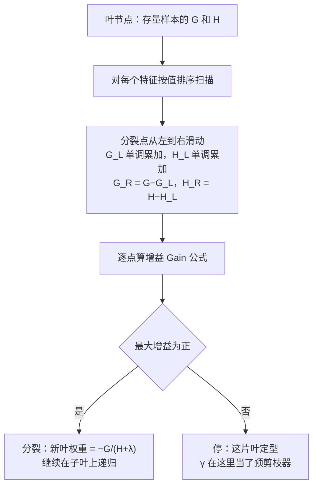

# 论文 15 | XGBoost：把梯度提升树推到系统工程的极限

> **一句话理解**：梯度提升（boosting）的数学在 2001 年就基本齐了，XGBoost 的贡献是把这套数学（二阶泰勒展开的目标 + 正则化的分裂增益）与系统设计（列抽样、缺失值默认方向、缓存感知、特征级并行）拧成一台机器——从此表格数据上"先跑一版 XGBoost"成了十年不变的行业默认动作。

[⬆️ 返回总目录](../README.md) · [⬆️ 返回专栏目录](./README.md)

---

## 📌 论文速览

| 条目 | 内容 |
|------|------|
| 标题 | XGBoost: A Scalable Tree Boosting System |
| 作者 / 机构 | Tianqi Chen、Carlos Guestrin（华盛顿大学，University of Washington） |
| 时间 / 发表 | 2016 年 3 月挂 arXiv（[arXiv:1603.02754](https://arxiv.org/abs/1603.02754)）；**KDD 2016** |
| 解决什么 | 梯度提升树（GBDT）在数据变大后"算不动、易过拟合、缺稀疏值处理"的三重困境 |
| 一句话方法 | 目标函数做**二阶泰勒展开** + 显式正则（叶权 L2 + 叶数惩罚）→ 推出叶权闭式解与分裂增益公式；系统上用列抽样、缺失值默认方向、缓存感知、块结构并行把它推到十亿样本级 |
| 代表数字 | 2015 年 Kaggle 29 个获胜方案中 **17 个**用了 XGBoost（其中 8 个只用它）；KDD Cup 2015 **前十名全员**使用 |
| 引用地位 | 表格机器学习的十年王座；"算法 + 系统"协同设计（co-design）论文的代表作 |

## 🌱 一句话核心思想

**每一轮加一棵树，加哪棵树由"二阶泰勒展开的目标函数"打分——这个打分有闭式解，于是"贪心长树"变成了"按增益公式扫分裂点"；再把整个扫描流程做成对缓存、稀疏、多核友好的系统，数学与工程各拿一半功劳。**

直觉版：boosting 是"错题本学习法"——每棵新树专门补当前模型还差的部分。老 GBDT 只用一阶梯度（错题的方向），XGBoost 连二阶梯度（错题的把握程度）一起用，于是每片叶子的最优修正量有了公式：`−梯度和/(二阶和+λ)`；要不要多分一个叉，也有公式：分裂前后目标之差。公式定了，剩下的是让它在一亿行数据上跑得动——论文的另一半篇幅都在讲这个。

## 背景：2016 年，GBDT 卡在哪

梯度提升的思想到 2016 年已经十五岁（Friedman 的 GBM，2001），但真拿去打硬仗，三堵墙挡在前面：

1. **算不动**：精确贪心要对每个特征全量排序、逐样本扫描分裂点，千万行数据上单机内存与算力都吃不消——"先用抽样再训练"成了无奈的常态；
2. **易过拟合**：树是记忆机器，正则化（限制树深、剪枝）在传统实现里是外挂的补丁，与"长树"的过程脱节，调好了train再回头看test的事故屡见不鲜；
3. **缺值与稀疏没人管**：真实数据缺值、one-hot 后的大规模稀疏是常态，传统做法"先填充再训练"既粗暴又费内存。

XGBoost 的回答分别对应论文的两大块：**数学上**把正则项写进目标函数，让"控制复杂度"长在分裂公式里（治墙 2）；**系统上**用列抽样、缺失默认方向、缓存感知、块结构并行与外存计算，把扫描从"逐样本"优化到"对缓存、稀疏、多核友好"（治墙 1 和 3）。标题里的 "System"，就是冲着这三堵墙去的。

---

## 🧠 方法精读

### 记号翻译表（论文记号 → 本库记号）

| 论文记号 | 含义 | 本库（第 3 章）记号 |
|----------|------|---------------------|
| $\hat y_i$ | 第 $i$ 个样本的当前预测 | $\hat y_i$ |
| $f_k(x_i)$ | 第 $k$ 棵树的输出 | 第 $k$ 棵树的预测 |
| $F = \{f_k\}$ | 回归树空间 | 树模型族 |
| $l(y_i, \hat y_i)$ | 可微凸损失（如平方、逻辑） | 损失函数 |
| $\Omega(f) = \gamma T + \tfrac{1}{2}\lambda \|w\|^2$ | 正则项（$T$ 叶数、$w$ 叶权） | 复杂度惩罚 |
| $g_i$、$h_i$ | 损失对 $\hat y_i$ 的一阶、二阶梯度 | 一阶/二阶梯度统计 |
| $q: \mathbb{R}^d \to \{1, \dots, T\}$ | 树结构（样本落到哪片叶） | 树的分裂结构 |
| $I_j$ | 第 $j$ 片叶上的样本集合 | 叶节点样本集 |
| $G_j = \sum_{i \in I_j} g_i$ | 叶 $j$ 上的一阶梯度和 | —— |
| $H_j = \sum_{i \in I_j} h_i$ | 叶 $j$ 上的二阶梯度和 | —— |
| $\eta$ | 学习率 / 收缩（shrinkage） | 学习率 |
| $\gamma$、$\lambda$ | 叶数惩罚 / 叶权 L2 强度 | 正则超参 |

### 机制一：目标函数的二阶泰勒展开

$K$ 棵树的加法模型，训练目标是"损失 + 所有树的复杂度"：

$$
\mathcal{L} = \sum_{i=1}^{n} l\big(y_i, \hat y_i\big) + \sum_{k=1}^{K} \Omega(f_k)
$$

> 👉 **人话**：模型要"预测准"，还要"长得简单"——正则项给每片叶子收两笔税：开叶子的固定税 $\gamma$，和叶权大小的比例税 $\lambda$。后面的推导会看到这两笔税直接长在公式里。

第 $t$ 轮，在前面 $t-1$ 棵树固定的前提下新增 $f_t$：

$$
\mathcal{L}^{(t)} = \sum_{i=1}^{n} l\big(y_i, \hat y_i^{(t-1)} + f_t(x_i)\big) + \Omega(f_t)
$$

> 👉 **人话**：$\hat y^{(t-1)}$ 是"已经学会的部分"，$f_t(x_i)$ 是"这轮要补的修正"。问题变成：给定当前预测，这轮的修正取多少最划算？

老 GBDT（梯度提升）在这里用**一阶**泰勒：$l(\hat y + f) \approx l(\hat y) + g\,f$。XGBoost 展开到**二阶**：

$$
l\big(\hat y^{(t-1)} + f\big) \approx l\big(\hat y^{(t-1)}\big) + g_i\, f + \tfrac{1}{2} h_i\, f^2,
\qquad
g_i = \frac{\partial l}{\partial \hat y^{(t-1)}},\quad h_i = \frac{\partial^2 l}{\partial \hat y^{(t-1)}}
$$

> 👉 **人话**：一阶告诉你"往哪边修"（方向），二阶告诉你"这一步大概修多到位"（曲率）。有了二阶项，$f$ 的二次式配平就能直接解出最优修正量——不用线搜索，不用逐样本迭代，闭式解。

🧮 展开推导：二阶泰勒的合法性与化简（一步不跳）

**第 1 步：泰勒展开。** 把 $l$ 看作"当前预测 $\hat y$ 加上修正量 $f$"的一元函数，在 $f = 0$ 处展开到二阶：

$$
l(\hat y + f) = l(\hat y) + l'(\hat y)\, f + \tfrac{1}{2} l''(\hat y)\, f^2 + O(f^3)
$$

记 $g_i = l'(\hat y_i^{(t-1)})$、$h_i = l''(\hat y_i^{(t-1)})$——注意它们**只依赖旧预测**，对这轮的 $f_t$ 是常数。这正是 boost 化的关键：$l$ 本身长什么样（平方损失？逻辑损失？排序损失？）全部被压缩成两个数字 $(g_i, h_i)$，**同一个长树算法通吃所有可微损失**。

**第 2 步：代入目标。**

$$
\mathcal{L}^{(t)} \approx \sum_{i=1}^{n}\Big[\, l\big(y_i, \hat y_i^{(t-1)}\big) + g_i f_t(x_i) + \tfrac{1}{2} h_i f_t^2(x_i) \Big] + \Omega(f_t)
$$

**第 3 步：扔掉常数。** 第一项 $l(y_i, \hat y^{(t-1)})$ 与 $f_t$ 无关（前面 $t{-}1$ 棵树已定），对这轮的最优化没有任何影响，删掉：

$$
\tilde{\mathcal{L}}^{(t)} = \sum_{i=1}^{n}\Big[\, g_i\, f_t(x_i) + \tfrac{1}{2}\, h_i\, f_t^2(x_i) \,\Big] + \gamma T + \tfrac{1}{2}\lambda \sum_{j=1}^{T} w_j^2
$$

**为什么二阶比一阶好**：一阶版（GBM）只有线性式，最优步长要靠外层线搜索去试；二阶版自带"抛物线碗"，碗底位置一步到位——这既是**牛顿法视角**（$-g/h$ 正是每片叶子上的牛顿步），也是后面"分裂增益有闭式公式"的前提（分母里的 $H$ 就来自二阶项）。

**$h_i$ 从哪来的两个常用损失**：平方损失 $l = \tfrac12(y - \hat y)^2$：$g_i = \hat y_i - y_i$，$h_i = 1$（曲率恒正）；二分类逻辑损失：$g_i = p_i - y_i$，$h_i = p_i(1 - p_i) > 0$。**常见损失的二阶恒正**，这是"每片叶上是个开口向上的碗"的保证。

### 机制二：按叶分组 → 叶权闭式解 → 结构打分

树的结构 $q$ 把样本映到 $T$ 片叶子，第 $i$ 个样本的修正量就是所在叶的权重：$f_t(x_i) = w_{q(x_i)}$。把求和按叶子重组（记 $G_j = \sum_{i \in I_j} g_i$，$H_j = \sum_{i \in I_j} h_i$）：

$$
\tilde{\mathcal{L}}^{(t)} = \sum_{j=1}^{T}\Big[\, G_j\, w_j + \tfrac{1}{2}\, (H_j + \lambda)\, w_j^2 \,\Big] + \gamma T
$$

> 👉 **人话**：全数据的目标 = 每片叶子各自的一个**一元二次函数**之和。样本 $i$ 对它所在的叶贡献 $g_i$ 与 $h_i$，叶子里把大家的账加总（$G_j, H_j$），这片叶的最优权重就能独立解出——叶子之间互不牵连。

每片叶是开口向上的抛物线 $G w + \tfrac12 (H+\lambda) w^2$，配方即得**最优叶权**与**最优目标值**：

$$
w_j^* = -\,\frac{G_j}{H_j + \lambda},
\qquad
\tilde{\mathcal{L}}^{*} = -\,\frac{1}{2} \sum_{j=1}^{T} \frac{G_j^2}{H_j + \lambda} + \gamma T
$$

> 👉 **人话**：叶子的最优修正 = "负的梯度和，除以（二阶和 + λ）"。直觉：梯度和为负说明这片叶的样本普遍被低估（要加正修正），除以曲率是"有多大把握修多少"——曲率大（样本多、损失陡）就谨慎，λ 再额外压一档。而 $\tfrac{G_j^2}{H_j+\lambda}$ 这一项可以读作**这片叶子的"结构分数"**：越大（目标值越负）这片叶越有用；$\gamma T$ 是开叶子的固定税。

### 📐 数学深潜：叶权闭式解 = 每片叶上的牛顿步

**严格陈述。** 第 $t$ 轮对"当前预测整体"做一次牛顿法更新时，若把修正量限制为"每片叶一个常数"，则牛顿步恰为 $w_j^* = -G_j/(H_j + \lambda)$——即机制二的闭式解。二阶展开不是精度装饰，是**把线搜索换成了有公式的步长**。

🧮 展开推导：从牛顿法到叶权，一维先看懂

**第 1 步：一维牛顿法复习。** 最小化一元函数 $\phi(w)$：二阶泰勒 $\phi(w) \approx \phi(w_0) + \phi'(w_0)\,\Delta + \tfrac12 \phi''(w_0)\,\Delta^2$，令导数为零解出步长 $\Delta^* = -\phi'(w_0)/\phi''(w_0)$。**方向（一阶）定"往哪走"，曲率（二阶）定"走多远"。**

**第 2 步：损失函数的牛顿视角。** 第 $t$ 轮要最小化的真实量是 $F(\{\Delta_i\}) = \sum_i l(y_i, \hat y_i + \Delta_i)$（每个样本一份修正）。它是"多变量"的——但树模型把样本分组共享修正量，正好把自由度压到 $T$ 片叶。

**第 3 步：按叶代入。** 叶 $j$ 上的目标对 $w_j$ 的导数（用链式法则逐样本加总）：

$$
\frac{\partial}{\partial w_j}\sum_{i \in I_j} l(y_i, \hat y_i + w_j) = \sum_{i \in I_j} g_i = G_j,
\qquad
\frac{\partial^2}{\partial w_j^2} = \sum_{i \in I_j} h_i = H_j
$$

牛顿步 $w^* = -G_j / H_j$；加 λ 正则等价于把二阶导换成 $H_j + \lambda$（弹性加强曲率，步子变小）——与机制二配平结果完全一致。**老 GBDT 只算 $G_j$，步长靠外层线搜索试出来；XGBoost 算 $(G_j, H_j)$，步长直接写死在公式里。**

**第 4 步：几何解释。** 把叶 $j$ 的目标画在 $(w, \text{loss})$ 平面上：二阶近似是一条开口向上的抛物线，顶点横坐标 $-G_j/(H_j+\lambda)$、顶点纵坐标 $-\tfrac{G_j^2}{2(H_j+\lambda)}$（相对常数项）。**叶越"有用"（$G_j^2$ 大、$H_j$ 小），抛物线越深**——这就是"结构分数"的几何形象；两片叶的分数能不能凑出一个正增益，就是问"把一条浅抛物线换成两条更深的，赚的深度够不够交 γ 的税"。

**第 5 步：反例与边界。**

- **$h_i$ 不恒正的损失**（如某些非凸/自定义损失）：抛物线开口向下，$w^*$ 变成最大点而非最小点，公式失效——XGBoost 默认损失族都满足 $h > 0$，自定义损失要先体检这条；
- **泰勒近似失真**：$|f_t|$ 大时三阶项不再可忽略，"最优"漂移。shrinkage（每棵树乘 η，典型 0.1，经验参考）压小步幅，正是给这份近似误差留的保险——**η 小 → 树多 → 每步近似误差小**，代价是训练时间。

> 👉 **一句人话**：二阶展开让"补错题"从"凭方向感小步试"升级成"看着抛物线直接走到碗底"——这既是精度的来源，也是一切闭式公式（叶权、结构分数、增益）能存在的前提。

🧮 展开推导：配平二次型（含数字验证）

**第 1 步：一元二次函数的最小点。** 对 $a w + \tfrac{1}{2} b w^2$（$b > 0$）：求导 $a + b w = 0 \Rightarrow w^* = -a/b$；代回得最小值 $-\tfrac{a^2}{2b}$。

**第 2 步：逐叶代入。** 叶 $j$ 上 $a = G_j$、$b = H_j + \lambda$（λ 并进 $b$，这就是"叶权的 L2 正则"的全部实现——它不需要任何额外步骤，只是让分母变大一点）。得 $w_j^* = -\tfrac{G_j}{H_j + \lambda}$，叶的最优目标贡献 $-\tfrac{G_j^2}{2(H_j+\lambda)}$。求和并加上开叶税 $\gamma T$，即上面的 $\tilde{\mathcal{L}}^*$。

**第 3 步：数字验证（6 个样本，λ=1，二分类逻辑损失）。** 设当前预测全为 $p_i = 0.5$，真实标签 $y = (1,1,1,0,0,0)$。则

$$
g_i = p_i - y_i = (-0.5, -0.5, -0.5, +0.5, +0.5, +0.5),\qquad
h_i = p_i(1-p_i) = 0.25\ (\text{各样本})
$$

**不分叶（单叶）**：$G = 0$，$H = 1.5$。$w^* = -0/(1.5+1) = 0$——整体修正为零（预测 0.5、标签一半一半，确实没什么可修），目标值 $-\tfrac{0}{2.5} + \gamma \cdot 1 = \gamma$。

**按标签分成两叶**（左叶样本 1–3，右叶 4–6）：$G_L = -1.5,\ H_L = 0.75;\ G_R = +1.5,\ H_R = 0.75$。

- 左叶 $w_L^* = -\tfrac{-1.5}{0.75+1} = +0.857$——被低估的正样本集中地，预测上调；
- 右叶 $w_R^* = -\tfrac{1.5}{1.75} = -0.857$——对称地下调；
- 目标值 $= -\tfrac12\big[\tfrac{2.25}{1.75} + \tfrac{2.25}{1.75}\big] + 2\gamma = -1.286 + 2\gamma$。

**从单叶的 $\gamma$ 降到 $-1.286 + 2\gamma$：这一刀切下去目标降了 1.286 − γ**——它就是下一节"分裂增益"的值。

### 机制三：分裂增益公式——长树的决策依据

一个候选分裂把叶 $j$ 的样本分成左右两半，**增益（gain）= 分裂前的结构分数 − 分裂后两叶分数之和 − 开新叶的税**：

$$
\mathrm{Gain} = \frac{1}{2}\left[\, \frac{G_L^2}{H_L + \lambda} + \frac{G_R^2}{H_R + \lambda} - \frac{(G_L + G_R)^2}{H_L + H_R + \lambda} \,\right] - \gamma
$$

> 👉 **人话**：左边两项是"分家后两家各自的价值"，中间一项是"不分家时的价值"，差值是这次分裂赚到的；再交一个开叶子的固定税 γ。**增益 > 0 才分裂，≤ 0 不分**——γ 就这样成了内置的预剪枝器。整棵树的生长 = 对每个叶、每个特征、每个候选切点反复算这个公式，贪心取最大。

🧮 展开推导：增益公式的完整链 + 极端情形体检

**第 1 步：从机制二直接搬。** 分裂前该叶（样本并集）的最优目标贡献 $-\tfrac12 \tfrac{(G_L+G_R)^2}{H_L+H_R+\lambda}$；分裂后两叶合计 $-\tfrac12\big[\tfrac{G_L^2}{H_L+\lambda} + \tfrac{G_R^2}{H_R+\lambda}\big]$；多开一片叶多交一份 γ。

**第 2 步：相减。** 目标值变化 = 分裂后 − 分裂前 = $-\tfrac12\big[\tfrac{G_L^2}{H_L+\lambda} + \tfrac{G_R^2}{H_R+\lambda}\big] + \tfrac12\tfrac{(G_L+G_R)^2}{H_L+H_R+\lambda} + \gamma$。目标是越小越好，所以**增益取相反数**，得公式本体。数字上，机制二算例里（λ=1）增益 $= \tfrac12[1.286 + 1.286 - 0] - \gamma = 1.286 - \gamma$：γ=0.5 时增益 0.786 > 0，分裂；γ=1.5 时增益 −0.214 < 0，这片叶保持不动——**调一个 γ，树的繁简就变了**。

**第 3 步：扫描为什么便宜。** 对某特征排序后从左往右扫：$G_L, H_L$ 每过一个样本累加一次，$G_R = G - G_L$、$H_R = H - H_L$ 免重算，每个候选切点的增益是 $O(1)$——单特征一次扫描 $O(n)$，全部特征 $O(n \cdot d)$。

**第 4 步：极端与失败情形体检**（本库深度标准的三情况）：

- **正常**：上面 6 样本算例，公式与逐项计算对得上。
- **极端（H→0）**：叶上只剩曲率极小的样本（逻辑损失下预测接近 0 或 1，$h \to 0$），若 λ 也为 0，则 $G^2/(H+\lambda)$ 分母趋零——一点残差就疯狂给权重，过拟合现场。**λ 的第一身份就是分母的保底**：$H_j + \lambda \ge \lambda > 0$，权重天然有界 $\left|w_j^*\right| \le |G_j|/\lambda$。
- **失败（单样本成叶）**：一片叶只剩一个样本，增益可以是正的（硬把离群点隔离开确实降训练目标），但纯过拟合——γ（开叶税）与 min_child_weight（$H_j$ 下限）就是拦这类分裂的两道闸。**公式本身不会自动防过拟合，防不防取决于两笔税怎么收。**
- **概念边界**：增益用的是**二阶泰勒近似**的目标，不是真目标——损失凹性差或修正量过大时，"最优"只是近似最优；shrinkage（每棵树权重乘 η，典型 0.1，经验参考）把每步修正压小，正是对这份近似误差的工程保险。

### 公式 → 超参对照表（把推导和调参接起来）

| 超参 | 公式里的身份 | 调大会怎样（经验方向） |
|------|--------------|------------------------|
| `lambda`（λ） | 叶权 L2：分母 $H_j + \lambda$ 的保底项 | 叶权整体变小、更保守；抗过拟合、防单样本成叶暴走 |
| `gamma`（γ） | 分裂增益末端的"开叶税" | 分裂门槛提高，树更浅；γ 是公式内生的预剪枝器 |
| `eta`（η / learning_rate） | shrinkage：每棵树输出乘 η | 每步修正更小、留给后面的树余地；常与树数反向搭配 |
| `max_depth` | 限制 $T$ 与 $q$ 的复杂度上限 | 深 = 更细的分组 = 更强的交互捕捉 + 更高的过拟合风险 |
| `min_child_weight` | 限制叶上 $H_j$ 的下限 | 直接卡机制二公式里的分母——小曲率的叶不给开 |
| `subsample` | 每棵树的行抽样比例 | 行级随机化，防过拟合 |
| `colsample_by*` | 列抽样（树/层/节点级） | 防过拟合（论文引用户反馈：比行抽样更有效）+ 提速 |

> 👉 **人话**：别的库调超参像"玄学旋钮"，XGBoost 的每个旋钮都对应推导链里的一个符号——知道 $\lambda$ 在分母里保底、$\gamma$ 在增益里收税，调参就从"扫网格"变成"看哪个税没收够"。

### 机制四：系统四件套——论文标题里 "System" 的分量

数学部分至此收工（增益公式 + 贪心扫描）。论文剩下的大半篇幅回答"怎么让它在大数据上跑得动"：

**① 列抽样（column subsampling）。** 每棵树（或每层/每个节点）只用部分特征：一防过拟合（论文引用户反馈：列抽样防过拟合比传统行抽样更有效），二省算力（并行扫描的特征数变少）。这是从随机森林借来的思想，装进了 boosting。

**② 缺失值的默认方向（sparsity-aware）。** 现实数据缺值/one-hot 后大量零是常态。XGBoost 给每个树节点学一个**默认方向**：样本该特征缺失时走左或走右，方向本身从数据里学（训练时两种方向都试，取目标更优者）。扫描时缺失样本直接跳过，复杂度与"非缺失条目数"成线性——论文在 one-hot 后高度稀疏的 Allstate 10M 上比朴素实现快约 50 倍（论文图 3 口径）。

**③ 缓存感知（cache-aware prefetching）。** 增益扫描按**特征排序后的顺序**访问梯度统计（$g_i, h_i$），而梯度在内存里按样本序存放——直接访问是跳跃式的，缓存命中率惨淡。解法：每个线程开一块内部缓冲，把梯度统计**成批预取**进缓存再累计。论文报告大数据集上约 2 倍加速（与朴素版比）。

**④ 块结构与特征级并行 + 外存计算。** 每个特征预先排好序存成"块（block）"，块内是压缩的（列存、按特征排序后只需存索引）——**分裂扫描在各特征之间天然可并行**（多线程各扫各的特征，比拼增益）。数据大于内存时块落盘，独立线程预取；再配两招：**块压缩**（解压开销换磁盘带宽，压缩率约 26%~29%，约 3 倍加速）与**块分片**（sharding，多盘轮流读，再约 2 倍）。shrinkage η（每棵树权重乘 η）也在这套系统叙事里：它牺牲单步收益，换后续树的修正空间，论文将其与列抽样并列为防过拟合的两件标配。

> 👉 **人话**：四件套没有一件改数学——它们改的是"内存怎么走、缺值怎么跳、多核怎么分、磁盘怎么读"。XGBoost 的遗产正是这个：**2001 年的算法 + 2016 年的系统设计 = 十年的工业默认**。论文标题里 "System" 一词，是作者自己标好的重点。

### 加映：近似分裂——精确贪心存不下时的备胎

精确贪心要对每个特征**全量排序、逐点扫描**，数据大到单机内存（甚至分布式每台机器）装不下排序结构时，XGBoost 给出**近似算法（approximate split finding）**：先按特征分布把候选切点压成若干分桶，扫描只在桶边界上做——从"逐样本"降到"逐桶"。

论文的一个漂亮细节是**加权分位数草图（weighted quantile sketch）**：分桶不是按样本个数等分，而是按二阶梯度 $h_i$ 加权等分——

$$
\frac{\sum_{i \in \text{桶}} h_i}{\sum_i h_i} \approx \text{每桶份额}
$$

> 👉 **人话**：$h_i$ 大的样本"说话分量重"（损失曲率大 = 这一带对切点位置敏感），分桶时给它们更细的刻度。**二阶梯度不但在叶权公式里当分母，还在分桶时当权重**——同一个量贯穿数学与系统，这是"算法-系统协同设计"最典型的一幕。论文比较了全局方案（建树前定一次桶）与局部方案（每次分裂重定桶），结论：桶数合适时精度逼近精确贪心、代价大降。

---

## 📊 实验解读

### 影响力口径（论文引言给出的硬数字）

- 2015 年 Kaggle 博客公布的 29 个挑战赛获胜方案中，**17 个用了 XGBoost，其中 8 个只用它**（其余把它放进集成）；深度神经网络出现在 11 个方案中——表格赛道上树模型的统治地位在这份统计里一目了然；
- **KDD Cup 2015：前十名获胜团队全部使用了 XGBoost**（论文口径；参赛者还反馈"集成方法只比调好的 XGBoost 好一点点"）。

### 系统性能实验（论文表 2–4 口径）

实验数据集（论文表 2）：

| 数据集 | 样本数 | 特征数 | 任务 |
|--------|--------|--------|------|
| Allstate | 10M | 4,227（one-hot 后，高度稀疏） | 保险理赔预测 |
| Higgs Boson | 10M | 28 | 事件分类 |
| Yahoo LTRC | 473K | 700 | 学习排序 |
| Criteo | 1.7B | 67 | 点击率预测 |

代表性数字：

- **单机精确贪心（Higgs 100 万子样本、500 棵树）**：XGBoost 每棵树 0.68 秒、AUC 0.8304；scikit-learn 每棵树 28.51 秒、AUC 0.8302——**40 倍上下的加速，精度不降**；R 的 gbm 每棵树 1.03 秒但 AUC 只有 0.6224（同为 500 棵树的口径下欠拟合）；
- **排序（Yahoo LTRC）**：每棵树 0.826 秒对 pGBRT 的 2.576 秒，精度相当；
- **分布式（32 台 EC2 节点跑 Criteo 1.7B）**：每轮迭代比 Spark MLlib 快 10 倍以上，比调优过的 H2O 也快约 2.2 倍（论文口径）；
- **外存（单台机器吃下 Criteo 1.7B）**：朴素实现只能处理约 2 亿样本；加块压缩约 3 倍速、再加双盘分片再约 2 倍速，最终单机跑完 17 亿样本。

### 证明了什么 / 没证明什么

**证明了**：

1. "正则化目标 + 二阶展开"推出的增益公式，配合系统四件套，可以在**精度持平或更高**的前提下把 GBDT 推到十亿样本级；
2. 正则（γ、λ、列抽样、shrinkage）不是补丁而是公式内生项——过拟合控制与"长树"在同一套数学里。

**没证明**：

1. **精度的普遍优势**：论文实验的主轴是**速度与伸缩性**，不是"在所有表格任务上精度第一"——"表格王者"的形象是此后十年社区实战积累出来的，不是这篇论文直接证明的；
2. **与神经网络的对照**：论文没有（也不必）做 XGBoost vs 深度模型的系统性比较——"表格数据之争"是后来的故事（见下节）；
3. **超参的普适性**：γ、λ、学习率、树深仍需按数据调，论文给的是框架不是免调参机器。

### 读数字的三个提醒

1. **"每棵树 0.68 秒 vs 28.51 秒"的公平性**：这是同为精确贪心、同为 500 棵树、Higgs 100 万子样本的对照——快慢之差来自算法（增益公式直接算 vs 反复求导）与工程（列存块 + 缓存预取）两层，论文没把两者拆开归因（后来 LightGBM 的直方图才把这层账算细）；
2. **AUC 0.8304 vs 0.8302**：千万样本级任务上小数点后第三位差异在噪声范围——**这场对比的胜负手是速度，不是精度**；
3. **分布式 10 倍 vs 单机外存**：两条路线殊途同归（都能吃 1.7B），选择取决于你有什么（集群还是一台大机器）——论文把两条都做出来，本身就是"系统论文"的自觉。

> 🔥 **炼丹小灶**：工业界起点配方（经验参考，不是圣旨）——$\eta = 0.1$、树深 6~8、`subsample`/`colsample` 0.7~0.8、早停轮数 50~100 起步；样本过千万先上直方图近似（`tree_method=hist`），缺值直接不填交给默认方向。玄学时刻：效果卡住时先查"类别特征是不是被当成了数值"与"训练/验证有没有时间泄漏"，再谈调参。

---

## 🔁 后世影响与争议

### 影响：表格机器学习的十年王座

- **行业默认动作**：从 2016 到 2020 年代中期，"拿到表格数据先跑一版 XGBoost 看基线"成了 Kaggle 与工业界的事实标准流程；风控、点击率、销量预测等结构化场景里它长期是生产主力。
- **"算法+系统"论文范式**：它示范了把经典算法做成系统设计的完整打法，直接催生了两个著名的"更快的追随者"：
  - **LightGBM**（2017）：直方图分桶（先把连续特征压成 255 个桶再扫）+ **叶子 wise 生长**（每次挑增益最大的叶展开，而不是层 wise）+ GOSS/EFB 采样——大数据上比 XGBoost 更快更省内存，与 XGBoost 一起构成 GBDT 双雄；
  - **CatBoost**（2018）：主打**类别特征**（目标统计 + 有序提升防泄漏）与更稳的默认超参——类别特征密集的业务（保险、电商）上常是首选。
- **可解释性生态**：SHAP（2017）与树模型是天作之合——TreeSHAP 对树集成给出精确的 Shapley 值，"XGBoost + SHAP"成了表格模型解释的标配流水线。

### 争议与反思

1. **GBDT 三国杀**：XGBoost / LightGBM / CatBoost 在多数基准上互有胜负，真正的差异在工程面——
   
   | 维度 | XGBoost | LightGBM | CatBoost |
   |------|---------|----------|----------|
   | 核心武器 | 正则化目标 + 全套系统工程 | 直方图分桶 + 叶子 wise 生长 + GOSS/EFB | 有序提升 + 类别特征的目标统计 |
   | 大数据速度 | 快（近似模式更快） | 通常更快更省内存 | 中等 |
   | 类别特征 | 需自行编码 | 需自行编码 | 原生支持、抗目标泄漏 |
   | 典型主场 | 通用、生态最全 | 大样本、竞速场景 | 类别密集（保险、电商） |
   
   "选哪个"常取决于数据形态与团队栈，而非精度本身。本库[决策树与集成学习](../docs/2-经典机器学习/03-机器学习/04-决策树与集成学习.md)页的选型表按场景给了对照。
2. **神经网络表格之争**：深度学习席卷感知与语言之后，表格数据成了"最后的堡垒"。2021 年的实证研究（Shwartz-Ziv & Armon，《Tabular Data: Deep Learning Is Not All You Need》）给出扎心结论：在不少表格任务上 XGBoost 仍胜过当时的深度表格模型；此后 FT-Transformer、TabPFN（2025 年登上 Nature 的小样本表格基础模型）等持续攻坚——王座有松动迹象，但"中等规模表格数据用 GBDT"仍是 2026 年最稳的默认判断。
3. **它没有发明 boosting**：梯度提升的思想链条（Friedman 2001 的 GBM，更早的 AdaBoost）在本文之前就完整存在——XGBoost 的准确历史定位是"**把 GBDT 做对、做快、做大**"的系统工程巅峰，而非算法原创。读论文时把功劳记对位置，也是精读的义务。
4. **过拟合的边界**：γ/λ/列抽样/早停给了四道闸，但小样本高维场景（样本少于特征）里 GBDT 依然会过拟合——正则是减震器不是免死金牌，交叉验证与分层验证不可省（正文第 3 章评估页的老规矩）。

---

## 🔗 在本库中的位置

- **正文主场**：[决策树与集成学习](../docs/2-经典机器学习/03-机器学习/04-决策树与集成学习.md)——bagging 与 boosting 的直觉版、GBDT 的"错题本"类比在那里；本页补上**论文级的完整推导链**（二阶泰勒 → 按叶配平 → 叶权闭式解 → 分裂增益），以及论文的系统实验数字。
- **同章配套**：[模型评估与调优](../docs/2-经典机器学习/03-机器学习/07-模型评估与调优.md)——γ/λ/学习率怎么调、早停与交叉验证的纪律；[经典 ML 理论高地](../docs/2-经典机器学习/03-机器学习/08-进阶专题-经典ML理论高地.md)——boosting 的理论视角（为什么"连错题本"能逼近边界）。
- **横向对照**：本专栏第 13 篇 GCN——同样是"把经典思想工程化"的故事；图结构丰富时 GNN 接棒，纯表格特征时 XGBoost 王座依旧，两者的选型纪律见第 9 章生产实战页。
- **下游**：推荐系统与风控章节的模型基座；SHAP 可解释性贯穿生产实战页。
- **时间线注**：XGBoost 论文是 KDD 2016，与 LightGBM（2017）、CatBoost（2018）前后脚——三者的竞争史本身就是"系统设计竞争"的教科书，见上文对照表。

## ⚠️ 常见误区

- **误区一**："XGBoost 发明了梯度提升" → 梯度提升的算法框架（Friedman 2001 GBM，更早的 AdaBoost）在本文之前就完整存在；XGBoost 的贡献是**二阶目标 + 内生正则 + 系统工程**，是"把 GBDT 做对、做快、做大"。
- **误区二**："增益公式天然防过拟合" → 公式只管"目标最优"，过拟合控制全靠两笔税（γ、λ）与树深/叶权重下限这些闸门——闸门开多大要靠验证集调，公式不会自动替你把关。
- **误区三**："二阶泰勒只是一点精度提升" → 二阶项是整个体系的承重墙：没有 $H_j$，就没有叶权闭式解、没有结构分数、没有增益公式里的分母、也没有加权分桶的权重——一阶 GBDT 只能外挂线搜索。
- **误区四**："论文证明了 XGBoost 精度无敌" → 论文实验的主轴是**速度与伸缩性**（对照 sklearn/GBM/H2O/Spark），"表格王者"是此后十年社区实战的累积结论，两者要分开记账。

## 🖱️ 自测一下（点击展开答案）

问题 1：为什么 $w_j^* = -G_j/(H_j+\lambda)$ 里的 λ 不能是 0？

λ 至少有三重身份：**（1）分母保底**——$H_j + \lambda \ge \lambda > 0$，叶权天然有界 $\left|w_j^*\right| \le |G_j|/\lambda$，防止曲率极小（逻辑损失下预测接近 0/1，$h \to 0$）的叶子给出天文数字修正；**（2）收缩效应**——λ 越大叶权整体越小，等价于给每片叶的"发言权"打折；**（3）正则化**——它就是 $\Omega(f)$ 里 $\tfrac12\lambda\|w\|^2$ 在闭式解里的投影，防的是对个别样本（尤其离群点）的过度迎合。

问题 2：分裂增益公式里如果把 γ 去掉（γ=0），长出来的树会怎样？

增益的门槛降为 0：任何能把目标降一丁点的分裂都会被执行——包括"单样本成叶"式的隔离操作（把离群点单独圈出来确实降训练目标，但纯属记忆）。γ>0 要求"分裂赚到的目标下降必须超过开叶子的固定税"，这是**公式内生的预剪枝**；工程上再叠 min_child_weight（卡 $H_j$ 下限）与 max_depth 双保险。

问题 3：缺了值的样本在 XGBoost 里到底怎么走？为什么说这是"学出来的"而不是"先填了再训"？

每个树节点带一个**默认方向**（左或右），训练扫描时缺失样本不参与梯度统计的切分计算，但会分别试"全部归左"与"全部归右"两种方案，哪个目标更优就把默认方向学成哪边；预测时缺失样本直接沿默认方向走。这与"预先填均值/众数"的本质区别：**方向可以逐节点不同**（同一个特征在树的上层缺失时往左、在深层可能往右），且不需要任何对缺失机制的人为假设。

## 📚 延伸阅读

- 原论文：[XGBoost: A Scalable Tree Boosting System（arXiv:1603.02754）](https://arxiv.org/abs/1603.02754)
- 官方文档（超参含义与系统设计白皮书级说明）：[xgboost.readthedocs.io](https://xgboost.readthedocs.io)
- 思想源头：Friedman（2001），*Greedy Function Approximation: A Gradient Boosting Machine*，Annals of Statistics（GBM 的出处）
- 竞争者：[LightGBM（arXiv:1711.01477）](https://arxiv.org/abs/1711.01477) · [CatBoost（arXiv:1706.09516）](https://arxiv.org/abs/1706.09516)
- 可解释性：[SHAP（arXiv:1705.07874）](https://arxiv.org/abs/1705.07874)
- 表格之争：[Tabular Data: Deep Learning Is Not All You Need（arXiv:2106.03253）](https://arxiv.org/abs/2106.03253)

---

[⬅️ 上一页：14 · DQN + PPO](./14-DQN-PPO.md) · [返回专栏目录](./README.md)

🎉 **专栏完**——十五篇经典论文精读到此全部结束：从 Attention、ResNet、Adam 走到 GCN、PPO、XGBoost，现代 AI 的骨架已经铺开。回到[专栏目录](./README.md)或[知识库总目录](../README.md)，接下来该轮到你读原著了。 · [⬆️ 返回总目录](../README.md)
