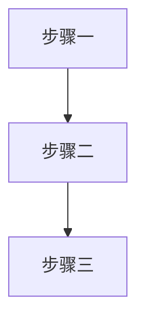
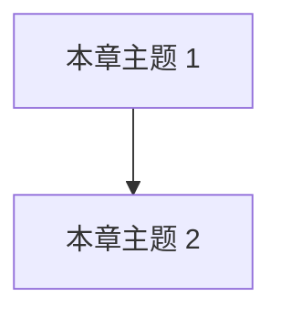

# 模型讲解模板（新页面从这里开始）

> 本文件是「节（主题页）」「章导览」「篇导览」「生产实战页」四级模板。新增内容时**复制对应模板**，按规范填写。

**使用步骤：**

1. 新增节：复制「模板一」到 `docs/篇/章/NN-页面名.md`（两位序号，中文文件名）。
2. 每章收官的生产实战页固定命名 `99-生产实战.md`，用「模板四」。
3. 填写所有 `{占位符}`，小节顺序可微调，但**不得删除任何小节**。
4. 写完更新三处：本章 `README.md`（阅读顺序表须含 99 页）、根 `README.md` 目录与进度、`CHANGELOG.md`。
5. 质量自查（易懂三件套）：📋 有例子节且带具体数字或小场景；🖼️ 每页 ≥1 张 mermaid 图；🖱️ ≥2 处 `<details>` 折叠交互；相关页面带 🎮/🕹️ 交互链接。

---

## ⬇️ 模板一：主题讲解页（节） ⬇️

````markdown
# {主题名}

> **一句话理解**：{用一句大白话说清这个模型/技术是什么、解决什么问题}

[⬆️ 返回总目录](../../../README.md) · [⬆️ 返回本篇](../README.md) · [⬅️ 返回本章目录](./README.md)

| 属性 | 说明 |
|------|------|
| 难度 | ⭐ / ⭐⭐ / ⭐⭐⭐ / ⭐⭐⭐⭐（入门 / 进阶 / 较难 / 高阶） |
| 所属分支 | {通用基础 / 视觉 / 时序 / NLP与LLM / 推荐 / 图 / 强化学习 / 因果 / 生成与多模态} |
| 前置知识 | [{页面名}](相对链接)；没有则写"无" |

---

## 📌 这一节解决什么问题

{在它出现之前，人们遇到了什么困难？它用什么思路解决？2~3 段，不用公式。}

## 🌱 通俗理解

{生活化类比 + 白话讲解，让读者建立直觉。本节不出现任何公式。
类比要贴近生活：外卖、考试、开会、看医生、找对象……任选贴切的。}

## 📋 举个例子

{带着具体数字或小场景完整走一遍，让抽象概念落地。例如：
- 线性回归：给 5 个"面积→房价"数据点，人工算两步梯度下降，看到数字真的在变；
- 注意力：给 3 个词的句子，列出一个 3×3 注意力权重表，指出谁在关注谁；
- Q-Learning：给一个 4 格走廊，列出每步 Q 表的变化。}
{较长的完整算例放折叠框：}

<details>
<summary>📊 展开完整算例</summary>

{step by step，数字对得上}

</details>

## 🧠 核心原理

### 整体流程



{mermaid 节点标签必须用双引号包裹；图要能独立看懂，配合下面的文字。
鼓励在核心概念处多放"小而准"的图，不只一张。}

### 逐步拆解

{配合上图逐块讲解。关键公式用块级公式，每个公式后必须跟一句人话解释：}

$$
{公式}
$$

> 👉 **人话**：{这个公式在说什么，用生活语言}

<details>
<summary>🧮 展开看推导/更多细节（可选）</summary>

{选讲推导、变体、进阶讨论}

</details>

## 💻 动手试试

```python
# 最小可运行示例：机器学习用 sklearn，深度学习用 PyTorch
# 注释用中文，代码末尾或注释中说明预期输出
```

## 🔥 炼丹小灶（可选，建议加上）

> 🔥 **炼丹小灶**：工业界常用起点配方与玄学——
> - 配方：{如 lr=1e-3 + Adam、batch=32、训练 10~50 epoch 起步}
> - 玄学：{如 loss 不降先换随机种子再怀疑人生、重启大法}
> - ⚠️ 以上是经验参考值，不是圣旨；换数据集请重新炼。

## 🖱️ 动手玩（有对应交互实验时务必加上）

> 🎮 **本库实验场**：[实验名](../../../playground/xxx.html)——{拖什么滑块能看到什么现象}
> 🕹️ **延伸玩一玩**：[外部交互工具名](https://...)——{一句话说明}

{没有合适的交互资源时，本节可省略。}

## 🔗 在知识树中的位置

- **上游**：建立在哪些知识之上（附相对链接）
- **下游**：哪些后续技术以它为基础（附相对链接）
- **横向对比**：与并列方法的异同（内容多时配小表格）

## ⚠️ 常见误区

- **误区一**：{说法} → {澄清}
- **误区二**：{说法} → {澄清}

## 📝 小结与自测

**要点回顾**

- {要点 1}
- {要点 2}
- {要点 3}

**自测一下**（点击展开答案）

<details>
<summary>问题 1：{问题}</summary>

{答案}

</details>

<details>
<summary>问题 2：{问题}</summary>

{答案}

</details>

## 📚 延伸阅读

- 论文：{标题（年份）+ 链接}
- 课程 / 博客 / 视频：{名称 + 链接}

---

[⬅️ 上一页：{上一页名}]({上一页链接}) · [返回本章目录](./README.md) · [下一页：{下一页名} ➡️]({下一页链接})
````

> **翻页导航规则**：本章第一页的"上一页"指向本章 `README.md`；正文末页的"下一页"指向 `./99-生产实战.md`；`99-生产实战.md` 的"下一页"指向下一章 `README.md`（章号全书连续 00→…→12）。第 12 章的 99 页末尾放"🎉 全书完 · [返回总目录](../../../README.md)"。

---

## ⬇️ 模板二：章导览（章 README） ⬇️

````markdown
# 第 {N} 章：{章节名} {章节emoji}

> {一段话：本章在篇中与整棵知识树中的位置、为什么值得读、读完能获得什么}

[⬆️ 返回总目录](../../../README.md) · [⬆️ 返回本篇](../README.md)

## 🗺️ 本章知识树



## 📖 推荐阅读顺序

| 顺序 | 页面 | 难度 | 一句话说明 |
|------|------|------|-----------|
| 1 | [{页面名}](./{文件名}.md) | ⭐ | {说明} |
| … | … | … | … |
| 收官 | [生产实战](./99-生产实战.md) | ⭐⭐ | 真实生产中这类项目从 0 到 1 怎么做 |

## 🎯 读完本章你应该能

- {能力 1}
- {能力 2}

## 🔗 与其他章节的关系

- **前置章节**：[{章节名}](路径)——{为什么需要它}
- **后续章节**：[{章节名}](路径)——{它为本章提供了什么}

---

[⬅️ 上一章：{上一章名}]({链接}) · [返回总目录](../../../README.md) · [下一章：{下一章名} ➡️]({链接})
````

> 第 0 章没有"上一章"，第 12 章没有"下一章"（放"全书完"）。跨篇链接格式见 `CONTRIBUTING.md` 路径速查表。

---

## ⬇️ 模板三：篇导览（篇 README） ⬇️

````markdown
# 第 {N} 篇 · {篇名} {篇emoji}

> {一段话：本篇定位、为什么这样编排、包含哪些章}

[⬆️ 返回总目录](../../README.md)

## 📑 本篇包含的章节

| 章 | 标题 | 一句话定位 |
|----|------|-----------|
| {N} | [{章节名}](./{章文件夹}/README.md) | {定位} |

## 🔗 在全书中的位置

- **上承**：{上一篇}——{衔接关系}
- **下启**：{下一篇}——{衔接关系}
````

---

## ⬇️ 模板四：生产实战页（每章收官，固定命名 99-生产实战.md） ⬇️

> 本库特色设计：**每章正文讲完原理，收官页回答"真实生产中到底怎么做"**——选型、成本、工具、坑，都要真实。

````markdown
# 生产实战：{副标题}

> **一句话理解**：{这一章的技术落地到真实工作时，工作流和课本上差在哪}

[⬆️ 返回总目录](../../../README.md) · [⬆️ 返回本篇](../README.md) · [⬅️ 返回本章目录](./README.md)

| 属性 | 说明 |
|------|------|
| 难度 | ⭐⭐ |
| 所属分支 | {同本章} |
| 前置知识 | 本章全部正文 |

---

## 🏭 一个真实项目从 0 到 1

{以一个具体、常见的业务场景为例，走完整生命周期。要有真实感：时间花在哪、钱花在哪、谁参与。}

```mermaid
{架构图或全流程图：需求 → 数据 → 选型 → 训练 → 评估 → 部署 → 监控迭代}
```

分阶段拆解（每个阶段说清"做什么、花多久、常见卡点"）：

- **需求定义**：{指标怎么定、和业务方对齐什么}
- **数据**：{从哪来、标注怎么做/花多少钱、清洗占多少时间}
- **设备与算力**：{什么阶段用什么算力：CPU 够不够/几张什么档次的 GPU/云租还是自建，参考量级}
- **算法选型**：{为什么选 A 不选 B，从数据量、延迟、可解释、维护成本讲}
- **训练炼丹**：{实验怎么管理、调参顺序、玄学时刻}
- **评估**：{离线指标和线上指标怎么对齐}
- **部署**：{怎么上线：API/端侧/批量，用什么工具}
- **监控与迭代**：{盯什么指标、多久重训、怎么发现漂移}

<details>
<summary>📋 展开一个真实的迭代故事（可选）</summary>

{上线后发现的第一个问题与修复过程}

</details>

## 🧭 场景选型表

| 场景 | 推荐 | 理由 | 不推荐 |
|------|------|------|--------|
| {如 数据少、要快出结果} | {方案} | {理由} | {方案} |

## 🧰 真实工具链

| 环节 | 常用工具 | 一句话点评 |
|------|----------|-----------|
| {如 实验跟踪} | {W&B / MLflow 等} | {真实评价} |

## 💣 踩坑实录

- **坑 1**：{真实翻车现场} → {怎么发现、怎么救}
- **坑 2**：{…}
- **坑 3**：{…}

## 🗣️ 炼丹师大实话

> {一句真实的、课本上不写的话。}

---

[⬅️ 上一页：{本章正文末页}](./{文件名}.md) · [返回本章目录](./README.md) · [下一页：{下一章名} ➡️]({下一章链接})
````

> **真实性行规**：工具用真名（PyTorch、LightGBM、W&B、ONNX、vLLM……）；数字给行业常见量级并注明"经验参考"；只写通用行业实践，不编造具体公司内部细节；拿不准的细节宁可写模糊也不虚构。

---

## 📌 写作口吻约定

- 定位是**教材 + 知识分享**：陈述事实与直觉，不做时间承诺（不写"X 天 / X 周学会"），不用课程营销与口号式语言。
- 用"读完本节你将理解……"，不用"学完你就能……拿高薪"。
- 像学长给学弟讲：亲切、准确、可用"你"。
- 炼丹文化元素（配方、玄学、丹炉）点到为止，为的是好记，不损害专业性。
